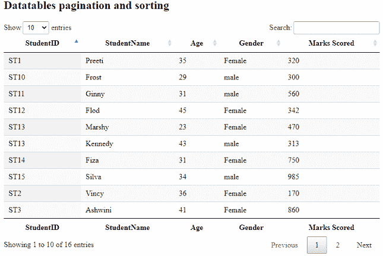
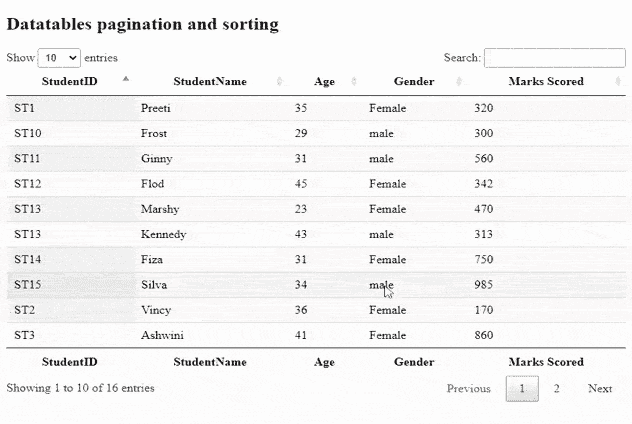

# 如何从文本文件加载 DataTables 中的 JSON 数据进行分页？

> 原文:[https://www . geesforgeks . org/如何从文本文件加载数据表中的 json 数据进行分页/](https://www.geeksforgeeks.org/how-to-load-json-data-in-datatables-from-text-file-for-pagination/)

我们非常熟悉用于存储相关数据的 HTML 表格。**数据表**是一个现代的 jQuery 插件，用于为我们的网页的 HTML 表格添加交互式和高级控件。数据表的一些特性是数据的排序、搜索、分页和排序。有许多方法可以将数据放入数据表。

在本文中，我们将学习如何从数据表中的文本文件加载数据，这些数据可以分页或排序。

实现代码所需的预编译文件有

CSS:

```htmlhtml
https://cdn.datatables.net/1.10.22/css/jquery.dataTables.min.css
```

**JavaScript:**

```htmlhtml
//cdn.datatables.net/1.10.22/js/jquery.dataTables.min.js
```

**示例:**

## 超文本标记语言

```htmlhtml
<!DOCTYPE html>
<html>

<head>
    <meta content="initial-scale=1, maximum-scale=1, 
                user-scalable=0" name="viewport" />
    <meta name="viewport" content="width=device-width" />

    <!--Datatable plugin CSS file -->
    <link rel="stylesheet" href=
"https://cdn.datatables.net/1.10.22/css/jquery.dataTables.min.css" />

    <!--jQuery library file -->
    <script type="text/javascript" src=
        "https://code.jquery.com/jquery-3.5.1.js">
    </script>

    <!--Datatable plugin JS library file -->
    <script type="text/javascript" src=
"https://cdn.datatables.net/1.10.22/js/jquery.dataTables.min.js">
    </script>
</head>

<body>
    <h2>Datatables server side process</h2>

    <!--HTML table with student data-->
    <table id="tableID" class="display" 
        style="width: 100%;">
        <thead>
            <tr>
                <th>StudentID</th>
                <th>StudentName</th>
                <th>Age</th>
                <th>Gender</th>
                <th>Marks Scored</th>
            </tr>
        </thead>
        <tfoot>
            <tr>
                <th>StudentID</th>
                <th>StudentName</th>
                <th>Age</th>
                <th>Gender</th>
                <th>Marks Scored</th>
            </tr>
        </tfoot>
    </table>

    <script>

        /* Initialization of datatable */
        $(document).ready(function () {

            /* Student's data loaded from 
            text file */
            $('#tableID').DataTable({
                "ajax": 'ajaxData.txt'
            });
        });
    </script>
</body>

</html>
```

**ajaxData.txt:** 以下是*学生*表的数据，写在*【Ajax data . txt】*文件中，上面代码的 JavaScript 部分使用了这个文件。

```htmlhtml
{
    "data": [
        [
            "ST1",
            "Preeti",
            "35",
            "Female",
            "320"
        ],
        [
            "ST2",
            "Vincy",
            "36",
            "Female",
            "170"
        ],
        [
            "ST3",
            "Ashwini",
            "41",
            "Female",
            "860"
        ],
        [
            "ST4",
            "Kelly",
            "32",
            "Female",
            "433"
        ],
        [
            "ST5",
            "Satvik",
            "41",
            "male",
            "162"
        ],
        [
            "ST6",
            "William",
            "37",
            "Female",
            "372"
        ],
        [
            "ST7",
            "Chandan",
            "31",
            "male",
            "375"
        ],
        [
            "ST8",
            "David",
            "45",
            "male",
            "327"
        ],
        [
            "ST9",
            "Harry",
            "29",
            "male",
            "205"
        ],
        [
            "ST10",
            "Frost",
            "29",
            "male",
            "300"
        ],
        [
            "ST11",
            "Ginny",
            "31",
            "male",
            "560"
        ],
        [
            "ST12",
            "Flod",
            "45",
            "Female",
            "342"
        ],
        [
            "ST13",
            "Marshy",
            "23",
            "Female",
            "470"
        ],
        [
            "ST13",
            "Kennedy",
            "43",
            "male",
            "313"
        ],
        [
            "ST14",
            "Fiza",
            "31",
            "Female",
            "750"
        ],
        [
            "ST15",
            "Silva",
            "34",
            "male",
            "985"
        ]
    ]
}

```

**输出:**

**从文件加载的数据:**



**搜索和分页执行:**

