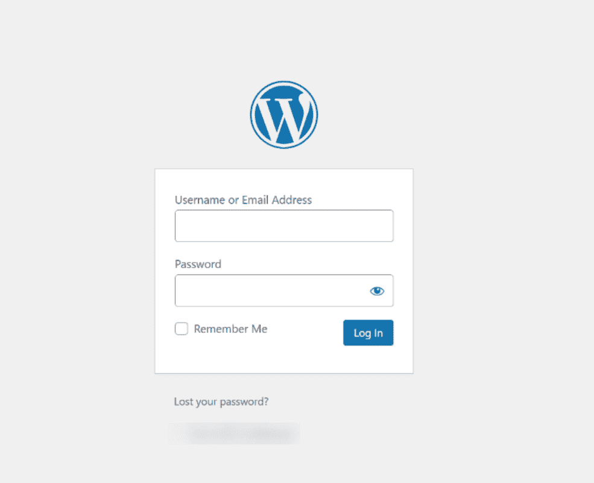
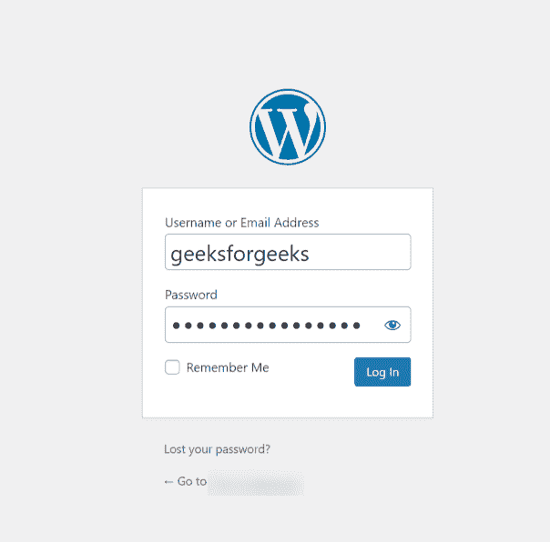
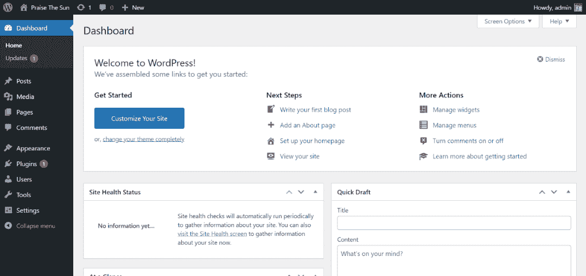

# 如何登录你的 WordPress 管理仪表盘？

> 原文:[https://www . geesforgeks . org/如何登录到您的 wordpress-admin-dashboard/](https://www.geeksforgeeks.org/how-to-login-into-your-wordpress-admin-dashboard/)

**WordPress** 是一个**内容管理系统(CMS)** ，这意味着它是一个简化制作、存储和显示网络材料过程的工具。WordPress 最初是作为一种工具来改进日常写作的常规排版。然而，它被用作博客工具，随着我们接近今年第四季度，WordPress 仍然是使用最广泛的内容管理系统，不仅在博客作者中。WordPress 是一个完全开源的程序，定期更新。仓库可能是在这里找到的[。WordPress 像任何其他开源软件一样，依赖于它的社区。](https://github.com/WordPress/WordPress)

**登录你的 WordPress 管理仪表盘:**在[第一次安装了一个自托管的 WordPress 网站](https://www.geeksforgeeks.org/how-to-make-a-website-using-wordpress-part-1/)之后，新用户发现自己的登录 URL 有问题是很正常的。此外，忘记或放错自己的登录网址太简单了。你可能想要不时地在你的 WordPress 网站上生成帖子，添加插件，或者做其他“后端”活动。这些通常是通过你的 WordPress 仪表板完成的。本文将帮助您访问您的 WP 仪表板。

在访问 WordPress 仪表板之前，您需要几个项目:

1.  **WordPress 后端 URL:** 如果你已经在你的域的根/主文件夹上安装了 WordPress，你访问 WordPress 的 URL 看起来会像:*example.com/wp-admin*。
2.  **用户名**:这是你第一次安装 WordPress 的时候创建的用户名。
3.  **密码:**这是你在 WordPress 安装过程中创建的密码。如果您在安装过程中通过电子邮件发送了安装详细信息，它也会出现在该电子邮件中。

按照以下步骤登录到您的 WordPress 管理面板:

**第一步:**开始，打开网页浏览器**前往 example.com/wp-admin**或**example.com/wp-login**。*(在 example.com 处插入您的域名)。*这意味着 *t* 要访问 WordPress 仪表板，只需在安装 WordPress 的网址末尾添加 **/wp-admin** 。

**注意:**请记住，如果您已经将 WordPress 安装到 URL 的文档根，则 URL 将是 example.com/wp-admin.如果您已经将 WordPress 安装在您的域中一个名为“test”的文件夹中，您将导航到 example.com/test/wp-admin.

**第二步:**输入安装 WordPress 时创建的用户名和密码，点击登录按钮。

**第 3 步:**登录后，仪表板应该如下所示:

