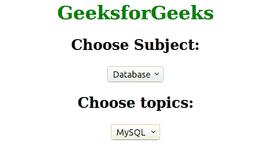

# 如何为“选择”框制作占位符？

> 原文:[https://www . geesforgeks . org/如何为选择框制作占位符/](https://www.geeksforgeeks.org/how-to-make-a-placeholder-for-a-select-box/)

“选择”标签中没有占位符属性，但它可以成为“选择”框的占位符。有许多方法可以为“选择”框创建占位符。

**例 1:**

```html
<!DOCTYPE html>
<html>
    <head>
        <title>make placeholder</title>
        <style>
            body {
                border:black;
                justify-content: center;
                text-align: center;
            }
            div {
                max-width: 18em;
            }
            h1 {
                color:green;
            }
            select {
                margin-left:130px;
            }
        </style>
    </head>
    <body>
        <h1>GeeksforGeeks<h1>
        <div include="form-input-select()">
            <select required>
                <option value="">Example Placeholder</option>

                <!-- Available Options -->
                <option value="1">GeeksforGeeks</option>
                <option value="2">w3skul</option>
                <option value="3">tuitorial point</option>
                <option value="4">CodeComunity</option>
                <option value="5">Coders</option>
                </select>
        </div>
    </body>
</html>                     
```

**输出:**


**示例 2:** 使用 JavaScript 在选择框中创建占位符。

```html
<!DOCTYPE html>
<html>
    <head>
        <script type="text/javascript">
            function populate(s, s1) {
                var s = document.getElementById(s);
                var s1 = document.getElementById(s1);
                s1.innerHTML = "";
                if(s.value == "Database") {
                    var arr = ["|Select","mysql|MySQL","oracale|Oracale"];
                }
                for(var option in arr) {
                    var pair = arr[option].split("|");
                    var new_op = document.createElement("option");
                    new_op.value = pair[0];
                    new_op.innerHTML = pair[1];
                    s1.options.add(new_op);
                }
            }
        </script>
        <style>
            body {
                text-align:center;
            }
            h1 {
                color:green;
            }
        </style>
    </head>
    <body>
        <h1>GeeksforGeeks</h1>
        <h2>Choose Subject:</h2>
        <select id = "slct" name = "slct"
            onchange = "populate(this.id, 'slct1')">
            <option value="">Select</option>
            <option value="Database">Database</option>
            <option value="Java">Java</option>
            <option value="Python">Python</option>
        </select>
        <h2>Choose topics:</h2>
        <select id = "slct1" name = "slct1"></select>
    </body>
</html>                                        
```

**输出:**
