# 如何使用 WordPress 制作网站(第 2 部分)

> 原文:[https://www . geeksforgeeks . org/如何制作网站-使用-wordpress-part-2/](https://www.geeksforgeeks.org/how-to-make-a-website-using-wordpress-part-2/)

嗨，伙计们，这是我们系列的第二个教程。在[第一个教程](https://www.geeksforgeeks.org/how-to-make-a-website-using-wordpress-part-1/)中，我们学习了[如何在我们的计算机](https://www.geeksforgeeks.org/how-to-make-a-website-using-wordpress-part-1/)上本地设置服务器和托管网站。

在本教程中，我将向您介绍 [wordpress](https://wordpress.org/) 的基本功能。我们将浏览一个网站的基本定制，然后在下一个教程中开始处理特定的网站。

* * *

首先输入网址“localhost/wordpress”(或“localhost/你的网站名”)。这里你会看到一个类似这样的屏幕。点击仪表板或输入网址“localhost/wordpress/wp-admin”

[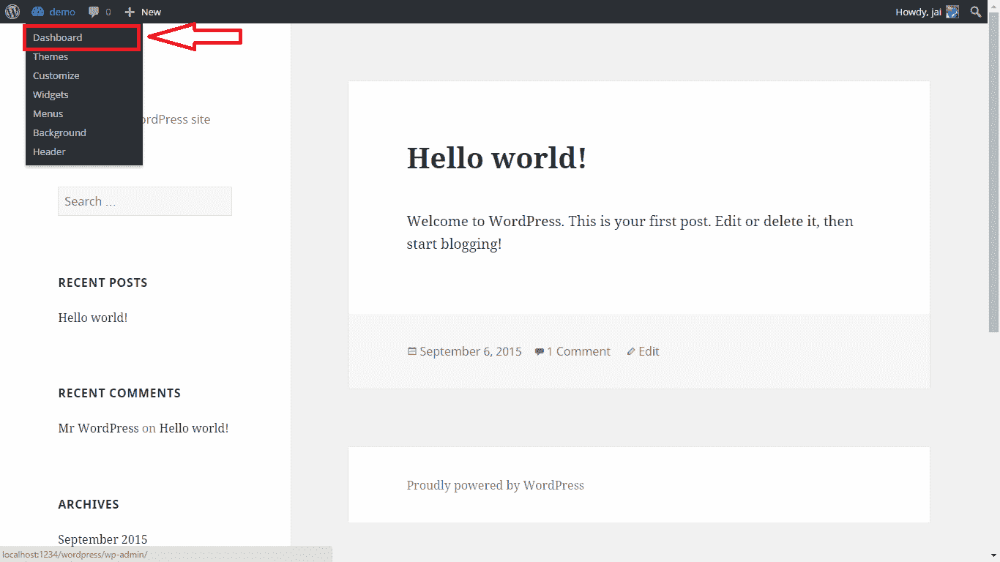](https://media.geeksforgeeks.org/wp-content/cdn-uploads/Jai_21.png)

我的网站的名字是“demo”，你可以用不同的名字。另外，我使用的是[端口编号](https://wordpress.org/support/topic/changing-port-number) 1234，但在您的情况下可能会有所不同。因此，**当你在截图中使用 url 作为“localhost:1234”时，用你的 apache 端口号替换“1234”。**

现在你会看到下面的屏幕。

[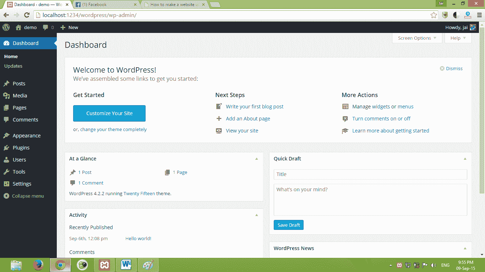](https://media.geeksforgeeks.org/wp-content/cdn-uploads/Jai_22.png)

根据您正在使用的[主题](https://wordpress.org/themes/)和[插件](https://wordpress.org/plugins/)，左侧工具栏中可以有更多的选项。

因此，让我们开始探索工具栏的所有功能。

1.  **仪表盘**

在这里，您可以快速访问与您的网站相关的所有内容。你最新的[帖子](https://codex.wordpress.org/Writing_Posts)，页面，评论等。你也可以在这里看到你的主题，插件和[的更新。](https://wordpress.org/)

强烈建议只要有更新就更新所有的主题、插件和 [wordpress](https://wordpress.org/) (除非你对新版本有兼容性问题)。**这样做可以让你免受所有安全威胁。**

2.  **岗位**

一个[帖子](https://codex.wordpress.org/Writing_Posts)只是一个填充了你网站大部分内容的内容条目。[帖子](https://codex.wordpress.org/Writing_Posts)通常会有评论，并包含在你网站的 RSS 源中。帖子的一个例子是:[https://www . geeksforgeeks . org/Microsoft-IDC-面试-体验-set-68-校外-for-sde/](https://www.geeksforgeeks.org/microsoft-idc-interview-experience-set-68-off-campus-for-sde/) 。要添加[帖子](https://codex.wordpress.org/Writing_Posts)只需转到帖子- >添加新内容并开始编写内容。要添加图片，点击“添加媒体”并上传文件。您可以在顶部看到两个选项:视觉和文本。为了方便使用，点击可视化，开始使用 [wordpress](https://wordpress.org/) ，就像使用[微软 word](https://products.office.com/en-us/word) 一样。

[特色图片](https://codex.wordpress.org/Post_Thumbnails)显示在[帖子](https://codex.wordpress.org/Writing_Posts)的顶部。当你在[脸书](http://www.facebook.com)/谷歌+上分享你的内容时，缩略图显示的就是这张图片。 [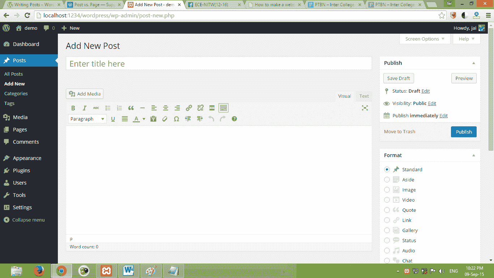](https://media.geeksforgeeks.org/wp-content/cdn-uploads/Jai_23.png)

您可以通过转到帖子- >类别将您的帖子内容分类到类别中。例如，如果你写关于计算机科学学生的博客，那么你可以有“数据结构”、“网页设计”等类别。

您也可以通过转到帖子- >标签来为帖子添加“[标签](https://codex.wordpress.org/Posts_Tags_Screen)”。

您不必总是发布帖子，您可以通过单击“保存草稿”来保存帖子供以后编辑。

3.  **媒体**

这里会显示您的所有媒体项目，如图片、视频、音频文件等。您可以点击任何项目，并在 [wordpress](https://wordpress.org/) 本身进行编辑。编辑工具包括裁剪、调整大小等。

4.  **页**页

[页面](https://codex.wordpress.org/Pages)是静态的，不像帖子那样有类别、评论、标签等。您可以创建任意数量的页面。可以使用边栏自定义页面。页面的一个示例是:

[https://www . geeksforgeeks . org/about/job-spangs-geeksforgeeks-急事-需求/](https://www.geeksforgeeks.org/about/job-vacancies-geeksforgeeks-urgent-requirement/)

[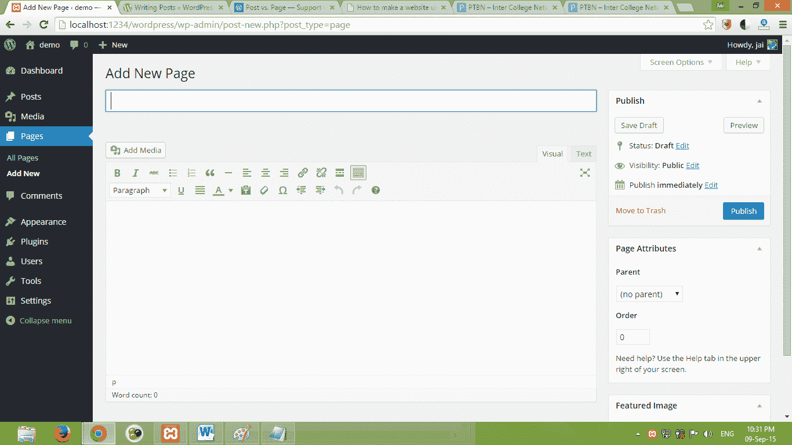](https://media.geeksforgeeks.org/wp-content/cdn-uploads/Jai_25.png)

和帖子里一样，你也有一个视觉和文本编辑器。您也可以在这里添加媒体，就像您在帖子中所做的那样。

您可能已经看到一个网站，如果您将鼠标悬停在菜单上，会出现一个子菜单。您可以通过选择“添加新页面”右侧的父页面来实现。

5.  [**点评**](https://codex.wordpress.org/Comments_in_WordPress)

这部分显示了你网站博客上的所有评论。在这里，您可以批准/取消批准评论，甚至删除它。

[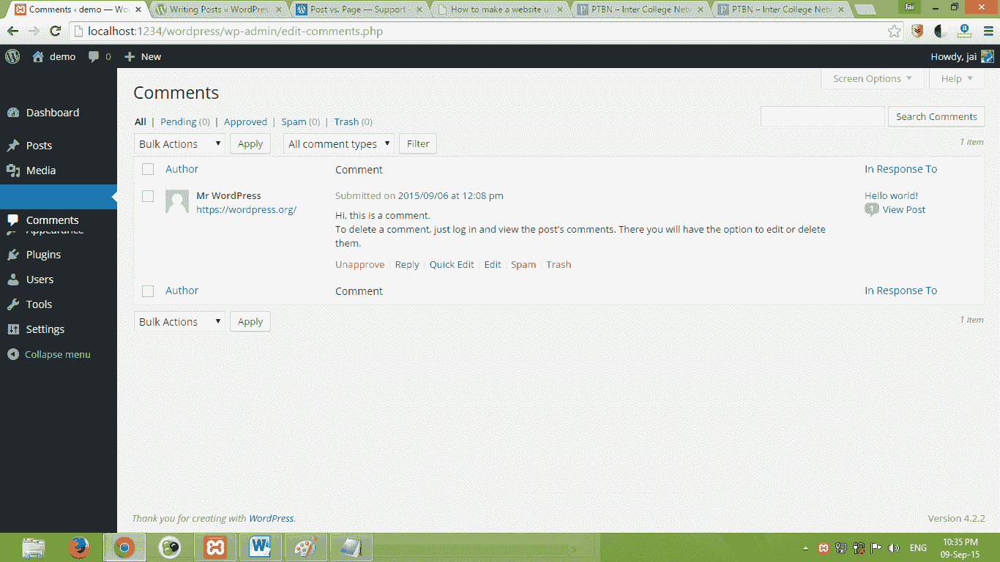](https://media.geeksforgeeks.org/wp-content/cdn-uploads/Jai_26.png)

6.  **外观**

这一部分在定制网站外观方面起着重要作用。让我们一步一步地看这些小节。

**a)主题**

在这里，您可以看到所有已安装的主题。目前我正在运行[25](https://wordpress.org/themes/twentyfifteen/)主题。点击 [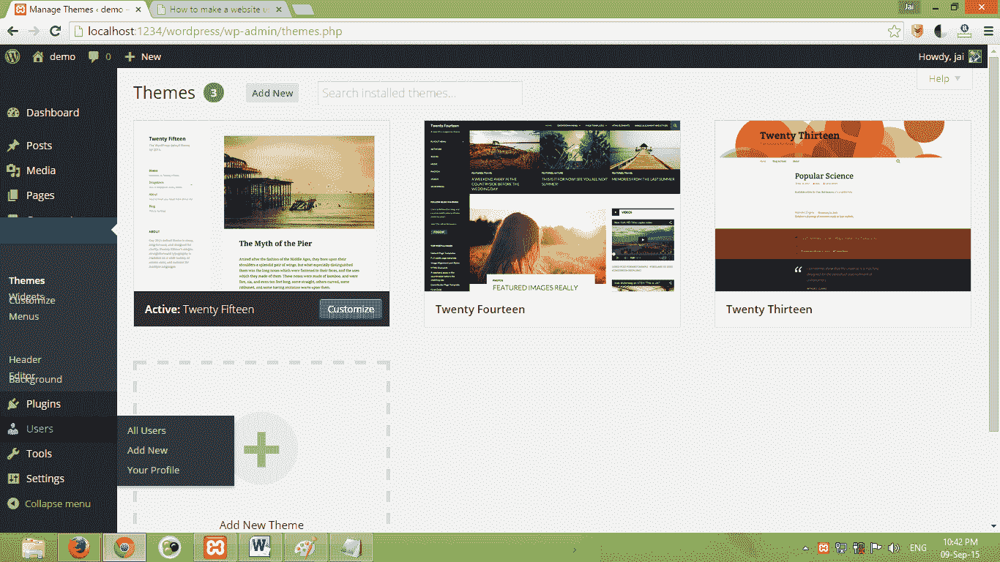](https://media.geeksforgeeks.org/wp-content/cdn-uploads/Jai_27.png) 即可下载自己选择的主题并上传其 zip 文件

**b)定制**

这是定制网站最简单的方法。无论你在这个部分做了什么样的修改，预览都会立即发生，这取决于你是否保存它。在这里你可以改变网站名称，背景颜色，标题图片，添加小部件(像搜索栏，最近的帖子，类别等。)

[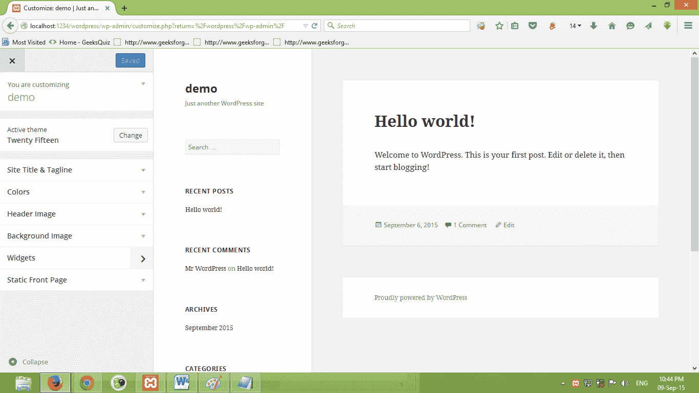](https://media.geeksforgeeks.org/wp-content/cdn-uploads/Jai_28.png)

**c)** [**小部件**](http://codex.wordpress.org/WordPress_Widgets)

小部件是为网站的页脚和侧边栏添加功能。

您可以使用这些小部件在边栏中显示最近的帖子、搜索栏、档案、评论、标签云。

[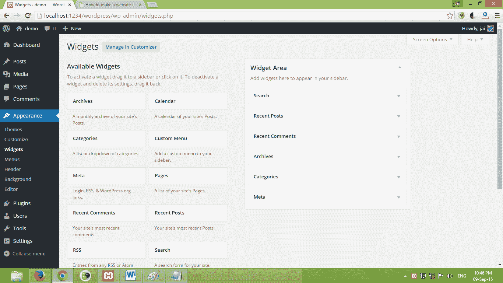](https://media.geeksforgeeks.org/wp-content/cdn-uploads/Jai_29.png)

d) **菜单:**大部分站点都有 2 个菜单，一级和二级。

例如:在[geeksforgeeks.org](https://www.geeksforgeeks.org)主菜单是 [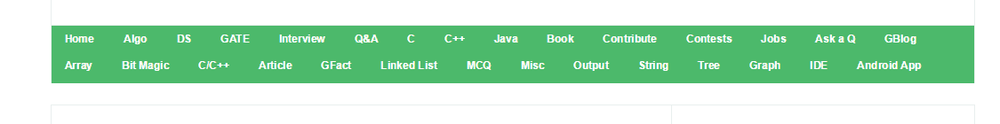](https://media.geeksforgeeks.org/wp-content/cdn-uploads/Jai_210.png)

而二级菜单则是 

您可以在“菜单”部分创建这些菜单。菜单可以包含您想要的页面、类别或其他自定义链接。

**e)** [**表头**](https://codex.wordpress.org/Designing_Headers) **&后台**

页眉和背景再次将您带到“自定义”部分，以便您可以更改页眉和菜单的外观。

**f)编辑器**

编辑器列出了所有用于创建页面的模板的 php 文件。如果你想改变编码，你可以在这里编辑 phpcode。您也可以通过编辑“style.css”来更改网站的样式。

**如果你是初学者，不要使用这个选项。**

7.  **[插件](https://wordpress.org/plugins/)**

在这里你可以查看当前安装的插件以及安装新的插件。浏览各种插件，点击“添加新插件”上传插件。 [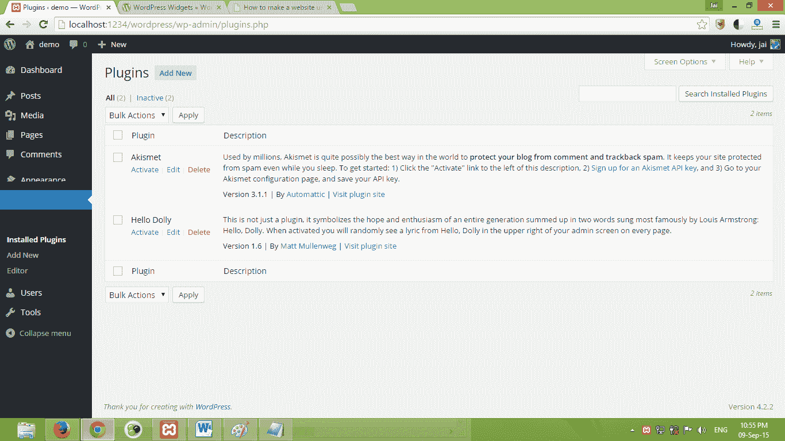](https://media.geeksforgeeks.org/wp-content/cdn-uploads/Jai_213.png)

8.  **用户**

此部分显示您网站上的所有注册用户。您可以在此部分更改用户的角色(比如从作者更改为管理员)。您也可以在此部分编辑用户的个人资料。

[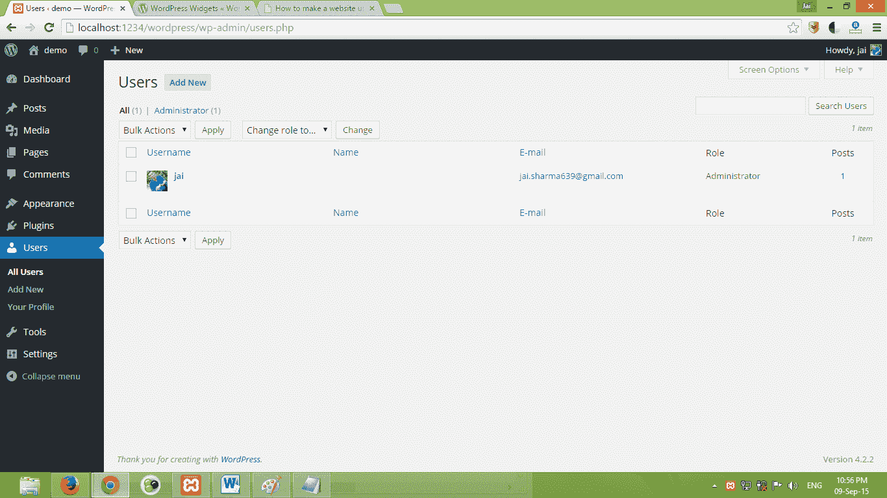](https://media.geeksforgeeks.org/wp-content/cdn-uploads/Jai_214.png)

9.  **工具**

它为你提供了一套工具，让你的网站**更加人性化**。例如:工具“按下这个”可以让你在任何网页上发布一篇文章，而不需要在仪表板中“添加新文章”。

工具还有另一个很好的用途。假设您开始在本地服务器上构建您的网站。在某一点上，你需要将你的整个网站从本地服务器转移到网络服务器。这时“工具->导出”选项就派上了用场。我们也可以在您将网站从一个网络主机移动到另一个主机时使用它，而不会丢失网站内容。

你可以在下图中看到导出是如何工作的。Wordpress 会问你是想移动全部内容还是部分内容。

[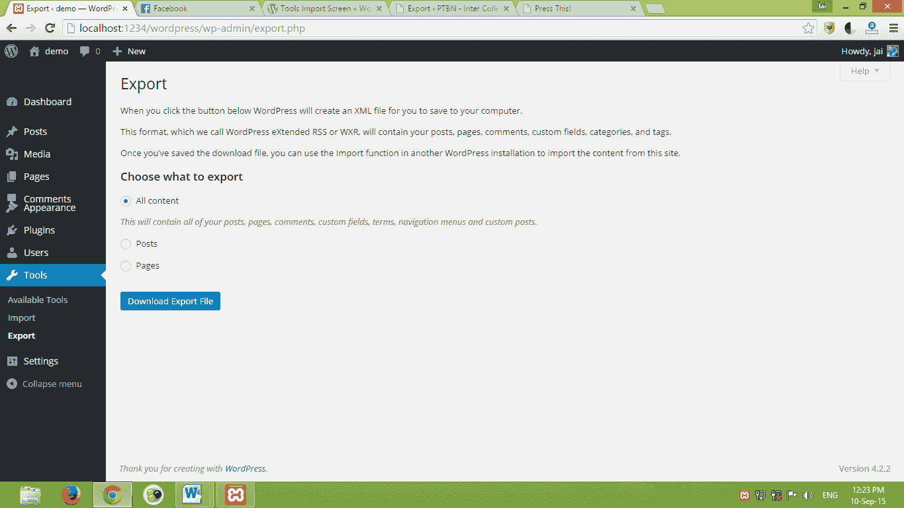](https://media.geeksforgeeks.org/wp-content/cdn-uploads/Jai_215.png)

10.  **设置**

在“设置”下，您可以编辑网站的主要和基本信息，如网站标题、网站的电子邮件 id、[永久链接](https://codex.wordpress.org/Using_Permalinks)结构、评论审核、媒体上传大小等。

有很多东西我还没有在这个教程中涉及到，比如如何添加边栏，以不同的风格定制每个页面，标签是用来做什么的，安装和使用插件，wordpress 的文件结构等等。这只是对 [wordpress](https://wordpress.org/) 所有功能的简单介绍。

**如有疑问，欢迎在下方留言。敬请关注如何使用 WordPress 制作网站(第 3 部分)**

参考文献:

1.  [http://www . WP 初学者. com/初学者指南 wordpress 中帖子与页面的区别是什么/](http://www.wpbeginner.com/beginners-guide/what-is-the-difference-between-posts-vs-pages-in-wordpress/)
2.  [https://en.support.wordpress.com/post-vs-page/](https://en.support.wordpress.com/post-vs-page/)
3.  [http://codex.wordpress.org/WordPress_Widgets](http://codex.wordpress.org/WordPress_Widgets)
4.  [https://codex.wordpress.org/Tools_Screen](https://codex.wordpress.org/Tools_Screen)
5.  [https://codex.wordpress.org/Tools_Import_Screen](https://codex.wordpress.org/Tools_Import_Screen)

文章作者 [Jai Sharma](https://www.facebook.com/Jaisharma639) ，来自国家理工学院的活跃博主  Warangal 有浓厚的兴趣撰写关于 web 开发的文章，wordpress  教程 等。目前他在[www.ptbn.org](http://www.ptbn.org)担任技术主管。你可以在[【jaisharma639.gmail.com】](mailto:jaisharma639.gmail.com)找到他

**如果你也想在这里展示你的博客，请查看 [GBlog](http://geeksquiz.com/gblog/) 在 GeeksforGeeks** 上的客座博文