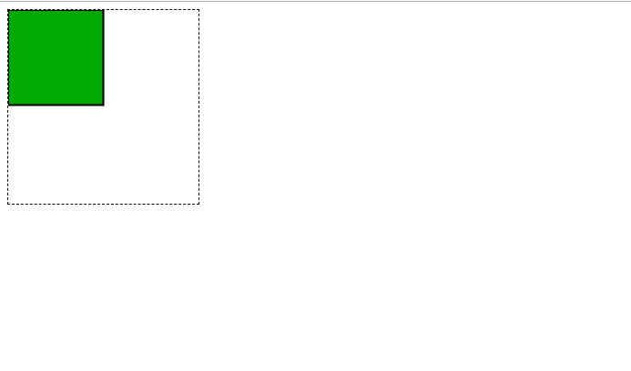
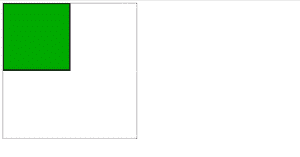
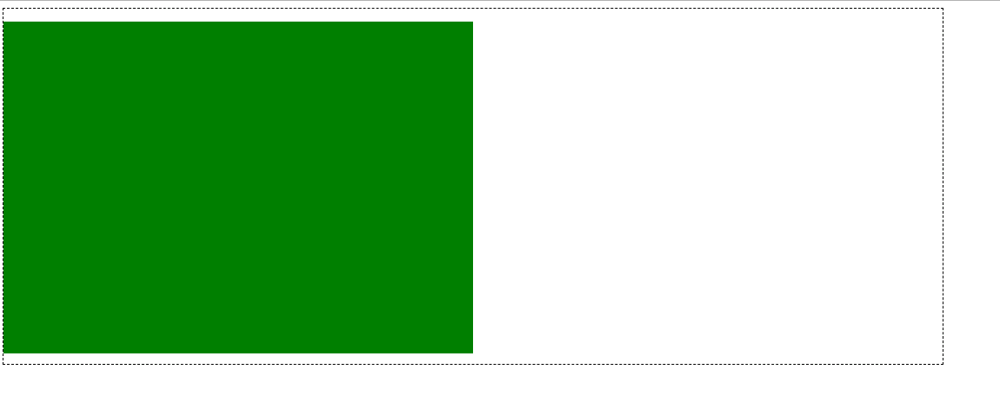
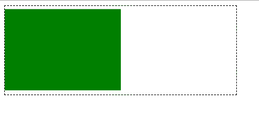

# 如何用父容器制作 svg 标尺？

> 原文:[https://www . geeksforgeeks . org/如何使用其父容器制作 svg 秤/](https://www.geeksforgeeks.org/how-to-make-an-svg-scale-with-its-parent-container/)

SVG 是可缩放矢量图形的缩写。它是一种基于可扩展标记语言(XML)的二维图形矢量图像格式。它支持交互性和动画。这意味着 SVG 文件中的每个属性和每个元素都可以被动画化。SVG 图像行为是在 XML 文本文件中定义的。它们可以被搜索、索引、编写脚本、压缩，并且可以使用任何文本编辑器以及使用诸如 Inkscape 的绘图软件来创建或编辑。几乎每个现代网络浏览器都支持 SVG。

缩放 SVG 很棘手的原因是它不像其他图像格式那样缩放。SVG 图像有一个明确定义的长宽比:宽高比，这使得它很难随着父容器的变化而缩放。其他图像很容易缩放，因为浏览器决定了图像的高度、宽度和纵横比，并且会相应地调整一切。所以将这些属性赋予 SVG 应该是我们需求的第一步。虽然设置高度和宽度几乎不能设置纵横比，但我们的目标是缩放超出纵横比的部分。一个[视窗](https://www.geeksforgeeks.org/svg-viewbox-attribute/)可以正确地服务于我们的目的。视图框是< svg >元素的一个属性，它接受四个参数 x，y，宽度和高度。x 和 y 表示 SVG 坐标系的原点，宽度和高度表示应该缩放以分别填充宽度和高度的像素数或坐标。让我们看看下面的例子:

**第一次进场:**

*   首先，我们创建一个占据屏幕总宽度 30%和屏幕总高度 20%的容器。
*   接下来，我们使用<rect>标记创建一个 SVG 图像(矩形)，并指定高度、宽度和填充属性。</rect>
*   <svg>元素包裹矩形图像。SVG 元素占据父容器的 100%宽度，其高度根据屏幕大小自动调整。我们使用 viewBox 使 SVG 图像可缩放。</svg>
*   **viewBox = "0 0 100 100"** :定义一个 x=0，y=0，宽度=100 单位，高度=100 单位的坐标系。
*   因此，包含宽度=50px 和高度=50px 的矩形的 SVG 将填充 SVG 图像的高度和宽度，并且所有维度都被相等地缩放。改变 x 和 y 坐标会产生不同的结果，但我们会将自己限制在规定的值内。

**示例:**

## 超文本标记语言

```htmlhtml
<!DOCTYPE html>
<html>

<body>
    <div class="container" style=
            "width:30%; height: 20%; 
            border:1px dashed black;">

        <svg width="100%" height="auto" 
            viewBox="0 0 100 100">
            <rect width="50" height="50" 
                style="fill:rgb(0,170,0);
                    stroke-width:1;
                    stroke:rgb(0,0,0)" />
        </svg>
    </div>
</body>

</html>
```

**输出:**

*   **全屏:**



全屏幕

*   **最小化屏幕:**



最小化屏幕

**第二种方法:**

*   第二种方法演示了存在于标签中的 svg 图像的缩放。
*   在这种情况下，浏览器会根据当前屏幕大小自动调整图像纵横比。
*   在 img 标签中提及高度或宽度作为属性是很重要的，否则 Internet Explorer 可能会将 width =“auto”和 height =“auto”更改为它可以接受的某个值。

**示例:**

## 超文本标记语言

```htmlhtml
<!DOCTYPE html>
<html>

<body>
    <div class="container" style=
        "width:80%; height:80%; 
        border:1px dashed black;">

        
    </div>
</body>

</html>
```

**输出:**

*   **全屏:**



全屏幕

*   **最小化屏幕:**



最小化屏幕