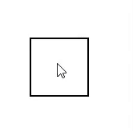

# 如何在悬停或选择元素时使复选框可见？

> 原文:[https://www . geeksforgeeks . org/如何使复选框在悬停或选择元素时可见/](https://www.geeksforgeeks.org/how-to-make-checkbox-visible-when-hover-or-select-the-element/)

这里的问题是如何使复选框仅在以下情况下可见:

1.  它在上空盘旋
2.  挑选

**方法:**
复选框未选中时不应该可见。只有再次悬停时才可见。
解决问题的办法很简单。我们可以使用复选框元素的**不透明度**属性来操纵它。当复选框元素悬停或被选中时，只需使用 CSS 将复选框的**不透明度**值更改为 **1** 。**不透明度**的默认值应为 **0** 。

**示例:**

```html
<!DOCTYPE html>
<html lang="en">
<head>
    <meta charset="UTF-8">
    <meta name="viewport" content="width=device-width, initial-scale=1.0">
    <meta http-equiv="X-UA-Compatible" content="ie=edge">
    <title>Checkbox</title>
    <style>
        #box{
            margin:50px;
            width:50px;
            height:50px;
            border:2px solid black;
            padding:10px;
        }

        .cardcheckbox {
        opacity: 0;

        }

        .cardcheckbox:hover,
        .cardcheckbox:checked {
            opacity: 1;
        }
    </style>
</head>
<body>
    <div id="box">
        <div>
            <input type="checkbox"
                   class="cardcheckbox" 
                   align="right"/>
        </div>
    </div>
</body>
</html>
```

**输出:**
