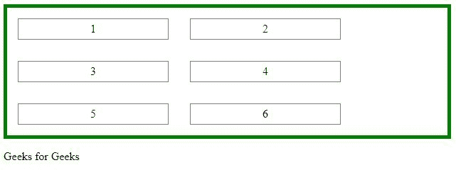

# 如何让容器收缩以适应子元素的包装？

> 原文:[https://www . geeksforgeeks . org/如何制作容器-收缩以适合儿童元素-包装时/](https://www.geeksforgeeks.org/how-to-make-container-shrink-to-fit-child-elements-as-they-wrap/)

灵活布局必须有一个显示属性设置为灵活的父元素。柔性容器的直接子元素自动成为柔性项。

**进场:**

*   **下面的元素表示一个包含四个伸缩项的伸缩容器。**

    ```htmlhtml
    <div id="container">
        <ul>
            <li>icecream</li>
            <li>sandwich</li>
            <li>juice</li>
            <li>coldrink</li>
               </ul>
    </div>
    ```

*   **Parent Element (Container)**

    通过将显示属性设置为 flex，flex 容器变得灵活:

    ```htmlhtml
    .flex-container {
      display: flex;
    }
    ```

*   **The flex-wrap Property**

    flex-wrap 属性说明 flex 项是否应该换行。

    ```htmlhtml
    .flex-container {
      display: flex;
      flex-wrap: wrap;
    }
    ```

    它包装值指定 flex 项目将在必要时包装

*   **Text Alignment**

    text-align 属性设置文本的水平对齐方式。文本可以左对齐或右对齐、居中或对齐。

    ```htmlhtml
    h1 {
      text-align: center;
    }

    h2 {
      text-align: left;
    }

    h3 {
      text-align: right;
    }
    ```

*   **CSS Setting height and width**

    高度和宽度属性用于设置元素的高度和宽度。

    ```htmlhtml
    div {
      height: 500px;
      width: 50%;
    }
    ```

*   **CSS Padding**

    CSS 填充属性用于在边框内的元素周围生成空间。

    ```htmlhtml
    div {
      padding-top: 100px;
      padding-right: 50px;
      padding-bottom: 1000px;
      padding-left: 100px;
    }
    ```

*   **CSS Margins**

    CSS 边距属性用于在边框之外的元素周围创建空间。

    ```htmlhtml
    p {
      margin-top: 100px;
      margin-bottom: 100px;
      margin-right: 150px;
      margin-left: 80px;
    }
    ```

**示例:**

```htmlhtml
<!DOCTYPE html>
<html>
<head>
<style>
ul {
    display: flex;
    flex-wrap: wrap;
    margin: 0;
    padding: 0;
    border: 5px solid green;
}

li {
    list-style-type: none;
    border: 1px solid gray;
    margin: 15px;
    padding: 5px;
    width: 200px;
    text-align: center;
}
</style>
<body>
<div id="container">
    <ul>
        <li>1</li>
        <li>2</li>
        <li>3</li>
        <li>4</li>
        <li>5</li>
        <li>6</li>
    </ul>
    <p> Geeks for Geeks </p>
</div></body>
</html>    
```

**输出:**

