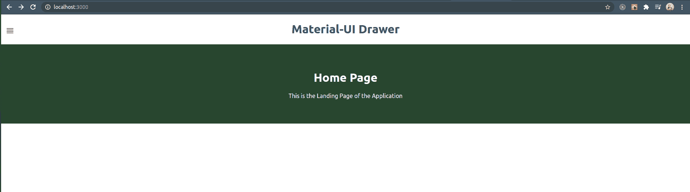
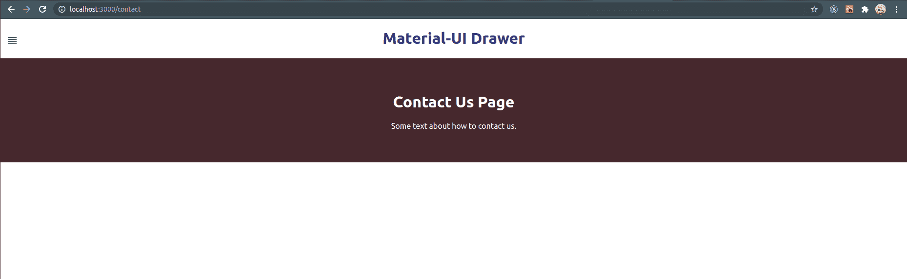
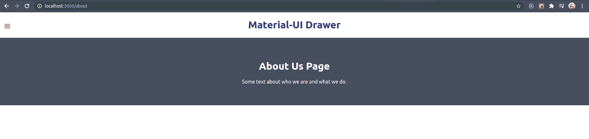
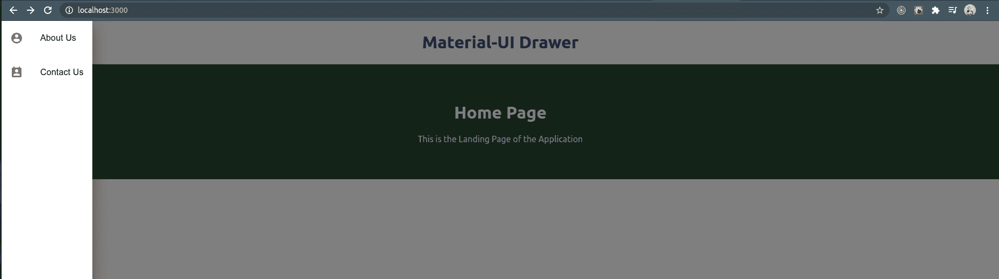

# 如何使用 Material UI 制作抽屉？

> 原文:[https://www . geesforgeks . org/如何使用材料制作抽屉-ui/](https://www.geeksforgeeks.org/how-to-make-drawer-using-material-ui/)

材料界面抽屉是材料界面中使用最广泛的组件。材料用户界面抽屉用作网站的导航栏，显示项目列表，然后点击项目，用户将被重定向到网页/网站的特定部分。几乎所有的网站都可以看到它，因为它们提供了更好的用户交互，并且易于在应用程序的不同部分之间导航。

**素材 UI 抽屉的一些重要道具和类型如下:**

<figure class="table">

| s。不 | Prop name | allowable value | default | explain |
| --- | --- | --- | --- | --- |
| one | anchor point | [Bottom] [Left] [Top] [Right] | left | Indicates false. | 错误的 | Specifies whether the drawer should be visible. |
| three | 无糖的 | – | – | Callback method triggered when a drawer is requested to be closed |
| four | variant | "Permanent", "Permanent" and "Temporary" |  |

</figure>

**材料界面广泛提供三种抽屉:**

**1。临时抽屉:** 只有当真值传递给*打开*道具时，该抽屉才会显示在网页上。抽屉以模态的形式出现在当前网页的顶部，为内容提供了一个阴暗的背景，如下例所示。

**2。持久抽屉:**当真值传递给*打开*道具时，该抽屉在网页上可见，但与临时抽屉不同，它通过调整网页内容来占据当前网页的一定空间。

**3。永久抽屉:**在这里，用户始终可以看到抽屉。这里不需要将*打开*道具传递给抽屉组件。

**先决条件:**小规模工作反应堆项目。

*   Basic Knowledge of React Js.

    **示例:**我们将设计一个主页，当点击该主页时，其左上角有一个菜单图标，显示如下所示的两个菜单项:

    1.  关于我们
    2.  联系我们

    其中每个菜单在被点击时，会将我们带到应用程序的相应页面。

    **模块安装:**但是在我们继续之前，我们需要将以下包安装到我们的项目中。打开您的终端并键入以下命令:

    ```html
    npm i @material-ui/core
    ```

    它将反应组件安装到我们的项目中。在我们的例子中，它安装了抽屉组件。

    ```html
    npm i react-router-dom
    ```

    这为网站提供了路由组件。简单地说，这是将用户从应用程序的一部分重定向到另一部分所必需的。

    ```html
    npm i @material-ui/icons
    ```

    上述命令将安装材料用户界面图标。可以选择安装。

    上面所有的命令都应该在您的项目中对您的*包进行如下更改:*

    ```html
    "dependencies": {
        "@material-ui/core": "^4.11.0",
        "@material-ui/icons": "^4.9.1",
        "react": "^17.0.1",
        "react-dom": "^17.0.1",
        "react-router-dom": "^5.2.0",
        // Other dependencies starts from here
        ...................... 
      },
    ```

    **示例:1** 使用以下命令进入您的 ***src*** 文件夹:

    ```html
    cd src
    ```

    现在让我们创建三个名为 *Home.js、*about . js、 *Contact.js* 的网页，如下所示:

    **文件名:Home.js**

    ## java 描述语言

    ```html
    import React from 'react';
    const styles = {
      home: {
        padding: '50px',
        textAlign: 'center',
        backgroundColor: '#28462f',
        color: 'white',
      }
    };
    export default class Home extends React.Component {
      render() {
        return <div style={styles.home}>
        <h1>Home Page</h1>

        <p>This is the Landing Page of the Application</p>
      </div>;
      }
    }
    ```

    **输出:**

    

    **文件名:Contact.js**

    ## java 描述语言

    ```html
    import React from 'react';
    const styles = {
      contact: {
        padding: '50px',
        textAlign: 'center',
        backgroundColor: '#46282d',
        color: 'white',
      }
    };

    export default class Contact extends React.Component {
      render() {
        return <div style={styles.contact}>
        <h1>Contact Us Page</h1>

        <p>Some text about how to contact us.</p>
      </div>;
      }
    }
    ```

    **输出:**

    

    **文件名:About.js**

    ## java 描述语言

    ```html
    import React from 'react';
    const styles = {
      about: {
        padding: '50px',
        textAlign: 'center',
        backgroundColor: '#474e5d',
        color: 'white',
      }
    };

    export default class About extends React.Component {
      render() {
        return <div style={styles.about}>
        <h1>About Us Page</h1>

        <p>Some text about who we are and what we do.</p>
      </div>;
      }
    }
    ```

    **输出:**

    

    这些是我们通过点击抽屉来切换的页面。现在是集成所有上述组件的时候了。创建另一个名为 *drawer.js 的文件，如下所示:*

    **文件名:抽屉. js**

    ## java 描述语言

    ```html
    import React from 'react';
    import { Drawer, Divider, IconButton } 
        from '@material-ui/core';
    import { List, ListItem, ListItemIcon, ListItemText } 
        from '@material-ui/core';
    import PermContactCalendarIcon from 
        '@material-ui/icons/PermContactCalendar';
    import ReorderIcon from '@material-ui/icons/Reorder';
    import AccountCircleIcon from 
        '@material-ui/icons/AccountCircle';
    import { Link } from 'react-router-dom';

    const styles = {
      sideNav: {
        marginTop: '-60px',
        zIndex: 3,
        marginLeft: '0px',
        position: 'fixed',
      },
      link: {
        color: 'black',
        textDecoration: 'none',
      }
    };

    export default class MarerialUIDrawer 
        extends React.Component {
      constructor(props) {
        super(props);
        this.state = {
          isDrawerOpened: false,
        };
      }
      toggleDrawerStatus = () => {
        this.setState({
          isDrawerOpened: true,
        })
      }
      closeDrawer = () => {
        this.setState({
          isDrawerOpened: false,
        })
      }
      render() {
        const { isDrawerOpened } = this.state;
        return (
          <div>
             <div style={styles.sideNav}>
                <IconButton onClick={this.toggleDrawerStatus}>
                  {!isDrawerOpened ? <ReorderIcon /> : null }
                </IconButton>
              </div>
              <Divider/>
            <Drawer
              variant="temporary"
              open={isDrawerOpened}
              onClose={this.closeDrawer}
            >
              <Link to='/about' style={styles.link}>
                <List>
                  <ListItem button key='About Us'>
                    <ListItemIcon><AccountCircleIcon/>
                    </ListItemIcon>
                    <ListItemText primary='About Us' />
                  </ListItem>
                </List>
              </Link>
              <Link to='/contact' style={styles.link}>
              <List>
                <ListItem button key='Contact Us'>
                  <ListItemIcon><PermContactCalendarIcon/>
                  </ListItemIcon>
                  <ListItemText primary='Contact Us' />
                </ListItem>
                </List>
              </Link>
            </Drawer>
          </div>
        );
      }
    }
    ```

    在这个例子中，我们使用了“关于我们”、“联系我们”以及为我们打开抽屉的按钮的图标。也可以给出一些简单直观的名字(文字)来代替图标。

    最后一步，也是最后一步，为每个组件指定正确的路由模式，并在 *App.js* 中导入我们的抽屉，如下所示:

    **文件名:App.js**

    ## java 描述语言

    ```html
    import './App.css';
    import Home from './Home';
    import Contact from './Contact';
    import About from './About';
    import MarerialUIDrawer from './drawer';
    import { BrowserRouter, Route, Switch } 
        from 'react-router-dom';

    function App() {
      return (
        <div className="App">
         <h1 style={{color: '#323576'}}>Material-UI Drawer</h1>
         <BrowserRouter>
         <MarerialUIDrawer/>
          <Switch>
            <Route exact path='/' render=
                {props => <Home {...props} /> }/>
            <Route exact path='/about' render=
                {props => <About {...props} /> }/>
            <Route exact path='/contact' render=
                {props => <Contact {...props} /> }/>
          </Switch>
        </BrowserRouter>
        </div>
      );
    }

    export default App;
    ```

    **输出:**

    

    **注意:**这是一个临时抽屉的例子。它在左侧以模式显示列表(默认情况下)。在抽屉组件中添加一个*锚点*属性，并给出一些值来观察变化。同样，更改*变量*属性值，以检查持久抽屉和永久抽屉。

    **参考:**了解更多素材 UI 抽屉，可从以下链接查看官方文档:[https://material-ui.com/](https://material-ui.com/)