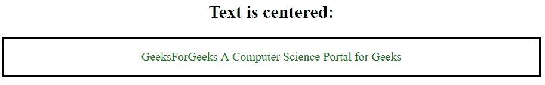

# 如何让元素飘向中心？

> 原文:[https://www . geesforgeks . org/如何制作元素-浮动到中心/](https://www.geeksforgeeks.org/how-to-make-elements-float-to-center/)

CSS float 属性用于设置或返回元素的水平对齐方式。但是这个属性允许一个元素只浮动在父体的右侧或左侧，其余的元素环绕在它周围。CSS 布局没有办法浮动中心。因此，我们可以使用 position 属性使元素居中。

**示例 1:** 本示例将元素的位置精确设置在屏幕的中心。

```html
<!DOCTYPE html>
<html>

<head>
    <title>
        Make float to center to element
    </title>

    <!-- Style to set element float
        to center -->
    <style>
        .Center {
            width:200px;
            height:200px;
            position: fixed;
            background-color: blue;
            top: 50%;
            left: 50%;
            margin-top: -100px;
            margin-left: -100px;
        }
    </style>
</head>

<body>
    <div class="Center"></div>
</body>

</html>                    
```

**输出:**


**示例:**本示例将文本浮动元素的位置精确设置在屏幕中心。

```html
<!DOCTYPE html>
<html>

<head>

    <!-- Style to set text-element
        to center -->
    <style>
        .center {
            text-align-last: center;
            border: 2px solid black;
        }
    </style>
</head>

<body>
    <h2 style = "text-align:center">
        Text is centered:
    </h2>

    <div class="center">
        <p>
            <font color="green">
                GeeksForGeeks A Computer
                Science Portal for Geeks
            </font>
        </p>
    </div>
</body>

</html>                    
```

**输出:**


HTML 是网页的基础，通过构建网站和网络应用程序用于网页开发。您可以通过以下 [HTML 教程](https://www.geeksforgeeks.org/html-tutorials/)和 [HTML 示例](https://www.geeksforgeeks.org/html-examples/)从头开始学习 HTML。

CSS 是网页的基础，通过设计网站和网络应用程序用于网页开发。你可以通过以下 [CSS 教程](https://www.geeksforgeeks.org/css-tutorials/)和 [CSS 示例](https://www.geeksforgeeks.org/css-examples/)从头开始学习 CSS。