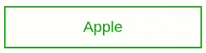

# 如何使整个自定义复选框/Div 可点击？

> 原文:[https://www . geeksforgeeks . org/如何制作整个定制-复选框-div-可点击/](https://www.geeksforgeeks.org/how-to-make-entire-custom-checkbox-div-clickable/)

在你的网站中使用自定义复选框而不是老式的 HTML 复选框总是一个不错的选择。

本文为其提供了一个分步实现。

**进场:**

*   使用[输入类型复选框](https://www.geeksforgeeks.org/html-input-typecheckbox/)并在 HTML 中链接一个标签。
*   隐藏输入复选框，并根据您的要求设置标签的样式。
*   随着复选框状态的变化更改样式。

**HTML 代码:**

## 超文本标记语言

```html
<!DOCTYPE html>
<html>
  <head>

    <style>
        label {
          display:block;
          border:solid 2px green;
          width: 200px;
          height:40px;
          margin-top:10px;
          color:green;
          text-align:center;
          line-height: 40px;
       }

       <!-- hide input -->
       input[type=checkbox] {
          display: none;
       }

       <!-- Add ✓ on checked before label -->
       input:checked + label:before {
          content: "✓ ";
       }

       <!--Add styling on check -->
       input:checked + label {
          border: solid 2px purple;
          color: purple;
       }
      </style>
  </head>
  <body>
    <input id="apple" type="checkbox" name="apple" />
    <label for="apple">Apple</label>
  </body>
</html>
```

**输出:**



结果

**支持的浏览器:**

*   谷歌 Chrome
*   微软公司出品的 web 浏览器
*   火狐浏览器
*   歌剧
*   旅行队