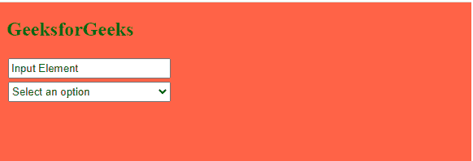

# 如何使输入和选择的元素宽度相同？

> 原文:[https://www . geeksforgeeks . org/如何输入和选择相同宽度的元素/](https://www.geeksforgeeks.org/how-to-make-input-and-select-elements-to-be-same-width/)

作为一个初学者，在使用[**【CSS】**](https://www.geeksforgeeks.org/css-tutorials/)和 [**HTML**](https://www.geeksforgeeks.org/html-tutorials/) 的时候，你可能注意到了像输入这样的表单元素有一个问题，选择当输出在浏览器中打开时，两个元素的宽度不一样。它看起来不太符合用户。

在本文中，我们将学习如何使[输入](https://www.geeksforgeeks.org/html-input-tag/#:~:text=In%20HTML%2C%20the%20input%20field,element%20which%20only%20contains%20attributes.)和[选择](https://www.geeksforgeeks.org/html-select-tag/#:~:text=The%20tag%20in%20HTML,form%20to%20recieve%20user%20response.)元素具有相同的宽度和高度。

为了创建相同宽度的输入，我们必须在程序中使用一些 CSS 属性。

*   **框尺寸:**定义如何计算元素的高度和宽度。
*   **moz-box-size:**仅在 Mozilla Firefox 浏览器中支持。
*   **-WebKit-box-size:**仅谷歌 Chrome 浏览器支持。

**示例:**在下面的 CSS 代码中，我们创建了两个宽度相同的元素。下面是 CSS 的代码，我们将在其中使用前面讨论过的一些属性。

## 超文本标记语言

```htmlhtml
<!DOCTYPE html>
<html>

<head>
    <title>
        Input and Select Elements with same width
    </title>

    <!-- CSS stylesheet-->
    <style>
        input,
        select {
            width: 200px;
            height: 25px;
            margin: 2px;
            -moz-box-sizing: border-box;
            -webkit-box-sizing: border-box;
            box-sizing: border-box;
        }

        body {
            background-color: tomato;
        }
    </style>

</head>

<!--body tag starts here-->

<body>
    <h2 style="color:green">GeeksforGeeks</h2>
    <input type="text" 
           name="Input Element" 
           id="input_Element" 
           value="Input Element"><br>

    <select name="Select Element" id="select_Element">
        <option value="">Select an option</option>
        <option value="option1">Option 1</option>
        <option value="option2">Option 2</option>
    </select>
</body>
<!--body tag ends here-->

</html>
```

**输出:**以下输出仅在 Mozilla Firefox 和微软 Edge 中显示。



相同宽度输入和选择选项