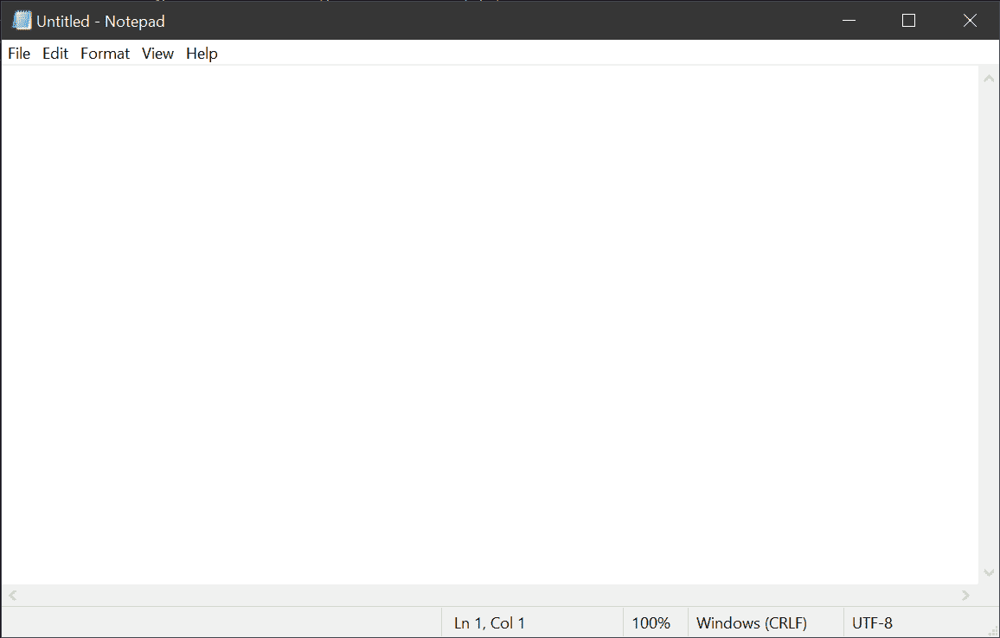
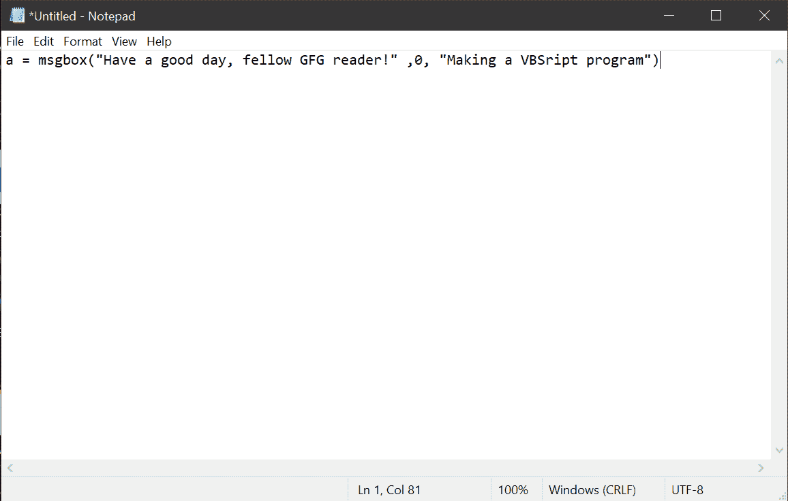
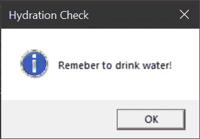
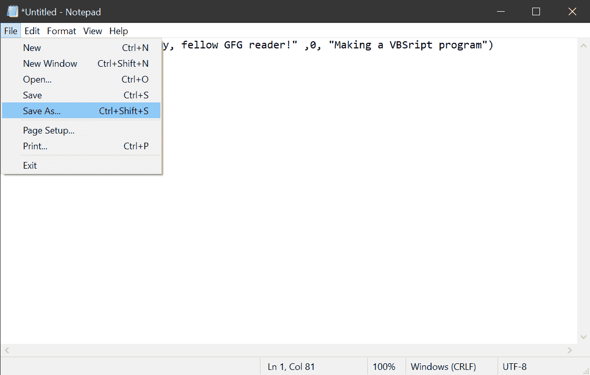
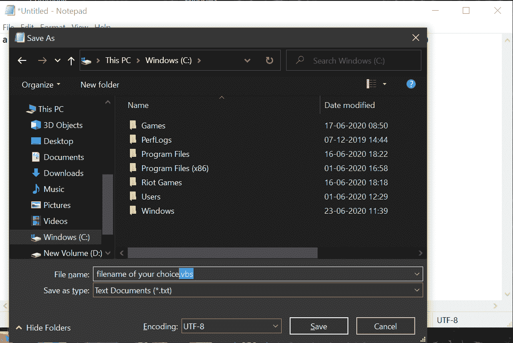
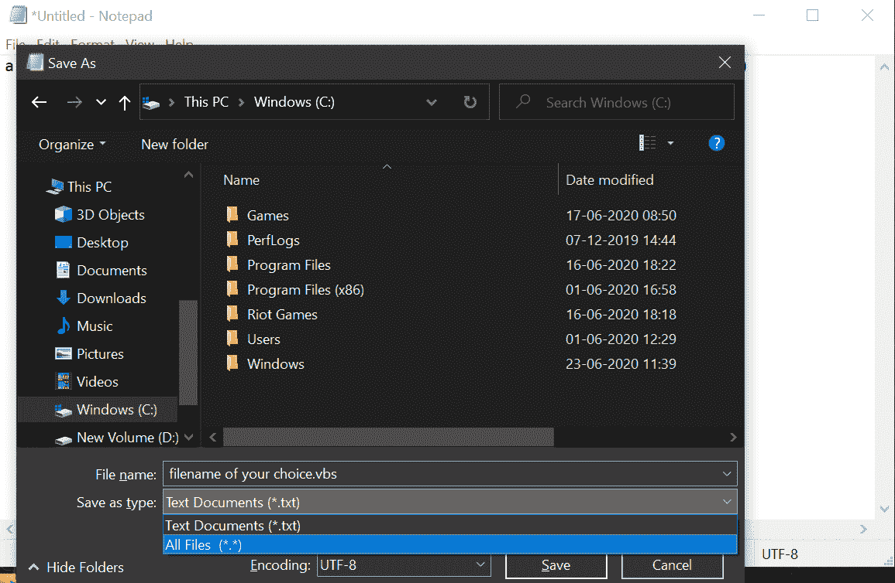
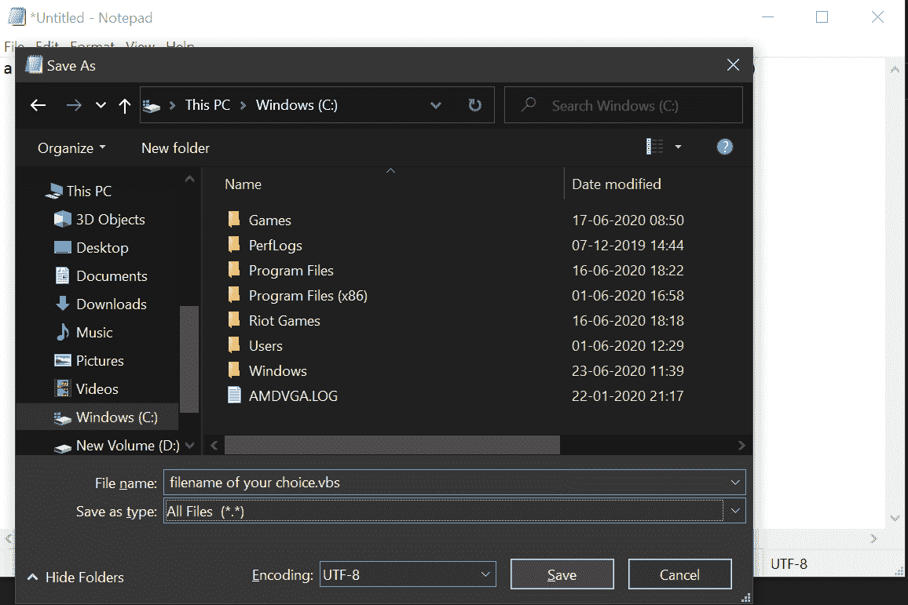
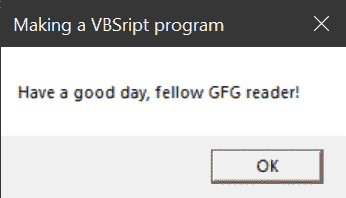

# 如何制作、保存和运行一个简单的 VBScript 程序？

> 原文:[https://www . geesforgeks . org/如何制作、保存和运行一个简单的 vbscript 程序/](https://www.geeksforgeeks.org/how-to-make-save-and-run-a-simple-vbscript-program/)

[VBScript](https://www.geeksforgeeks.org/vbscript-introduction/) 是流行的微软 Visual Basic 的轻量级脚本版本，顾名思义由微软开发。它用于开发动态网页。与 Visual Basic 编程语言相比，它要轻得多，但可以作为像 JavaScript 这样的脚本语言工作。要在客户端运行 VBScript，客户端必须使用 Internet Explorer，因为 VBScript 仍然不支持其他浏览器。

#### 如何制作一个 VBScript 程序？

就像很多其他简单的脚本语言一样，VBScript 可以写在一个简单的文字编辑器上，像记事本等这样的软件(如记事本++、写字板等)。).请参考以下步骤，更好地了解如何制作 VBScript 程序:

**第一步:**打开自己选择的文字编辑器(这里用的是记事本)。



**第二步:**现在，这里有一个简单的 VBScript 程序，它会让一个简单的消息对话框出现在屏幕上。VBScript 中这样一个程序的代码是:

```
a = msgbox("Have a good day, fellow GFG reader!", 0, "Making a VBScript program")
```



**代码说明:**只要遵循 VBScript 中的变量声明规则就可以放任何东西，而不是上面代码开头的“a”。实际上，我们可以通过以下方式破解和理解上述代码:

```
put_any_Variable_name = msgbox("Your main text here", 0, "Your title text here")
```

要根据需要更改对话框的属性，请参考以下数据:

<figure class="table">t70t73】第一个按钮将变为默认 t76t79】第二个按钮将变为默认 t82t88 当前应用程序将停止工作直到用户响应对话框)

| code | attribute |
| Zero | Only the OK button will be displayed. ? ? ? ? Will display |
| one | And the OK and Cancel buttons. ? ? ? ? ❌ |
| Two | The abort, retry and ignore buttons will be displayed. ? ? ? ? ? ? ? ? ? ? ? ? Will display |
| three | Yes, No and Cancel buttons. ✅❎❌ |
| four | Yes and No buttons will be displayed. ✅❎ |
| five | Retry and Cancel buttons will be displayed. ? ? ? ? ❌ |
| Sixteen | Will the key message icon be displayed in the dialog box? ? ? ? |
| Thirty-two | A warning query icon will be displayed in the dialog box |
| Forty-eight | A warning message icon will be displayed in the dialog box? ? ? ? |
| Sixty-four | The message icon will be displayed in the dialog box. |
| Zero | Two hundred and fifty-six | Five hundred and twelve |
| Four thousand and ninety-six | Trigger system mode (basically all applications will stop working until the user responds to the dialog box) |

</figure>

用上面提供的任何数字更改上面书写代码中的“0”。
要在 you 对话框中获得多个上述属性，可以简单编写，例如:“0+16”，而不是上面代码中的“0”。
参考代码:

```
hydro = msgbox("Remember to drink water!", 0+64, "Hydration Check")
```

将给出如下输出:



就这样，我们刚刚编写了一个基本的 VBScript 程序，它将显示一个对话框作为输出。现在开始保存这个程序。

#### 如何保存一个 VBScript 程序？

按照下面给出的步骤保存 VBScript 程序:

**第一步:**按键盘上的 *Ctrl + Shift + S* ，或者在记事本窗口点击*文件>另存为*，这将打开一个另存为对话框窗口，询问当前记事本文档的保存位置。



**第二步:**现在为这个记事本文档写下你选择的任何文件名，但是一定要写。vbs 作为其扩展。一定要加”。将文件名写入“文件名:”字段后。



**第 3 步:**现在，更改“另存为类型:文本文档中的字段”(*)的值。txt)“至”所有文件(*。*)”通过在下拉菜单的帮助下点击它。



**第四步:**最后，选择文件保存的合适位置后，点击保存。



#### 如何运行一个 VBScript 程序？

现在，这是一件非常简单的事情，只需双击现在保存的**。vbs** 文件从你保存它的地方，瞧！它将运行并给你以下输出:

