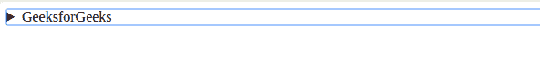

# 如何在 github wiki 页面中制作“剧透”文字？

> 原文:[https://www . geesforgeks . org/how-make-spoiler-text-in-github-wiki-pages/](https://www.geeksforgeeks.org/how-to-make-spoiler-text-in-github-wiki-pages/)

GitHub Wiki 页面支持 GitHub 风味降价。点击此处了解更多关于 GitHub 风味降价的信息:

*   [掌握降价](https://guides.github.com/features/mastering-markdown/)
*   [GitHub 风味降价规格](https://github.github.com/gfm/)

然而，在 GitHub 风味的 Markdown 中没有直接的方法来添加剧透文本。但是，有一个解决方法！

**方法:** Markdown 支持其中的 HTML 块。所以，我们可以用 HTML 的 **[<明细>](https://www.geeksforgeeks.org/html5-details-tag/)** 和 **[<汇总>](https://www.geeksforgeeks.org/html-5-summary-tag/)** 标签来创建一个剧透文字。**扰流板警告**的标题可在 **<摘要>标签**中指定。扰流板的其余部分必须在 **<细节>标签**内。只有点击“前方扰流板”标题才会显示扰流板。摘要标签中的文本是剧透标题。代码、图像、链接等可以在 GitHub 风格的降价之后，在细节标签中使用。

**例:**

## 超文本标记语言

```html
<!DOCTYPE html>
<head>
<head>
    <title>
         “spoiler” text in github wiki pages
    </title>
</head>
<body>
    <details>
        <summary>GeeksforGeeks</summary>
         A Computer Science Portal for Geeks
    </details>        
</body>
</html>
```

**输出:****<详细信息>标记**以及 **<汇总>标记**在**降价**中创建以下输出。


**注:**以上输出直接来自 GitHub Wiki Pages 的降价预览。