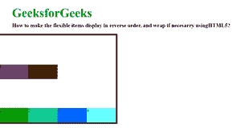

# 如何让柔性物品逆序显示，必要时进行包裹？

> 原文:[https://www . geeksforgeeks . org/如何制作柔性物品-逆序展示-必要时包装/](https://www.geeksforgeeks.org/how-to-make-the-flexible-items-display-in-reverse-order-and-wrap-if-necesarry/)

本文的方法是让柔性项以相反的顺序显示，必要时使用 CSS 中的 [flex-wrap 属性](https://www.geeksforgeeks.org/css-flex-wrap-property/)进行包装。

该属性设置为换行-反转值。此属性用于在弹性项换行时反转它们的流向。

**语法:**

```html
flex-wrap: wrap-reverse; 
```

**示例:**

## 超文本标记语言

```html
<!DOCTYPE html>
<html>
    <head>
        <style>
            #main {
                width: 400px;
                height: 300px;
                border: 5px solid black;
                display: flex;
                flex-wrap: wrap-reverse;
            }

            #main div {
                width: 100px;
                height: 50px;
            }
            h1 {
                color:#009900;
                font-size:42px;
                margin-left:50px;
            }
            h3 {
                margin-top:-20px;
                margin-left:50px;
            } aa
        </style>
    </head>
    <body>
        <h1>GeeksforGeeks</h1>
        <h3>How to make the flexible items
          display in reverse order, and wrap
          if necessary usingHTML5?</h3>
        <div id="main">
            <div style="background-color: #009900;">1</div>
            <div style="background-color: #00cc99;">2</div>
            <div style="background-color: #0066ff;">3</div>
            <div style="background-color: #66ffff;">4</div>
            <div style="background-color: #660066;">5</div>
            <div style="background-color: #663300;">6</div>
        </div>
    </body>
</html>
```

输出:



**支持的浏览器:**

*   谷歌 Chrome
*   微软公司出品的 web 浏览器
*   火狐浏览器
*   歌剧
*   旅行队