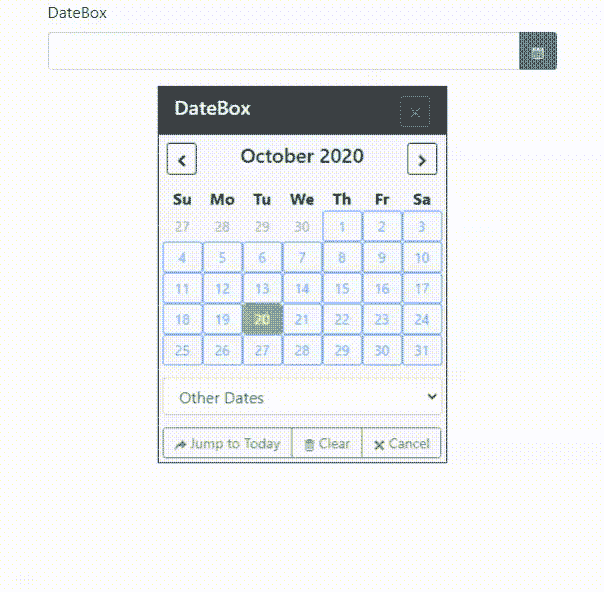
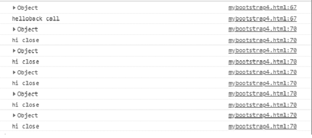
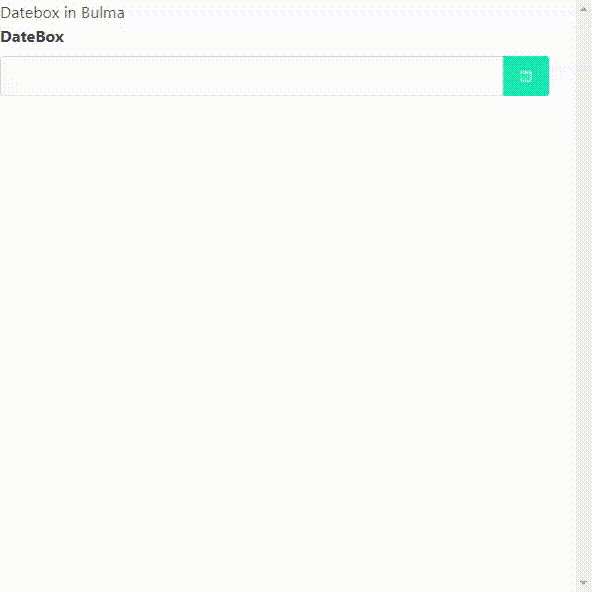
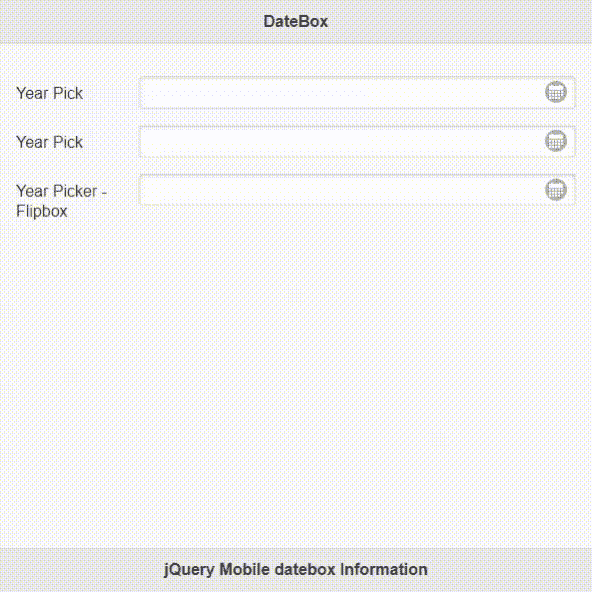

# 如何利用多模式 jtsage-datebox 插件？

> 原文:[https://www . geesforgeks . org/如何使用多模式-jtsage-datebox-plugin/](https://www.geeksforgeeks.org/how-to-make-use-of-multi-mode-jtsage-datebox-plugin/)

在本文中，我们将学习为 Bootstrap (3&4)、jQueryMobile 和布尔玛使用多模式日期和时间选择器插件。jQuery **日期框**插件完全基于 JavaScript、HTML 和 CSS 技术。

插件的一些关键特性如下

*   它可以限制任何条件，如日期、时间和持续时间。
*   许多回调和触发器可用于创建、打开、关闭、更改、销毁事件。
*   该工具提供了像滑动柱或周等功能。

请从[链接](https://github.com/jtsage/jtsage-datebox)下载所需的预编译文件，并保存在您的工作文件夹中以供执行。

**HTML 头段代码:**下面的 HTML 代码片段保存了头段，其中包含了以下所有示例执行所需的所有常见预编译文件。

**注意:**请用正确的文件路径在代码中包含以下所有库链接。

## 超文本标记语言

```html
<head>
        <meta http-equiv="Content-Type"
    content="text/html; charset=utf-8" />
    <meta name="viewport"
     content="width=device-width,
         initial-scale=1, maximum-scale=1">

        <script src="https://code.jquery.com/jquery-3.2.1.min.js"
    integrity="sha256-hwg4gsxgFZhOsEEamdOYGBf13Fy
        QuiTwlAQgxVSNgt4="
    crossorigin="anonymous"></script>

        <script type="text/javascript"
         src="../src/js/external/widgetLib.js">
        </script>
    <script type="text/javascript"
         src="../src/js/baseObject.js"></script>
        <!-- Enhance JavaScript date object-->
    <script type="text/javascript"
         src="../src/js/lib/dateEnhance.js"></script>
    <!--Date / Time output -->
    <script type="text/javascript"
        src="../src/js/lib/dateFormatter.js"></script>
     <!--Limit functions -->
    <script type="text/javascript"
        src="../src/js/lib/dateLimit.js"></script>
    <!-- Date / Time input -->
    <script type="text/javascript"
        src="../src/js/lib/dateParser.js"></script>
    <!--Event loop -->
    <script type="text/javascript"
        src="../src/js/lib/eventHandler.js"></script>
     <!--  Date adjustments -->
    <script type="text/javascript"
        src="../src/js/lib/offset.js"></script>
     <!-- Public functions  -->
    <script type="text/javascript"
        src="../src/js/lib/public.js"></script>
     <!--  Short utility functions -->
    <script type="text/javascript"
         src="../src/js/lib/shortUtil.js"></script>
    <script type="text/javascript"
        src="../src/js/lib/standardControls.js"></script>
    <!-- Create the widget -->
    <script type="text/javascript"
        src="../src/js/lib/widgetCreate.js"></script>
    <script type="text/javascript"
        src="../src/js/lib/widgetOpen.js"></script>
     <!--  Closing of the widget -->
    <script type="text/javascript"
        src="../src/js/lib/widgetClose.js"></script>
     <!-- Destroy, Enable & Disable the widget -->
    <script type="text/javascript"
        src="../src/js/lib/widgetDestroyEnableDisable.js">
        </script>
     <!-- Handle positioning of the widget -->
    <script type="text/javascript"
         src="../src/js/lib/positioning.js"></script>
         <!-- Twitter Bootstrap v3.4.1 -->
    <script type="text/javascript"
        src="../src/js/framework/bootstrap.js"></script>
        <!-- DateBox, TimeBox, DateTimeBox, DurationBox -->
    <script type="text/javascript"
         src="../src/js/modes/datebox.js"></script>
    <!-- FlipBox, TimeFlipBox, DateTimeFlipBox,
         DurationFlipBox -->
    <script type="text/javascript"
         src="../src/js/modes/flipbox.js"></script>
    <!-- CalBox -->
    <script type="text/javascript"
         src="../src/js/modes/calbox.js"></script>
    <!-- SlideBox -->
    <script type="text/javascript"
        src="../src/js/modes/slidebox.js"></script>
        <!--  Used only in the test environment -->
    <script type="text/javascript"
        src="../src/js/widgetBinding.js"></script>
    <!--  Auto enhance for data-role on a page -->
    <script type="text/javascript"
        src="../src/js/autoInit.js"></script>

    <script type="text/javascript"
     src="https://cdn.jtsage.com/jtsage-datebox/
         i18n/jtsage-datebox.lang.utf8.js">
    </script>
</head>
```

**示例 1:** 以下日期和时间选择器演示了[引导程序 4。](https://www.geeksforgeeks.org/bootstrap-4-introduction/)不要忘记在您的引导代码中包含引导(3 & 4)预编译文件，如下所示。

## 超文本标记语言

```html
<!DOCTYPE html>
<html lang="en">
<head>

  <link rel="stylesheet"
   href="https://maxcdn.bootstrapcdn.com/bootstrap/
   4.3.1/css/bootstrap.min.css">
  <script src="https://cdnjs.cloudflare.com/ajax/libs/
   popper.js/1.12.9/umd/popper.min.js"></script>   
  <script src="https://maxcdn.bootstrapcdn.com/bootstrap/
   4.3.1/js/bootstrap.min.js"></script>

  <script type="text/javascript">       
        jQuery.extend(jQuery.jtsage.datebox.prototype.options, {
            mode : "calbox",

            /* Display */
            displayMode : "inline",           
            lockInput: false,

            displayDropdownPosition : "bottomRight",           
            useImmediate     : true,
            useFocus         : true,
            useButton : true,

            /* Callbacks */
             beforeOpenCallbackArgs : [ "helloback call", "bye"],
             beforeOpenCallback     : function(a, b)
                                            {
                                            console.log(a);
                                            console.log(b);
                                            return true;
                                            },

            closeCallbackArgs : [ "hi close", "bye close"],
            closeCallback     : function(a, b)
                                          {
                                          console.log(a);
                                          console.log(b);
                                          },

            calDateList     : [
                                          ["1980-04-25", "JT's Date of Birth"],
                                          ["1809-02-12", "Lincoln's Birthday"] ],
            calShowDateList : true,
            slideDateList     : [ ["1980-04-25", "JT's Date of Birth"],
                                           ["1809-02-12", "Lincoln's Birthday"] ],
             slideShowDateList : true,

             minHour : 9,
             maxHour : 5,

             minTime : "9:00",
             maxTime : "17:00",

            slideUsePickers       : true,
            slideYearPickMax      : 2020,
            slideYearPickMin      : 1950,

            minuteStep   : 15,

            /* Control Buttons */
             closeTodayButton    : true,       
            useCancelButton     : true,
            useClearButton      : true,           
            useTodayButton      : true,       
            useCollapsedBut     : true,           
        });
    </script>
</head>
<body>
    <div class="container" role="main">       
        <form>       
        <div class="form-group">
            <label class="control-label"for="db">
                        DateBox</label>
            <input class="form-control" name="db"
            type="text" data-role="datebox" id="db" />
        </div>
        </form>
    </div>
</body>
</html>
```

**输出:**



下面是控制台中显示的输出，演示回调函数的工作。



**示例 2:** 以下代码演示了[布尔玛](https://www.geeksforgeeks.org/bulma-introduction/)。不要忘记在您的布尔玛代码中包含**布尔玛**预编译文件，如下所示。

## 超文本标记语言

```html
<!DOCTYPE html>
<html lang="en">
<head>
 <link rel="stylesheet" href="https://cdn.jsdelivr.net/
  gh/jgthms/bulma@0.8.0/css/bulma.css" />
 <script type="text/javascript"
 src="../src/js/framework/bulma.js"></script>

 <script type="text/javascript">
        jQuery.extend(jQuery.jtsage.datebox.prototype.options,
                     {
            /* Modes can be changed as per user*/            
            mode : "slidebox",

            /* Display */
            displayMode : "dropdown",

            /* Linked fields */
            linkedField : false,   
            slideShowDateList : true,

            calDateList     : [ ["1980-04-25", "JT's Date of Birth"],
                                          ["1809-02-12", "Lincoln's Birthday"] ],
            calShowDateList : true,

            slideDateList     : [ ["1980-04-25", "JT's Date of Birth"],
                                         ["1809-02-12", "Lincoln's Birthday"] ],
            slideShowDateList : true,

            calUsePickers       : true,
            slideUsePickers       : true,

            calUsePickers       : true,           
            slideUsePickers       : true,           
            useCancelButton     : true,           
            useTodayButton      : true,           
            useCollapsedBut     : true,

            useCancelButton     : true,
            useClearButton      : true,           
            useTodayButton      : true,           
            useCollapsedBut     : true,
        });
    </script>
    <style>
     body{
     width:550px;
     padding:10px,10px;
     }
     h3{
      margin:0 auto;
      padding:20px,20px;
     }
    </style>

</head>
<body>
   <h3>Datebox in Bulma </h3>
    <div class="container" role="main">
        <form class="form">

        <div class="field is-horizontal">
            <div class="field-label is-normal">
             <label class="label" for="db">DateBox</label>
            </div>
            <div class="field-body">
              <div class="field">
                  <div class="control">
                 <input class="input" name="db" type="text"
                  data-role="datebox" id="db" />
                  </div>
               </div>
            </div>
        </div>
        </form>   
    </div>
</html>
```

**输出:**以下是开发者选择的模式为“日界线”
时的输出


下面是开发者选择的模式为“slidebox”时的输出。



**注意:**开发者可以根据应用的需求，尝试不同的模式，实现各种回调函数和其他 JavaScript 选项。演示中只显示了几个选项。

**示例 3:** 下面的代码演示了 jQuery 移动代码的日期和时间选择器。不要忘记将 jQuery 手机预编译文件包含在手机设计的代码中，如下所示。回调函数可以根据需要按照第一个示例中所示的方式实现。

## 超文本标记语言

```html
<!DOCTYPE html>
<html lang="en">
<head>
       <!--  jQuery mobile libraries -->
    <link rel="stylesheet"
    href="https://code.jquery.com/mobile/1.4.5/jquery.mobile-1.4.5.css" />
    <script src="https://code.jquery.com/mobile/1.4.5/jquery.mobile-1.4.5.js">
    </script>
        <script type="text/javascript" src="../src/js/framework/jqm.js"></script>
    <!--  jQuery mobile libraries -->
    <script type="text/javascript">
        jQuery.extend(jQuery.jtsage.datebox.prototype.options, {
            /* Mode */       
            mode : "datebox",

            /* Display */
            displayMode : "dropdown",
            displayDropdownPosition : "bottomMiddle",

            linkedField : false,

            calDateList     : [ ["1980-04-25", "JT's Date of Birth"],
                              ["1809-02-12", "Lincoln's Birthday"] ],
            calShowDateList : true,

            slideDateList     : [ ["1980-04-25", "JT's Date of Birth"],
                             ["1809-02-12", "Lincoln's Birthday"] ],
            slideShowDateList : true,

            calUsePickers       : true,
            slideUsePickers       : true,           
            useCancelButton     : true,
            useClearButton      : true,           
            useTodayButton      : true,           
        });
    </script>

</head>
<body>
    <div data-role="page" id="main">
        <div data-role="header" data-position="fixed">
            <h3>DateBox </h3>
        </div>
        <div class="ui-content" role="main">

            <div class="ui-field-contain">
            <label for="db">Year Pick</label>
            <input name="db" type="text" data-mini="true"
                        data-role="datebox" id="db" />
            </div>
            <div id="db-dbAttach"></div>

            <div class="ui-field-contain">
            <label for="db2">Year Pick</label>
            <input name="db2" type="text" data-mini="true"
            data-options='{"mode":"datebox", "overrideDateFieldOrder": ["y"],
            "overrideHeaderFormat":"%Y", "overrideDateFormat": "%Y" }'
                        data-role="datebox" id="db2" />
            </div>

            <div class="ui-field-contain">
            <label for="db3">Year Picker - Flipbox</label>
            <input name="db3" type="text" data-mini="true"
            data-options='{"mode":"flipbox", "overrideDateFieldOrder": ["y"],
            "overrideHeaderFormat":"%Y", "overrideDateFormat": "%Y" }'
                        data-role="datebox" id="db2" />
            </div>           
        </div>

        <div data-role="footer" data-position="fixed">
            <h1>jQuery Mobile datebox Information</h1>
        </div>
    </div>

</body>
</html>
```

**输出:**

