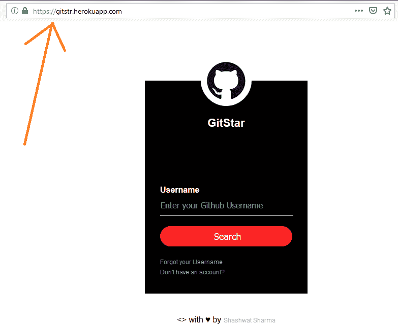
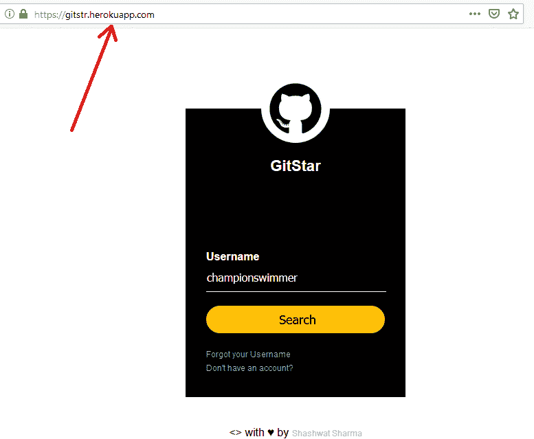
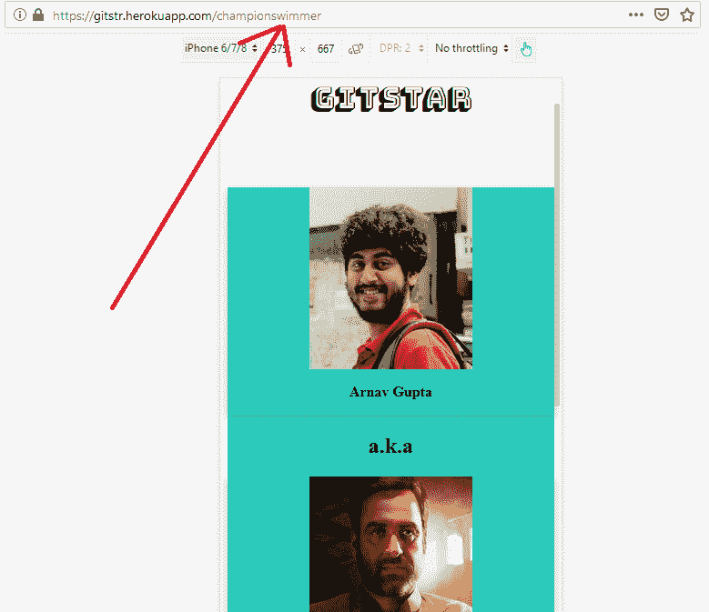

# 如何为 window.location.href 制定变通方法？

> 原文:[https://www . geesforgeks . org/如何为窗口位置制作变通方法-href/](https://www.geeksforgeeks.org/how-to-make-workaround-for-window-location-href/)

给定一个 **URL** ，任务是使用页面的**当前地址**，并使用**这个地址**执行操作。

**示例 1:** 此示例指向相同的 URL，并且仅重定向到相同的地址。**网址= ' https://gistr . herokupapp . com '**

```html
<!DOCTYPE html>
<html lang="en">

<head>
    <title>Example 1:</title>
</head>

<body bgcolor="white" ;>
    <div class="loginbox">
        
        <h1>GitStar</h1>
        <br>

        <form id="todoInputForm">
            <div class="avatar"></div>
            <p>Username</p>
            <input type="text"
                   placeholder="Enter your Github Username" 
                   class="input-username"
                   id="login" />
          <input type="submit" 
                 id="searchbtn name=" 
                 value="Search" />
      <a href=
"https://help.github.com/en/articles/changing-your-github-username ">
        Forgot your Username
          </a>
       <br>
      <a href="https://github.com/join ">Don't have an account?</a>
     <br>
    </form>
  </div>
 <script>
    $(document).ready(function () {
      $('#todoInputForm').submit(function (e) {
        e.preventDefault()
        var input = $('#login').val()
        window.location.href = '/'
      })
    })
  </script>
</body>
</html>
```

**输出:**

*   **点击*搜索*按钮前:搜索**
    
*   点击*搜索*按钮后:
    
    点击**搜索按钮后可以看到**网址没有变化，因为**第 38 行:window.location.href = '/'** 。

**示例 2:** 在本例中，我们希望使用 **window.location.href** 属性
来指向其他地址，让我们看看它是如何工作的。

```html
<!DOCTYPE html>
<html lang="en">

<head>
    <title>Example 2:</title>
</head>

<body bgcolor="white" ;>
    <div class="loginbox">
        
        <h1>GitStar</h1>
        <br>

        <form id="todoInputForm">
            <div class="avatar"></div>
            <p>Username</p>
            <input type="text"
                   placeholder="Enter your Github Username"
                   class="input-username" 
                   id="login" />
          <input type="submit"
                 id="searchbtn name" 
                 value="Search" />
      <a href="https://help.github.com/en/articles/changing-your-github-username">
        Forgot your Username
          </a>
          <br>
      <a href="https://github.com/join ">Don't have an account?</a>
      <br>
    </form>
  </div>
 <script>
    $(document).ready(function () {
      $('#todoInputForm').submit(function (e) {
        e.preventDefault()
        var input = $('#login').val()
        window.location.href = '/' + input;
      })
    })
  </script>
```

**输出:**

*   **点击按钮前:搜索**
    
*   **点击按钮后:搜索**
    
    如你所见，点击搜索按钮**后，由于**第 37 行的
    为:window . location . href = '/'+ input**，网址确实发生了变化**，现在是指默认的窗口位置+input。

这是一个简单的例子，展示了我如何在我的项目中使用 **window.location.href** 属性，如果你想更好地理解这个主题，以及当涉及到完整的后端和前端时它是如何工作的，那么一定要参考这个 [Github repo](https://github.com/imsashwat/GitStar) 。