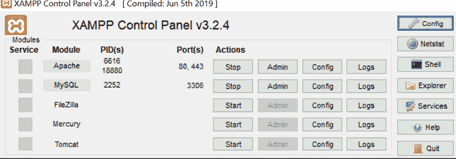
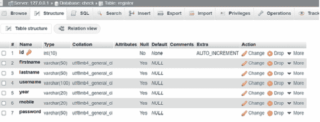
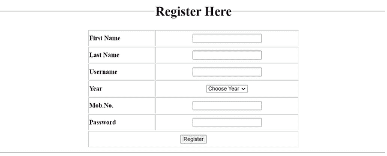
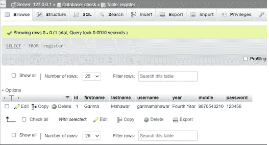
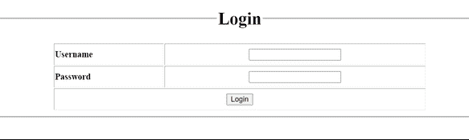
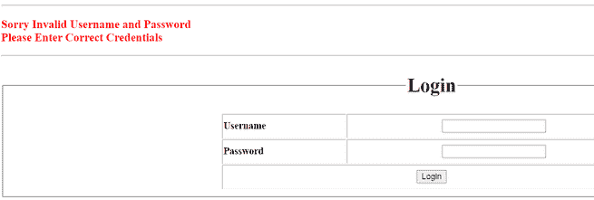
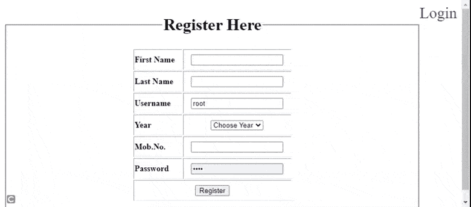

# 如何在 SQL 中匹配数据库中的用户名和密码？

> 原文:[https://www . geesforgeks . org/如何在 sql 数据库中匹配用户名和密码/](https://www.geeksforgeeks.org/how-to-match-username-and-password-in-database-in-sql/)

在本文中，我们将检查用户输入的凭据(用户名和密码)。如果数据库条目中的凭据匹配，用户可以进入另一个页面，如果凭据不正确，则会显示“对不起，用户名和密码无效”。

**先决条件:** [XAMPP 服务器](https://www.geeksforgeeks.org/how-to-install-xampp-on-windows/)[HTML 基础](https://www.geeksforgeeks.org/html-tutorials/)[CSS](https://www.geeksforgeeks.org/css-tutorials/)[PHP](https://www.geeksforgeeks.org/php-tutorials/)[MySQL](https://www.geeksforgeeks.org/mysql-common-mysql-queries/)。

**步骤 1:** 首先，我们必须从 XAMPP 控制面板启动 XAMPP 服务器。XAMPP 是捆绑软件。

打开 XAMPP 控制面板，启动 Apache 和 MySQL 服务。在 XAMPP 文件夹中，转到 *htdocs* 文件夹，并创建一个名为 check_username_pwd 的文件夹。我们会将所有文件保存在项目文件夹中。这些档案分别是*index.php、login.php、check.php。*



**第二步:**打开自己选择的编辑器。创建一个名为*connect.php*的文件来建立数据库连接。连接对象返回到 *$conn* 变量。数据库名称为*勾选*。

**connect . PHP:**[**<u>MySQL _ connect()</u>**](https://www.geeksforgeeks.org/php-mysqli_connect-function/)功能用于连接数据库。

## 服务器端编程语言（Professional Hypertext Preprocessor 的缩写）

```html
<?php
$conn = mysqli_connect("localhost", "root", "", "check");
?>
```

**步骤 3:** 创建数据库表。

*   转到 localhost/phpMyAdmin
*   创建一个名为*的数据库，勾选*。
*   现在点击 SQL 并编写下面提到的查询代码。

```html
CREATE TABLE register(
    id int(10) AUTO_INCREMENT PRIMARY KEY,
    firstname varchar(50),
    lastname varchar(50),
    username varchar(100),
    year varchar(20),
    mobile varchar(20),
    password varchar(50)
);
```

创建一个名为“*寄存器*的数据库表



**步骤 4:** 创建另一个名为*index.php*的文件

该页面是一个 PHP 表单，用于插入用户数据以创建用户名和密码。当插入数据时，会显示一条警告消息“您已成功注册”。该页面包含一个超链接登录，点击该用户跳转到*login.php。*

**index.php:**

## 服务器端编程语言（Professional Hypertext Preprocessor 的缩写）

```html
<?php

include("connect.php");

if(isset($_POST['submit'])) {
    $query = mysqli_query($conn,
    "INSERT INTO REGISTER SET firstname='"
    . $_POST["firstname"] . "'  ,lastname ='"
    . $_POST["lastname"] . "'   ,username ='"
    . $_POST["username"] . "'    ,year     ='"
    . $_POST["year"] . "'        ,mobile     ='"
    . $_POST["mob"] . "'        ,password ='"
    . $_POST["pwd"] . "'        ");

?>
<script>
    alert('You Registered Successfully, Login now');
</script>
<?php
}
?>
<html>

<head>
    <meta charset="utf-8">
    <title>Register Page</title>
    <style>
        th {
            text-align: left;
        }

        td {
            text-align: center;
        }

        a {
            text-decoration: none;
        }
    </style>
</head>

<body>
    <a href="login.php"
        style="font-size:30px; float:right;">
        Login
    </a>
    <form method="post" action="index.php" name="frm1">

        <fieldset>
            <legend align="center">
                <h1>Register Here</h1>
            </legend>
            <table align="center" border="1"
                width="40%" style="border:thick;">
                <tr>
                    <th height="40"><label for="firstname">
                            First Name</label>
                    </th>
                    <td><input type="text"
                        name="firstname"
                        id="firstname" required>
                    </td>
                </tr>
                <tr>
                    <th height="40"><label for="lastname">
                            Last Name</label>
                    </th>
                    <td><input type="text"
                            name="lastname"
                            id="lastname" required>
                    </td>
                </tr>
                <tr>
                    <th height="40"><label for="username">
                            Username</label>
                    </th>
                    <td><input type="text"
                        name="username"
                        id="username" required>
                    </td>
                </tr>
                <tr>
                    <th height="40">
                        <label for="year">Year</label>
                    </th>
                    <td><select name="year"
                        id="year" required>
                            <option value="">
                                Choose Year
                            </option>
                            <option value="First Year">
                                First Year
                            </option>
                            <option value="Second Year">
                                Second Year
                            </option>
                            <option value="Third Year">
                                Third Year
                            </option>
                            <option value="Fourth Year">
                                Fourth Year
                            </option>
                        </select>
                    </td>
                </tr>
                <tr>
                    <th height="40">
                        <label for="mob">Mob.No.</label>
                    </th>
                    <td><input type="tel" name="mob"
                            id="mob" required>
                    </td>
                </tr>
                <tr>
                    <th height="40">
                        <label for="pwd">Password</label>
                    </th>
                    <td><input type="password"
                        name="pwd" id="pwd" required>
                    </td>
                </tr>
                <tr>
                    <td height="40" colspan="2"><input
                        type="submit" name="submit"
                        value="Register">
                    </td>
                </tr>
            </table>
        </fieldset>
    </form>
</body>

</html>
```

**输出:**



这是通过*index.php*上提供的登记表输入数据后数据库的输出。



**步骤 5:** 创建另一个文件*login.php*。在这里，我们创建一个登录表单。当用户输入他们的*用户名*和*密码*时，如果是正确的用户，跳转到另一个页面*check.php*。

登录。php:

## 服务器端编程语言（Professional Hypertext Preprocessor 的缩写）

```html
<?php

include("connect.php");

if(isset($_POST['login'])) {
    $sql = mysqli_query($conn,
    "SELECT * FROM REGISTER WHERE username='"
    . $_POST["username"] . "' AND
    password='" . $_POST["pwd"] . "'    ");

    $num = mysqli_num_rows($sql);

    if($num > 0) {
        $row = mysqli_fetch_array($sql);
        header("location:check.php");
        exit();
    }
    else {
?>
<hr>
<font color="red"><b>
        <h3>Sorry Invalid Username and Password<br>
            Please Enter Correct Credentials</br></h3>
    </b>
</font>
<hr>

<?php
      }
}
?>
<html>

<head>
    <style>
        th {
            text-align: left;
        }

        td {
            text-align: center;
        }

        a {
            text-decoration: none;
        }
    </style>
</head>

<body>
    <form method="post" action="login.php">
        <fieldset>
            <legend align="center">
                <h1 align="center">Login</h1>
            </legend>
            <table width="50%" border="1"
                align="center" style="border:thick;">
                <tr>
                    <th height="40"><label for="username">
                        Username</label>
                    </th>
                    <td><input type="text" name="username"
                            id="username" required>
                        </td>
                </tr>
                <tr>
                    <th height="40"><label for="pwd">
                        Password
                    </label>
                    </th>
                    <td><input type="password"
                        name="pwd" id="pwd" required></td>
                </tr>
                <tr>
                    <td colspan="2" height="40"><input
                        type="submit" name="login"
                        value="Login"></td>
                </tr>
            </table>
        </fieldset>
    </form>
</body>

</html>
```

**输出:**



如果用户名和密码不匹配，则显示“对不起，用户名和密码无效”。



**步骤 6:** 创建另一个文件*check.php。*当用户输入正确的凭据，然后点击登录按钮时，该页面打开，这意味着用户名和密码从数据库中匹配。

## 服务器端编程语言（Professional Hypertext Preprocessor 的缩写）

```html
<html>

<body>
    <h2>
        Your login Credientials i.e.;
        Username, Password are matched
    </h2>
</body>

</html>
```

**输出:**


**第六步:**在浏览器中运行本项目。

*   打开浏览器(谷歌浏览器)
*   在 URL 栏“localhost/check_username_pwd/”中写入项目的正确路径

**输出:**

