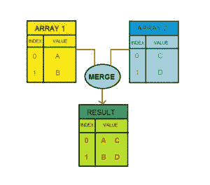

# 如何将一个数组的第一个索引和第二个数组的第一个索引合并？

> 原文:[https://www . geesforgeks . org/如何将数组的第一个索引与第二个数组的第一个索引合并/](https://www.geeksforgeeks.org/how-to-merge-the-first-index-of-an-array-with-the-first-index-of-second-array/)

任务是将一个数组的第一个索引与另一个数组的第一个索引合并。假设一个数组是 array1 = {a，b，c}，另一个数组是 array2 = {c，d，e}如果我们在这些数组上执行任务，那么输出将是

```html
result array
    { 
    [0]=> array(2) 
        { 
        [0]=> string(1) "a" 
        [1]=> string(1) "c" 
        } 
    [1]=> array(2) 
        { 
        [0]=> string(1) "b" 
        [1]=> string(1) "d" 
        } 
    [2]=> array(2) 
            { 
            [0]=> string(1) "c" 
            [1]=> string(1) "e" 
            } 
    }

```



大多数人认为 **array_merge()函数**可以解决上述需求，下面的代码说明了这不是实现的方法:

**例 1:** 使用 **array_merge()函数**会给你想要的结果。

## 服务器端编程语言（Professional Hypertext Preprocessor 的缩写）

```html
<?php
    $array1=array("a","b","c");
    $array2=array("c","d","e");
    $result=array_merge($array1,$array2);
    var_dump($result);
?>
```

**输出:**

```html
array(6) { [0]=> string(1) "a" 
           [1]=> string(1) "b" 
           [2]=> string(1) "c" 
           [3]=> string(1) "c" 
           [4]=> string(1) "d" 
           [5]=> string(1) "e" 
         }

```

为了通过索引组合这两个数组，我们必须循环遍历它们并合并。使得第一和第二阵列的第一索引一起形成结果阵列的第一索引。

**示例 2:** 合并两个简单数组的程序

## 服务器端编程语言（Professional Hypertext Preprocessor 的缩写）

```html
<?php
    $array1=array("a","b","c");
    $array2=array("c","d","e");
    $result=array();
    foreach($array1 as $key=>$value ){
      $val=$array2[$key];
      $result[$key]=array($value,$val);
    }

    var_dump($result);
?>
```

**输出:**

```html
array(3) { 
    [0]=> array(2) 
        { 
        [0]=> string(1) "a" 
        [1]=> string(1) "c" 
        } 
    [1]=> array(2) 
        { 
        [0]=> string(1) "b" 
        [1]=> string(1) "d" 
        } 
    [2]=> array(2) 
            { 
            [0]=> string(1) "c" 
            [1]=> string(1) "e" 
            } 
    }

```

**示例 3:** 合并 2 个复杂数组的程序

## 服务器端编程语言（Professional Hypertext Preprocessor 的缩写）

```html
<?php
    $array1=array(array("a","b"),array("c","d"));
    $array2=array(array("z","y"),array("x","w"));
    $result=array();
    foreach($array1 as $key=>$value ){
      $val=$array2[$key];
      $result[$key]=array($value,$val);
    }

    var_dump($result);
?>
```

**输出:**

```html
array(2) { 
    [0]=> array(2) 
        { 
        [0]=> array(2) 
            { 
            [0]=> string(1) "a" 
            [1]=> string(1) "b" 
            } 
        [1]=> array(2) 
            { 
            [0]=> string(1) "z" 
            [1]=> string(1) "y" 
            } 
        } 
    [1]=> array(2) 
        {
        [0]=> array(2) 
            { 
            [0]=> string(1) "c" 
            [1]=> string(1) "d" 
            } 
        [1]=> array(2) 
            { 
            [0]=> string(1) "x" 
            [1]=> string(1) "w" 
            } 
        } 
    }

```