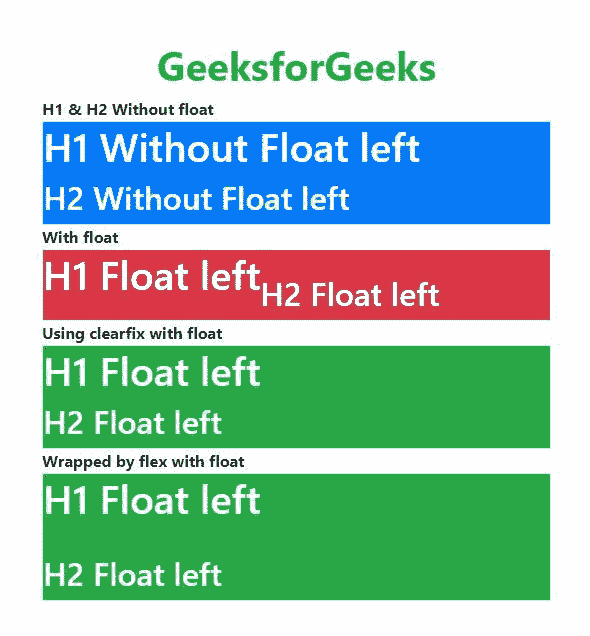

# 如何仅使用浮动属性将 H2 移动到 H1 下方？

> 原文:[https://www . geeksforgeeks . org/如何使用仅浮动属性在 h1 下移动 H2/](https://www.geeksforgeeks.org/how-to-move-h2-beneath-h1-by-using-only-float-property/)

**描述:**

*   在 Bootstrap 4 中，H2 标签可以添加在 H1 标签的下方。而在使用 float 的情况下，H2 标签不能添加到 H1 标签之下，因为由于 bootstrap 4 CSS 属性，H2 标签将移动到 H1 标签末尾之下。
*   为了消除这个问题，我们可以通过用一个具有 flex 属性的元素包装两个标签，或者通过用一个具有 clearfix 类的元素单独包装每个标签，来将 H2 移到 float 上的 H1 下面。

**示例 1:** 以下示例说明了如何仅使用浮动将 H2 移动到 H1 下方。

```html
<!DOCTYPE html>
<html lang="en">

<head>
    <meta charset="utf-8">
    <meta name="viewport" content="width=device-width, initial-scale=1">
    <link rel="stylesheet" href="
https://maxcdn.bootstrapcdn.com/bootstrap/4.3.1/css/bootstrap.min.css
">
    <script src="
https://ajax.googleapis.com/ajax/libs/jquery/3.4.1/jquery.min.js
"></script>
    <script src="
https://cdnjs.cloudflare.com/ajax/libs/popper.js/1.14.7/umd/popper.min.js
"></script>
    <script src="
https://maxcdn.bootstrapcdn.com/bootstrap/4.3.1/js/bootstrap.min.js
"></script>
</head>

<body>
    <div class="container-fluid p-5">
        <h1 class="text-success font-weight-bold text-center">
GeeksforGeeks</h1>
        <span class="font-weight-bolder">
          H1 & H2 Without float
      </span>
        <div class="border bg-primary text-white">
            <h1 class="">H1 Without Float left</h1>
            <h2 class="">H2 Without Float left</h2>
        </div>

        <span class="font-weight-bolder">With float</span>
        <div class="border bg-danger clearfix text-white">
            <h1 class="float-left  ">H1 Float left</h1>
            <br>
            <h2 class="float-left ">H2 Float left</h2>
        </div>

        <span class="font-weight-bolder">
          Using clearfix with float
      </span>
        <div class="border bg-success text-white">
            <span class="clearfix">
      <h1 class="float-left">H1 Float left</h1>
   </span>
            <span class="clearfix">
      <h2 class="float-left">H2 Float left</h2>
   </span>
        </div>

        <span class="font-weight-bolder">
          Wrapped by flex with float
      </span>
        <div class="border bg-success text-white d-flex flex-column">
            <h1 class="float-left  ">H1 Float left</h1>
            <br>
            <h2 class="float-left ">H2 Float left</h2>
        </div>
    </div>
</body>

</html>
```

**输出:**
