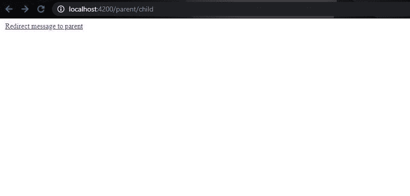
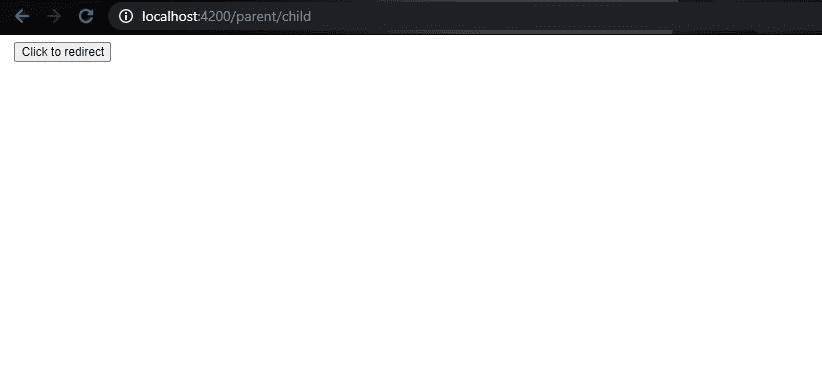
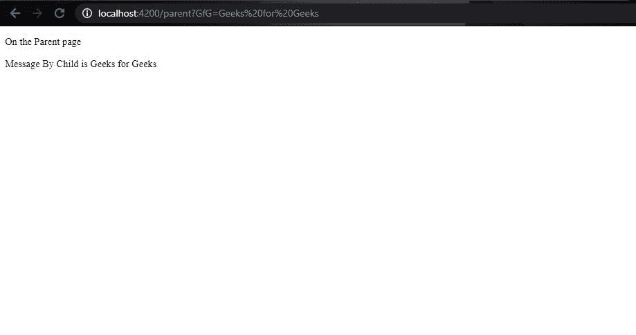

# 如何从子路线导航到父路线？

> 原文:[https://www . geesforgeks . org/如何从子路由导航到父路由/](https://www.geeksforgeeks.org/how-to-navigate-to-a-parent-route-from-a-child-route/)

在 angular 中，作为所有组件和其他组件的父组件的根组件可以称为根组件的子组件。这种结构是树的形式，其中子组件的父组件位于子组件之上，并且它们之间没有直接的链接，但是一般来说，父组件可以通过两种方式从子组件路由:

1.  在子对象链接到父对象的情况下，直接使用 routerLink 指令。
2.  在导航发生在触发事件时使用路由类。

**进场:**

在执行上述两个操作之前，需要在位于 **app-routing.module.ts** 文件中的 Route 类实例中注册这个组件。这将进一步用于从子代导航到父代。

路由应该在 **app-routing.module.ts** 文件中定义，如下所示:

```
import { NgModule } from '@angular/core';
import { Routes, RouterModule } from '@angular/router';
import { ParentComponent } from './parent/parent.component';
import { ChildComponent } from './parent/child/child.component';

const routes: Routes = [
  {path: 'parent' , component: ParentComponent},
  {path: 'parent/child' , component: ChildComponent}
];

@NgModule({
  imports: [RouterModule.forRoot(routes)],
  exports: [RouterModule]
})
export class AppRoutingModule { }

```

一旦完成，这两种方法中的任何一种都可以用来从一个子代路由到父代。
**语法:**

要为任何组件注册角度路由，请在 **app-routing.module.ts** 文件中设置路径和组件的类名。其语法如下:

```
import { Routes, RouterModule } from '@angular/router';
import { Component_1 } from 'path_to_component_1';
import { Component_2 } from 'path_to_component_2';

const routes: Routes = [
  {path: 'URL_mapping_component_1' , component: Component_1},
  {path: 'URL_mapping_component_2' , component: Component_2}
];

```

因为组件不同于网页，因此要用正确的网址路径注册，这将把相应的路径映射到相应的组件。

**基本示例和说明**

*   **使用 routerLink 指令:**

这是一种最简单的方法，可以用来重定向到整个项目中的任何组件。它在模板中用作一个选项，其作用等同于锚点标签中的 **href** 选项，不同之处在于，它将锚点链接到角度投影中的组件。

它用作定位标记中的指令。子模板文件代码如下所示:

## 超文本标记语言

```
<!DOCTYPE html>
<html lang="en">
<head>
    <meta charset="UTF-8">
    <meta name="viewport"
          content="width=device-width,
                   initial-scale=1.0">
    <title>Document</title>
</head>
<body>

     <a [routerLink]=
     "[ '/parent']" [queryParams]="{GfG: 'Geeks for Geeks'}">
               Redirect message to parent
      </a>
</body>
</html>
```

路由链接被设置为父组件路由。总而言之，queryParams 指令用于通过查询字符串向父组件发送消息。

在父组件文件中，可以按如下方式访问查询参数:

```
@Component({
  selector: 'app-parent',
  templateUrl: './parent.component.html',
  styleUrls: ['./parent.component.css']
})
export class ParentComponent implements OnInit {
  constructor( private activateRoute: ActivatedRoute) {
   }
   message = this.activateRoute.snapshot.queryParamMap.get('GfG')
  ngOnInit() {

  }

}

```

在消息变量中，接收参数并存储消息。它使用 ActivatedRoute 类捕获。

## 超文本标记语言

```
<!DOCTYPE html>
<html>
    <head>
      <title>Page Title</title>
    </head>
<body>

<p>On the Parent page </p>

<p>
    Message By Child is {{message}}
</p>

</body>
</html>
```

*   **使用路线导航()方法:**

在本节中，我们将使用来自 **@angular/route** 模块的 **Route** 类。route 对象用于通过。ts 文件。这个物体有一个**。导航()**方法路由到不同的模块。它需要两个参数，第一个是路由路径，第二个是由要发送的查询参数、与路由路径的相关性等信息组成的对象。当需要通过模板有条件地触发事件时，使用此方法。

```
import { Component, OnInit } from '@angular/core';
import { Router, ActivatedRoute } from '@angular/router';

@Component({
  selector: 'app-child',
  templateUrl: './child.component.html',
  styleUrls: ['./child.component.css']
})
export class ChildComponent implements OnInit {

  constructor(
private router: Router, 
private activatedRoute: ActivatedRoute) {}

  ngOnInit(){}
  redirect_to_parent(){  
  this.router.navigate(["../../parent"], {
  relativeTo: this.activatedRoute, queryParams: 
        {GfG: 'Geeks for Geeks'}});
} 
}

```

上面的代码是针对子组件文件的，其中使用模板中的一个按钮触发了一个方法 redirect_to_parent()，以执行重定向操作并向父组件发送消息。孩子的模板文件如下所示:

## 超文本标记语言

```
<!DOCTYPE html>
<html lang="en">
<head>
    <meta charset="UTF-8">
    <meta name="viewport"
          content="width=device-width,
                   initial-scale=1.0">
    <title>Document</title>
</head>
<body>

     <button (click)="redirect_to_parent()">
         Click to redirect
      </button>
</body>
</html>
```

**输出:**




