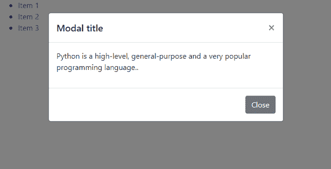
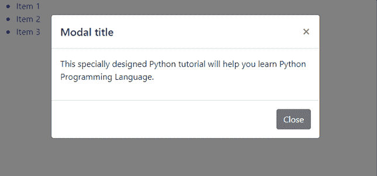
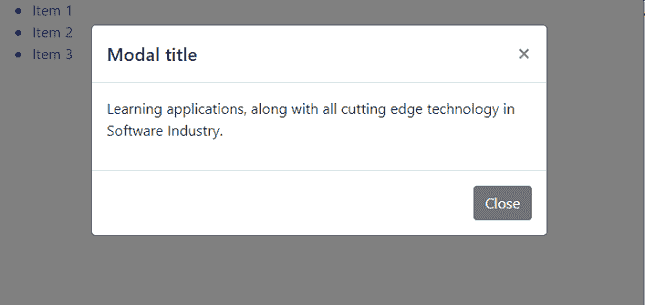
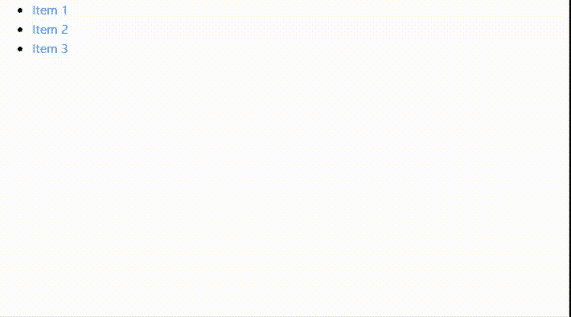

# 如何打开列表内部的不同模态？

> 原文:[https://www . geeksforgeeks . org/如何打开列表中的不同模式/](https://www.geeksforgeeks.org/how-to-open-a-different-modal-that-is-inside-of-a-list/)

级联样式表是一种样式表语言，与 HTML 和 JavaScript 一起用于构建网络应用程序。CSS 框架提供了一个库，允许更简单、标准化的网页设计。一个这样的 CSS 框架是 Bootstrap 4。Bootstrap 4 是最常用的 CSS 框架，因为它简单且内置库，提供了设计交互式用户界面所需的大量组件和实用程序。

列表和模式是 Bootstrap 4 中各种各样的预定义组件之一。模态是基于 HTML、CSS 和 JavaScript 的组合。模态位于文档中触发它的父元素之上，可以通过单击模态中的关闭选项来移除。另外，点击模态背景会自动关闭模态。Bootstrap 4 一次只支持一种模式。本文着重于打开一个列表中的不同模式。下面的示例演示了从列表项打开模式。

**第一种方法:**第一种方法处理包含完全不同内容的情态动词。在这种情况下，模态必须单独编码。

```html
<!DOCTYPE html>
<html>

<head>
    <link rel="stylesheet" href=
"https://stackpath.bootstrapcdn.com/bootstrap/4.4.1/css/bootstrap.min.css"
            integrity=
"sha384-Vkoo8x4CGsO3+Hhxv8T/Q5PaXtkKtu6ug5TOeNV6gBiFeWPGFN9MuhOf23Q9Ifjh"
        crossorigin="anonymous">
    <script src=
"https://code.jquery.com/jquery-3.4.1.slim.min.js" integrity=
"sha384-J6qa4849blE2+poT4WnyKhv5vZF5SrPo0iEjwBvKU7imGFAV0wwj1yYfoRSJoZ+n"
        crossorigin="anonymous">
    </script>
    <script src=
"https://cdn.jsdelivr.net/npm/popper.js@1.16.0/dist/umd/popper.min.js" 
        integrity=
"sha384-Q6E9RHvbIyZFJoft+2mJbHaEWldlvI9IOYy5n3zV9zzTtmI3UksdQRVvoxMfooAo"
        crossorigin="anonymous">
    </script>
    <script src=
"https://stackpath.bootstrapcdn.com/bootstrap/4.4.1/js/bootstrap.min.js"
        integrity=
"sha384-wfSDF2E50Y2D1uUdj0O3uMBJnjuUD4Ih7YwaYd1iqfktj0Uod8GCExl3Og8ifwB6"
        crossorigin="anonymous">
    </script>
</head>

<body>

    <!-- Button trigger modal -->
    <ul>
        <li data-toggle="modal" 
            data-target="#exampleModal1" 
            data-whatever="item 1">
            <a href="#">Item 1</a>
        </li>
        <li data-toggle="modal" 
            data-target="#exampleModal2" 
            data-whatever="item 2">
            <a href="#">Item 2</a>
        </li>
        <li data-toggle="modal" 
            data-target="#exampleModal3" 
            data-whatever="item 3">
            <a href="#">Item 3</a>
        </li>
    </ul>
    <!-- Modal -->
    <div class="modal fade" id="exampleModal1" 
        tabindex="-1" role="dialog" 
        aria-labelledby="exampleModalLabel"
        aria-hidden="true">
        <div class="modal-dialog" role="document">
            <div class="modal-content">
                <div class="modal-header">
                    <h5 class="modal-title" 
                        id="exampleModalLabel">
                        Modal title
                    </h5>
                    <button type="button" class="close" 
                        data-dismiss="modal" aria-label="Close">
                        <span aria-hidden="true">×</span>
                    </button>
                </div>
                <div class="modal-body">
                    <p>
                        Python is a high-level, general-purpose 
                        and a very popular programming language..
                    </p>
                </div>
                <div class="modal-footer">
                    <button type="button" class=
                        "btn btn-secondary" data-dismiss="modal">
                        Close
                    </button>
                </div>
            </div>
        </div>
    </div>

    <div class="modal fade" id="exampleModal2" 
        tabindex="-1" role="dialog" 
        aria-labelledby="exampleModalLabel"
        aria-hidden="true">
        <div class="modal-dialog" role="document">
            <div class="modal-content">
                <div class="modal-header">
                    <h5 class="modal-title" 
                        id="exampleModalLabel">
                        Modal title</h5>
                    <button type="button" class="close" 
                        data-dismiss="modal" aria-label="Close">
                        <span aria-hidden="true">×</span>
                    </button>
                </div>
                <div class="modal-body">
                    <p>
                        This specially designed Python 
                        tutorial will help you learn 
                        Python Programming Language.
                    </p>
                </div>
                <div class="modal-footer">
                    <button type="button" 
                        class="btn btn-secondary" 
                        data-dismiss="modal">
                        Close
                    </button>
                </div>
            </div>
        </div>
    </div>

    <div class="modal fade" id="exampleModal3" 
        tabindex="-1" role="dialog" 
        aria-labelledby="exampleModalLabel"
        aria-hidden="true">
        <div class="modal-dialog" role="document">
            <div class="modal-content">
                <div class="modal-header">
                    <h5 class="modal-title" 
                        id="exampleModalLabel">
                        Modal title
                    </h5>
                    <button type="button" class="close" 
                        data-dismiss="modal" 
                        aria-label="Close">
                        <span aria-hidden="true">×</span>
                    </button>
                </div>
                <div class="modal-body">
                    <p>
                        Learning applications, along with 
                        all cutting edge technology in 
                        Software Industry.
                    </p>
                </div>
                <div class="modal-footer">
                    <button type="button" 
                        class="btn btn-secondary" 
                        data-dismiss="modal">
                        Close
                    </button>
                </div>
            </div>
        </div>
    </div>
</body>

</html>
```

**输出**

*   点击“项目 1”会显示以下输出

    

*   点击“项目 2”会显示以下输出

    

*   点击“项目 3”将显示以下输出

    

**第二种方法:**第二种方法处理内容几乎相似但差异很小的情态动词。JavaScript 函数是为根据需求改变文本而编写的。当调用列表项的 show instance 方法时， **show.bs.modal** 事件会立即触发。单击的元素可作为事件的*相关目标*属性。目标元素存储在“li”变量中。接下来,*数据——无论目标元素的*值是什么，都存储在接收变量中。当前模态事件存储在模态变量中。这个模态变量调用 **find()** 方法找到模态“title”和模态“body”，并用需要的文本替换。

```html
<!DOCTYPE html>
<html>

<head>
    <link rel="stylesheet" href=
"https://stackpath.bootstrapcdn.com/bootstrap/4.4.1/css/bootstrap.min.css"
        integrity=
"sha384-Vkoo8x4CGsO3+Hhxv8T/Q5PaXtkKtu6ug5TOeNV6gBiFeWPGFN9MuhOf23Q9Ifjh" 
        crossorigin="anonymous">
    <script src="https://code.jquery.com/jquery-3.4.1.slim.min.js"
        integrity=
"sha384-J6qa4849blE2+poT4WnyKhv5vZF5SrPo0iEjwBvKU7imGFAV0wwj1yYfoRSJoZ+n" 
        crossorigin="anonymous">
    </script>
    <script src=
"https://cdn.jsdelivr.net/npm/popper.js@1.16.0/dist/umd/popper.min.js"
        integrity=
"sha384-Q6E9RHvbIyZFJoft+2mJbHaEWldlvI9IOYy5n3zV9zzTtmI3UksdQRVvoxMfooAo" 
        crossorigin="anonymous">
    </script>
    <script src=
"https://stackpath.bootstrapcdn.com/bootstrap/4.4.1/js/bootstrap.min.js"
        integrity=
"sha384-wfSDF2E50Y2D1uUdj0O3uMBJnjuUD4Ih7YwaYd1iqfktj0Uod8GCExl3Og8ifwB6"
        crossorigin="anonymous">
    </script>
</head>

<body>

    <!-- Button trigger modal -->
    <ul>
        <li data-toggle="modal" 
            data-target="#exampleModal" 
            data-whatever="item 1">
            <a href="#">Item 1</a>
        </li>
        <li data-toggle="modal" 
            data-target="#exampleModal" 
            data-whatever="item 2">
            <a href="#">Item 2</a>
        </li>
        <li data-toggle="modal" 
            data-target="#exampleModal" 
            data-whatever="item 3">
            <a href="#">Item 3</a>
        </li>
    </ul>
    <!-- Modal -->
    <div class="modal fade" id="exampleModal" 
        tabindex="-1" role="dialog" 
        aria-labelledby="exampleModalLabel"
        aria-hidden="true">
        <div class="modal-dialog" role="document">
            <div class="modal-content">
                <div class="modal-header">
                    <h5 class="modal-title" 
                        id="exampleModalLabel">
                        Modal title
                    </h5>
                    <button type="button" class="close" 
                        data-dismiss="modal" 
                        aria-label="Close">
                        <span aria-hidden="true">×</span>
                    </button>
                </div>
                <div class="modal-body">
                    <p> hi</p>
                </div>
                <div class="modal-footer">
                    <button type="button" 
                        class="btn btn-secondary" 
                        data-dismiss="modal">
                        Close
                    </button>
                </div>
            </div>
        </div>
    </div>
    <script>
        $('#exampleModal').on('show.bs.modal', 
        function (event) {

            // Button that triggered the modal
            var li = $(event.relatedTarget)

            // Extract info from data attributes 
            var recipient = li.data('whatever')

            // Updating the modal content using 
            // jQuery query selectors
            var modal = $(this)

            modal.find('.modal-title')
                .text('New message to ' + recipient)

            modal.find('.modal-body p')
                .text('Welcome to ' + recipient)
        })
    </script>
</body>

</html>
```

**输出**
