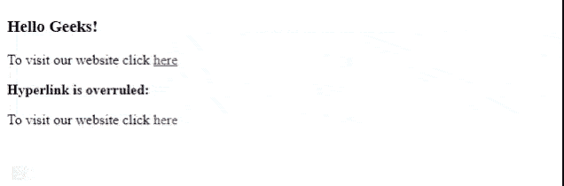

# 如何否决下划线超链接？

> 原文:[https://www . geeksforgeeks . org/如何否决-下划线-超链接/](https://www.geeksforgeeks.org/how-to-overrule-underlining-hyperlinks/)

在 CSS 中，超链接默认带有下划线。这是由于 HTML/CSS *强加的*默认*装饰。*为了去掉这条下划线，我们需要使用 CSS 对锚点标签的默认装饰做以下更改。我们可以通过使用 [CSS 文本修饰属性](https://www.geeksforgeeks.org/css-text-decoration-property/)来去除底层超链接。如果此属性设置为无，则不会显示下划线超链接。

**语法:**

```html
a { 
    text-decoration: none; 
}
```

**示例:**在给定的示例中，HTML 文档中添加了两个超链接，这两个超链接指向[*【geeksforgeeks.org】*](https://www.geeksforgeeks.org/)网站。默认情况下，超链接(*)*带下划线。要删除下划线，CSS 将以下列方式在第二个超链接中使用。实施上述更改后，下划线将被删除。

## 超文本标记语言

```html
<!DOCTYPE html>
<html lang="en">

<head>
    <style>

        /* Changing anchor tag's text
           decoration to none */
        #a2 {
            text-decoration: none;
        }
    </style>
</head>

<body>
    <h3>Hello Geeks!</h3>

    <!-- Defining hyperlink 'here' using
        <a> tag -->

<p>To visit our website click
        <a href="https://www.geeksforgeeks.org/">here</a>
    </p>

    <b>Hyperlink is overruled:</b>

<p>To visit our website click
        <a id="a2" href="https://www.geeksforgeeks.org/">
            here
        </a>
    </p>

</body>

</html>
```

**输出:**



否决超链接