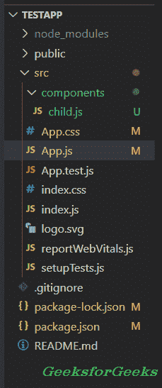
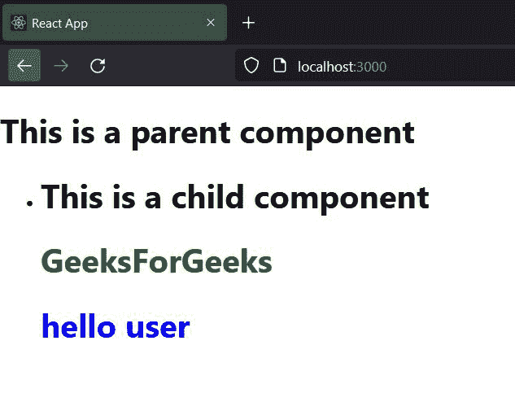

# 如何将属性从父组件道具传递给子组件？

> 原文:[https://www . geesforgeks . org/如何将属性从父组件传递到子组件/](https://www.geeksforgeeks.org/how-to-pass-property-from-a-parent-component-props-to-a-child-component/)

在本文中，我们将学习如何在 React js 中将属性从父组件传递给子组件。在 React 中将子组件嵌入父组件时，开发人员需要从父组件向子组件发送属性或数据。

React.js 允许我们使用 props(属性的缩写)将数据从父组件传递给子组件。我们必须在子组件中设置道具值，同时将其嵌入到父组件中。

**先决条件:**本教程的先决条件是:

*   [反应知识](https://www.geeksforgeeks.org/react-js-introduction-working/)
*   [级组件](https://www.geeksforgeeks.org/reactjs-class-based-components/)
*   [功能组件](https://www.geeksforgeeks.org/reactjs-functional-components/)

**创建应用程序:**下面的命令将帮助你[启动一个新的 react 应用程序](https://www.geeksforgeeks.org/reactjs-setting-development-environment/)。

```
npx create-react-app testapp
```

接下来，您必须从终端移动到“**test PP**”项目文件夹。

```
cd testapp
```

在 *src* 文件夹内创建一个新的**组件**文件夹，并在组件文件夹内创建一个名为 **child.js** 的组件。

**项目目录:**应该是这样的。



### **使用类组件将属性从父组件传递给子组件**

当用户使用类组件将数据从父组件传递给子组件时，他们可以使用“[*【this . props . property _ name】*](https://www.geeksforgeeks.org/reactjs-props-set-1/)*访问子组件内部。*

**步骤:**

1.  将子组件嵌入到父组件中。
2.  将带有赋值的数据变量(道具)作为参数传递给子组件，同时将其嵌入父组件。
3.  如果用户想要传递多个数据变量(道具)，所有变量名都应该是唯一的。
4.  在子组件中，使用“this.props.variable_name”访问数据变量值。

**示例:**

**文件名:App.js** 在这个文件中，我们将子组件嵌入到父组件中。此外，我们将多个道具传递给子组件。

## java 描述语言

```
import React, { Component } from 'react';
import Child from './components/child.js';

// Child component embeded to parent component
// with props value
class App extends Component {
  render() {
    return (
      <div>
        <h1>This is a parent component</h1>
        <ul>
         <li>
          <Child gfgcolor="green" usercolor="blue"/>
         </li>
        </ul>
      </div>
    );
  }
}

export default App;
```

**文件名:Child.js** 在 Child.js 文件中，我们将从父组件中访问道具，并在子组件中渲染它们。

## java 描述语言

```
import React, { Component } from 'react';

// Accessing the props value using this.props
class Child extends Component {
  render() {
    return (
      <div>
        <h1>This is a child component</h1>
        <h1 style={{color: this.props.gfgcolor}}>
          GeeksForGeeks
        </h1>
        <h1 style={{color: this.props.usercolor}}>
          hello user
        </h1>  
      </div>
    );
  }
}

export default Child;
```

**运行应用程序的步骤:**打开终端，键入以下命令。

```
npm start
```

**输出:**



在上面的输出图像中，用户可以看到 HTML 元素的颜色根据道具值而改变。

### 使用功能组件将属性从父组件传递给子组件

要使用功能组件从父组件到子组件访问属性，用户不需要像类组件那样使用“ *this.props* ”。用户只能通过写变量名来访问道具值。

**步骤:**

1.  将子组件嵌入到父组件中。
2.  将道具作为参数传递给子组件，同时将其嵌入父组件。
3.  在子组件中，仅通过写入名称或变量来访问数据变量值。

**示例:**

**Filename: App.js** 在 App.js 中，我们会添加一个功能组件，用道具及其价值调用一个子组件。

## java 描述语言

```
import React, { Component } from 'react';
import Child from './components/child.js';

// parent component
// embeding child component inside it
function App (){
  return(
    <div>
    <h1>This is a parent component</h1>
    <ul><li>
  <Child gfgcolor="green" usercolor="blue"/></li>
  </ul>
  </div>
  )
}
```

**Filename: child.js** 在 child.js 中，我们将添加道具作为功能组件的参数，并在组件内部使用。

## java 描述语言

```
import React, { Component } from 'react';

// Passing props as a parameter
// inside the child component
function Child ({gfgcolor,usercolor}){
  return(
      <div>
        <h1>This is a child component</h1>
        <h1 style={{color: gfgcolor}}>GeeksForGeeks</h1>
        <h1 style={{color: usercolor}}>hello user</h1>  
      </div>
  )
}
```

**运行应用程序的步骤:**打开终端，键入以下命令。

```
npm start
```

**输出:**

