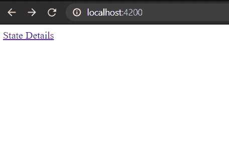
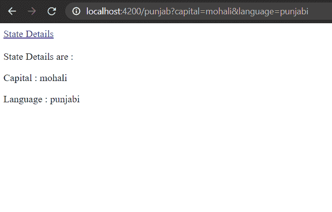

# 如何用 routerLink 传递查询参数？

> 原文:[https://www . geesforgeks . org/how-to-pass-query-parameters-with-a-router link/](https://www.geeksforgeeks.org/how-to-pass-query-parameters-with-a-routerlink/)

任务是用 routerLink 传递查询参数，为此我们可以使用**属性绑定**概念来达到目的。使用属性绑定，我们可以绑定 queryParams 属性，并可以在对象中提供所需的详细信息。

**什么是属性绑定？**

这是一个概念，我们使用方括号符号将数据绑定到超文本标记语言元素的文档对象模型属性。

**语法:**

```
<a [routerLink]="[/path]" [queryParams]="{property:value}">
   State Details 
</a>

```

**属性绑定示例:**

## java 描述语言

```
import { Component, OnInit } from '@angular/core'

@Component({

    selector: 'app-property',
    template:
        // Property Binding 
        `<p [textContent]="title"></p>`
})

export class AppComponent implements OnInit {

    constructor() { }
    ngOnInit() { }

    title = 'Property Binding example in GeeksforGeeks';

}
```

**输出:**


上述代码的图示

**进场:**

*   首先，在 app.module.ts 中配置路由
*   在 HTML 文件中实现带有必需值的查询参数。
*   然后进去。ts 文件，通过从“angular@router”导入，尝试使用激活的路由访问查询参数
*   一旦您能够访问它们，请尝试在 HTML 文件中使用字符串插值语法或属性绑定语法来呈现它们。

下面是上述步骤的实现:

**app.module.ts:**

## java 描述语言

```
import { NgModule } from '@angular/core';
import { BrowserModule } from 
            '@angular/platform-browser';

// Importing Routes
import { RouterModule, Routes } 
        from '@angular/router';

import { AppComponent } from 
            './app.component';

import { StateComponent } from 
        './state/state.component';

// Configuring Routes
const routes: Routes = [{ 
    path: 'punjab', 
    component: StateComponent 
},];

@NgModule({
    imports: [BrowserModule, R
        outerModule.forRoot(routes)],

    declarations: [AppComponent, 
        StateComponent],
    bootstrap: [AppComponent]
})
export class AppModule { }
```

**app.component.html:**

## 超文本标记语言

```
<a [routerLink]="['/punjab']" [queryParams]=
    "{capital:'mohali',language:'punjabi'}">
    State Details
</a>
<router-outlet></router-outlet>
```

**点击锚点标签**后，网址会以如下方式显示:


我们还可以使用激活的路由访问查询参数。

这样，我们可以通过 routerLink 传递查询参数。

**获取查询参数:**

**state.component.ts :**

## java 描述语言

```
import { Component, OnInit } from '@angular/core';
import { ActivatedRoute } from '@angular/router';

@Component({
  selector: 'app-state',
  templateUrl: './state.component.html',
  styleUrls: ['./state.component.css']
})
export class StateComponent implements OnInit {

  capital: string;
  language:string;

  constructor(private route: ActivatedRoute) { }

  ngOnInit() {
    this.route.queryParams.subscribe(
      params => {
        this.capital =  params['capital'];
        this.language=params['language'];
      }
    )
  }

}
```

**state.component.html:**

## 超文本标记语言

```
State Details are : 

<p>Capital  : {{capital}} </p>

<p>Language : {{language}} </p>
```

**输出:**

*   **点击按钮前:**

    

*   **点击按钮后:**可以看到传递的查询参数

    