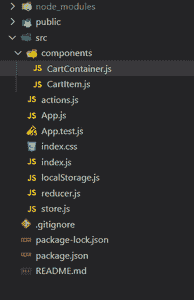

# 在没有任何外部库的情况下，如何在本地存储中持久化 Redux 状态？

> 原文:[https://www . geeksforgeeks . org/如何持久化-redux-state-in-local-storage-不带任何外部库/](https://www.geeksforgeeks.org/how-to-persist-redux-state-in-local-storage-without-any-external-library/)

根据官方文档，Redux 是 JavaScript 应用程序的可预测状态容器。简单来说就是一个状态管理库，在 Redux 的帮助下管理组件的状态变得非常容易。我们可以通过创建一个称为商店的全局状态来管理应用程序的状态。

对于一个复杂的 react 应用程序来说，使用 Redux 的想法可能很好，但是这种状态并不是一直持续的。这意味着一旦你重新加载浏览器，应用程序的状态就会改变，并达到默认状态。保存此类 react 应用程序的数据非常容易。我们将使用本地存储来存储 React 应用程序的当前状态，即使在重新加载时也能保存数据。

**创建反应应用程序并安装模块:**

**步骤 1:** 使用以下命令创建一个反应应用程序:

```
npx create-react-app myapp
```

**步骤 2:** 创建项目文件夹(即 **myapp)后，使用以下命令将**移动到该文件夹:

```
cd myapp
```

**步骤 3:** 创建 ReactJS 应用程序后，使用以下命令安装所需的模块:

```
npm install redux
npm install react-redux
```

**项目结构:**如下图。



项目结构

**示例:**我们将创建一个简单的购物车应用程序，通过它我们将数据持久化到本地存储中。

**Filename- App.js** 这是我们 React 应用的 App 组件。典型的 react 应用程序所需的所有依赖项都会被导入。提供程序函数是从 react-redux 导入的。这将作为我们的应用程序的包装组件，我们将把商店传递给这个包装组件。商店基本上是我们应用程序的全局状态。

## java 描述语言

```
import React from "react";
import { Provider } from 'react-redux';
import CartContainer from "./components/CartContainer";

// Store
import { store } from './store';
import { saveState } from './localStorage';

store.subscribe(() => {
  saveState({
    cart: store.getState().cart,
    total: store.getState().total,
    amount: store.getState().amount
  });
});

// Items
const cartItems = [
  {
    id: 1,
    title: "Samsung",
    price: 799.99,
    img:
      "shorturl.at/ajkq9",
    amount: 1
  },
  {
    id: 2,
    title: "Google pixel Max",
    price: 399.99,
    img:
      "shorturl.at/ajkq9",
    amount: 1
  },
  {
    id: 3,
    title: "Xiaomi",
    price: 999.99,
    img:
      "shorturl.at/ajkq9",
    amount: 1
  }
];

function App() {
  return (
    <Provider store={store}>
      <CartContainer cart={cartItems} />
    </Provider>
  );
}

export default App;
```

**Filename- store.js** 在这个文件中，基本的存储设置是使用 redux 完成的。存储被初始化，状态被保存到本地存储。redux 商店包含总额、金额和购物车项目。该存储的状态稍后将保存在本地存储中。

## java 描述语言

```
import reducer from './reducer';
import { createStore } from 'redux';
import { loadState } from './localStorage';

const cartItems = [
  {
    id: 1,
    title: "Samsung",
    price: 799.99,
    img:
      "shorturl.at/ajkq9",
    amount: 1
  },
  {
    id: 2,
    title: "Google pixel Max",
    price: 399.99,
    img:
      "shorturl.at/ajkq9",
    amount: 1
  },
  {
    id: 3,
    title: "Xiaomi",
    price: 999.99,
    img:
      "shorturl.at/ajkq9",
    amount: 1
  }
];

const persistedState = loadState();

const initialStore = {
  cart: cartItems,
  amount: 0,
  total: 0,
  persistedState
}

export const store = createStore(reducer, persistedState);
```