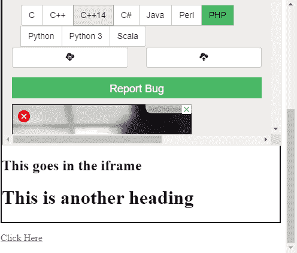

# 如何在 IE 的 iframe 中放置 div？

> 原文:[https://www . geesforgeks . org/how-to-place-a-div-in-iframe-for-ie/](https://www.geeksforgeeks.org/how-to-place-a-div-inside-an-iframe-for-ie/)

**简介:**一个 Iframe 用于在网页内显示一个网页(或者可能是一个文档)，即它加载当前页面内一个页面(或者文档)的内容。

**Iframe 语法:**

```htmlhtml
<iframe src="URL"></iframe>

```

**方法 1:** 要在 iframe 中添加额外的 div，您需要使用包装 div，它将您想要的 div 和 iframe 的内容包装成一个单元。这样，您可以显示 div 的内容以及嵌入到文档/网页中的 iframe。

**示例:**

```htmlhtml
<!DOCTYPE html>
<html>

<head>
    <title>
        How to place a div inside
        an iframe for IE?
    </title>
</head>

<body>
    <h2>Div in an Iframe</h2>

    <div id="container" style="border: solid 2px #000;">
        <iframe height="500px" 
            width="100%" name="iframe_a">
        </iframe>

        <div>
            <h2>This goes in the iframe</h2>
            <h1> This is another heading </h1>
        </div>

        <!-- Put all your contents 
            of the div here -->
    </div>

    <p><a href="https://ide.geeksforgeeks.org/" 
            target="iframe_a">
            Click Here
        </a>
    </p>
</body>

</html>                    
```

**输出:**


**说明:**带有 *id = "container"* 的 div 是 iframe 和 div 内容的包装器/容器，因此 div 的内容与 iframe 一起显示。

**方法 2:** 处理问题的另一种方法是使用 iframe 本身来显示 div 的内容，而不是与 iframe 一起显示。然而，这样 iframe 只在任何时间点显示 div 或网页/文档的内容，因此这种方法有点受限。

**语法:**

```htmlhtml
<iframe srcdoc="div goes here"></iframe>

```

**示例:**

```htmlhtml
<!DOCTYPE html>
<html>

<head>
    <title>
        How to place a div inside
        an iframe for IE?
    </title>
</head>

<body>
    <h2>Div in an Iframe</h2>
    <div id="container" style=
            "border: solid 2px #000;">
        <iframe srcdoc="<div>
            <h2>This goes in the iframe</h2>
             </div>" height="500px" 
             width="100%" name="iframe_a">
        </iframe>
        <!-- Put all your contents 
            of the div here -->
    </div>

    <p><a href="https://ide.geeksforgeeks.org/"
            target="iframe_a">
            Click Here
        </a>
    </p>
</body>

</html>
```

**输出:**


**解释:**在上面的例子中，iframe 显示包含文本的 div:“这进入 iframe”，并且每当点击“点击这里”链接时，iframe 加载 iframe 中的目标 URL 页面，覆盖先前存在的 div。这样做将加载维基百科页面，但是，要再次显示 div 的内容，您需要重新加载页面。