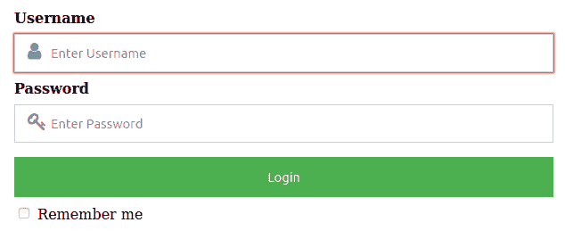

# 如何在输入栏放置 Font Awesome 图标？

> 原文:[https://www . geesforgeks . org/how-to-place-font-awesome-icon-to-input-field/](https://www.geeksforgeeks.org/how-to-place-font-awesome-icon-to-input-field/)

在你的表单中放置字体棒极了的图标是一个创新的想法，它会给你的网站带来关注。这就像在任何一个按钮上放置字体牛逼图标一样简单。 **< i >** 标签和**T6】span>**标签被广泛用于在网页上添加图标。要在网页上添加任何图标，它需要标题部分中的字体棒极了的链接。字体棒极了的图标可以通过在图标名称前使用 fa 前缀来放置。

**Fontawesome 链接:**

> https://cdnjs.cloudflare.com/ajax/libs/font-awesome/4.7.0/css/font-awesome.min.css

**示例:**在本例中，我们将采用一种需要输入字段的形式。之后，我们将在输入栏中放置字体棒极了的图标。我们将使用 CDN 链接来使用令人敬畏的字体图标。在输入字段之后，我们将放置我们的图标。然后在 **[CSS 位置属性](https://www.geeksforgeeks.org/css-positioning-elements/)** 的帮助下，我们将图标放置在输入栏上。

下面是上述方法的实现:

```html
<!DOCTYPE html> 
<html> 

<head>
    <link rel="stylesheet" href= 
"https://cdnjs.cloudflare.com/ajax/libs/font-awesome/4.7.0/css/font-awesome.min.css"> 

    <style> 

        /* Assign full width inputs*/ 
        input[type=text], 
        input[type=password] { 
            width: 100%; 
            padding: 12px 40px; 
            margin: 8px 0; 
            display: inline-block; 
            border: 1px solid #ccc; 
            box-sizing: border-box; 
        } 

        /* Set a style for the buttons*/ 
        button { 
            background-color: #4CAF50; 
            color: white; 
            padding: 14px 20px; 
            margin: 8px 0; 
            border: none; 
            cursor: pointer; 
            width: 100%; 
        } 

        /* Set a hover effect for the button*/ 
        button:hover { 
            opacity: 0.8; 
        } 

        /* Set extra style for the cancel button*/ 
        .container { 
            padding: 16px; 
        } 

        .fontuser {
            position: relative;
        }

        .fontuser i{
            position: absolute;
            left: 15px;
            top: 40px;
            color: gray;
        }

        .fontpassword {
            position: relative;
        }

        .fontpassword i{
            position: absolute;
            left: 15px;
            top: 40px;
            color: gray;
        }
    </style> 
</head>

<body> 
    <div class="container"> 
        <div class="fontuser">
            <label><b>Username</b></label> 
            <input type="text" 
                    placeholder="Enter Username"
                    name="uname" required> 
            <i class="fa fa-user fa-lg"></i>
        </div>

        <div class="fontpassword">
            <label><b>Password</b></label> 
            <input type="password"
                    placeholder="Enter Password"
                    name="psw" required> 
            <i class="fa fa-key fa-lg"></i>
        </div>     

        <button type="submit">Login</button> 
        <input type="checkbox" checked="checked">
                Remember me 
    </div> 
</body> 

</html>
```

**输出:**


HTML 是网页的基础，通过构建网站和网络应用程序用于网页开发。您可以通过以下 [HTML 教程](https://www.geeksforgeeks.org/html-tutorials/)和 [HTML 示例](https://www.geeksforgeeks.org/html-examples/)从头开始学习 HTML。

CSS 是网页的基础，通过设计网站和网络应用程序用于网页开发。你可以通过以下 [CSS 教程](https://www.geeksforgeeks.org/css-tutorials/)和 [CSS 示例](https://www.geeksforgeeks.org/css-examples/)从头开始学习 CSS。