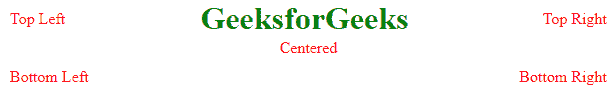

# 如何在图像中的任意位置放置文本？

> 原文:[https://www . geeksforgeeks . org/如何在任何需要的位置放置图像中的文本/](https://www.geeksforgeeks.org/how-to-place-text-in-an-image-at-any-desired-position/)

在我们的日常生活中，我们会遇到很多情况，我们想在理想的位置，在图像上写下文字。在本文中，您将学习如何使用元素的定位在图像上书写文本。在转到概念之前，我们首先需要了解元素的位置定位通常意味着您希望元素出现在网站上的位置。

定位有**静态**、**相对**、**绝对**、**粘性**等多种选择。因此，这里我们将使用 position 属性将文本放置在图像中。

**语法:**

```html
position: static|absolute|fixed|relative|sticky|initial|inherit;

```

在本文中，您将了解到在图像上书写文字所需的**相对**和**绝对**

*   **相对定位:**该方法用于给出相对于正常位置的元素位置。
*   **绝对定位:**在此方法中，元素相对于其定位的祖先进行定位(定位意味着祖先的位置不是静态的)*，因为静态是默认定位。

**原图:**


**示例:**

```html
<!DOCTYPE html>
<html>

<head>
    <meta name="viewport" 
          content="width=device-width, initial-scale=1">
    <style>
        .container {
            position: relative;
            text-align: center;
            color: green;
        }

        .bottom-left {
            position: absolute;
            bottom: 8px;
            left: 16px;
        }

        .top-left {
            position: absolute;
            top: 8px;
            left: 16px;
        }

        .top-right {
            position: absolute;
            top: 8px;
            right: 16px;
        }

        .bottom-right {
            position: absolute;
            bottom: 8px;
            right: 16px;
        }

        .centered {
            position: absolute;
            top: 50%;
            left: 50%;
            transform: translate(-50%, -50%);
        }
    </style>
</head>

<body>
    <div class="container">
        
        <div class="bottom-left">Bottom Left</div>
        <div class="top-left">Top Left</div>
        <div class="top-right">Top Right</div>
        <div class="bottom-right">Bottom Right</div>
        <div class="centered">Centered</div>
    </div>
</body>

</html>
```

**输出:**
