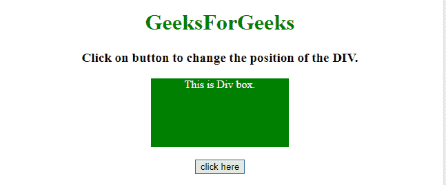
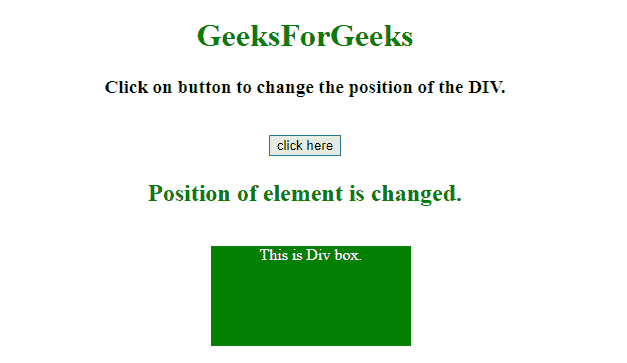
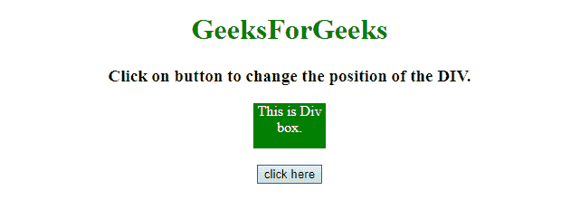
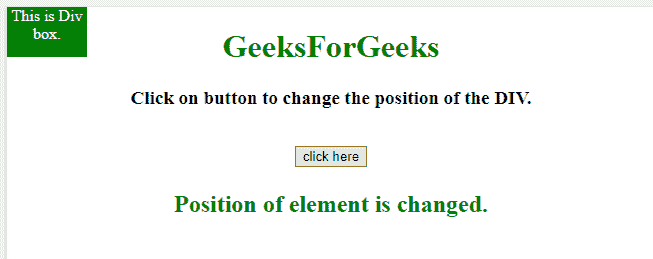

# 如何在特定坐标定位 div？

> 原文:[https://www . geeksforgeeks . org/如何在特定坐标定位 a-div/](https://www.geeksforgeeks.org/how-to-position-a-div-at-specific-coordinates/)

给定一个 HTML 文档，任务是使用 JavaScript 在网页的特定坐标上定位一个 **< div >** 。我们将讨论一些技巧。

**进场:**

*   首先设置元素的 **style.position** 属性。
*   然后设置我们想要定位的元素的 **style.top，style.left** 属性。

**示例 1:** 在本例中，DIV 位于文档的末尾。

```html
<!DOCTYPE HTML>
<html>

<head>
    <title>
        JavaScript 
      | Position a DIV in a specific coordinates.
    </title>
    <style>
        #GFG_DIV {
            background: green;
            height: 100px;
            width: 200px;
            margin: 0 auto;
            color: white;
        }
    </style>
</head>

<body style="text-align:center;" id="body">
    <h1 style="color:green;">  
            GeeksForGeeks  
        </h1>
    <p id="GFG_UP" 
       style="font-size: 19px;
              font-weight: bold;">
    </p>
    <div id="GFG_DIV">
        This is Div box.
    </div>
    <br>
    <button onClick="GFG_Fun()">
        click here
    </button>
    <p id="GFG_DOWN" 
       style="color: green; 
              font-size: 24px; 
              font-weight: bold;">
    </p>
    <script>
        var el_up = 
            document.getElementById(
              "GFG_UP");
        var el_down = 
            document.getElementById(
              "GFG_DOWN");
        el_up.innerHTML = 
          "Click on button to change"+
          " the position of the DIV.";

        function GFG_Fun() {
            var x = 370;
            var y = 250;
            var el = document.getElementById('GFG_DIV');
            el.style.position = "absolute";
            el.style.left = x + 'px';
            el.style.top = y + 'px';
            el_down.innerHTML = 
              "Position of element is changed.";
        }
    </script>
</body>

</html>
```

**输出:**

*   **点击按钮前:**
    
*   **点击按钮后:**
    

**示例 2:** 在本例中，DIV 位于文档的左上角。

```html
<!DOCTYPE HTML>
<html>

<head>
    <title>
        JavaScript | 
      Position a DIV in a specific coordinates.
    </title>
    <style>
        #GFG_DIV {
            background: green;
            height: 50px;
            width: 80px;
            margin: 0 auto;
            color: white;
        }
    </style>
</head>

<body style="text-align:center;"
      id="body">
    <h1 style="color:green;">  
            GeeksForGeeks  
        </h1>
    <p id="GFG_UP" 
       style="font-size: 19px;
              font-weight: bold;">
    </p>
    <div id="GFG_DIV">
        This is Div box.
    </div>
    <br>
    <button onClick="GFG_Fun()">
        click here
    </button>
    <p id="GFG_DOWN" 
       style="color: green; 
              font-size: 24px;
              font-weight: bold;">
    </p>
    <script>
        var el_up = 
            document.getElementById("GFG_UP");
        var el_down = 
            document.getElementById("GFG_DOWN");
        el_up.innerHTML = 
          "Click on button to change the position of the DIV.";

        function GFG_Fun() {
            var x = 0;
            var y = 0;
            var el = document.getElementById('GFG_DIV');
            el.style.position = "absolute";
            el.style.left = x + 'px';
            el.style.top = y + 'px';
            el_down.innerHTML = "Position of element is changed.";
        }
    </script>
</body>

</html>
```

**输出:**

*   **点击按钮前:**
    
*   **点击按钮后:**
    