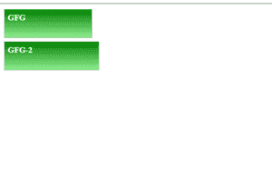

# 如何在新的一行中定位绝对渲染按钮？

> 原文:[https://www . geesforgeks . org/how-to-position-absolute-rendering-the-button-in-new-line/](https://www.geeksforgeeks.org/how-to-position-absolute-rendering-the-button-in-a-new-line/)

position CSS 属性设置元素在文档中的定位方式。绝对定位允许您将元素放置在您想要的位置。相对于第一个绝对定位的元素进行定位。我们定位为绝对的元素将从文档的正常流程中移除，并且不会在页面中为该元素创建空间。

现在，如果您有一个按钮，并想使用绝对定位将它定位在新行中。将按钮元素设为绝对，并将父元素设为相对(默认情况下是相对的)，然后使用顶部、左侧、右侧、底部，您可以将元素放置在任何想要的位置。

**示例:**我们将在一个 div 中放置两个按钮，并使第二个 div 的位置绝对，然后通过使用顶部和左侧，我们将它定位在新的一行中。使用以下代码创建一个*index.html*文件。

## index.html

```html
<!DOCTYPE html>
<html lang="en">
<head>
  <meta charset="UTF-8">
  <meta http-equiv="X-UA-Compatible" content="IE=edge">
  <meta name="viewport" 
        content="width=device-width, initial-scale=1.0">
</head>
<style>
  .box {
    position: relative;
  }

  .btn-primary {
    color: #fff;
    padding: 0px 7% 0px 5px;
    height: 45px;
    display: inline-block;
    cursor: pointer;
    background-image: linear-gradient(green, lightgreen);
    border: 1px solid #ccc;
  }

  .btn-text {
    margin-top: 5px;
    margin-bottom: 5px;
  }

  .btn-primary-2 {
    position: absolute;
    left: 0px;
    top: 52px;
  }
</style>

<body>
  <div class="box">
    <a class="btn-primary btn-primary-1">
      <h5 class="btn-text">GFG</h5>
    </a>
    <a class="btn-primary btn-primary-2">
      <h5 class="btn-text">GFG-2</h5>
    </a>
  </div>
</body>

</html>
```

**输出:**



输出