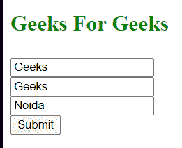

# 如何用 Axios 从表单发布文件？

> 原文:[https://www . geeksforgeeks . org/如何用 axios 从表单发布文件/](https://www.geeksforgeeks.org/how-to-post-a-file-from-a-form-with-axios/)

在本文中，我们将讨论使用 Axios 库用表单数据发出开机自检请求。Axios 是一个基于 Promise 的 HTTP 客户端，可用于网络和节点。JS 开发。但是，在本文中，我们将严格参考 Axios 的客户端使用。

首先，我们需要使用 CDN 链接将 axios 添加到我们的开发中:

```html
<script src="https://cdn.jsdelivr.net/npm/axios/dist/axios.min.js"> </script>
```

为了使用从表单中提取数据，我们将使用 FormData()方法。formdata 方法以键值对的形式转换表单中的数据输入，以创建多部分/表单数据对象。

**HTML:**

```html
<!DOCTYPE html>
<html lang="en">
<head>
  <meta charset="UTF-8">
  <meta name="viewport" 
        content="width=device-width, 
                 initial-scale=1.0">
  <script src=
"https://cdnjs.cloudflare.com/ajax/libs/axios/0.19.2/axios.min.js" 
          crossorigin="anonymous">
  </script>
  <title>Document</title>
</head>
  <body>
  <h3 style="color:green; font-size:25px;">
    Geeks For Geeks
  </h3>
  <form>
    <input name="first-name"/><br>
    <input name="last-name"/><br>
    <input name="address"/><br>
    <button type="submit">Submit</button>
  </form>
</body>
</html>
```

**输出:**


**Axios 发布请求语法**
有两种方法可以发出 Axios 发布请求:

1.  **Standard post request:**

    > *axios.post(url，数据)。然后(callbackFn())。catch(callbackFn(err))*
    > 网址:HTTP POST 的请求网址。
    > 数据:包含 POST 数据的对象
    > callbackFn():处理承诺的回调函数。

    **用配置对象发布请求**

2.  *axios({
    method : ‘post’,
    url : url,
    data : data
    headers : headers
    }).then(callbackFn()).catch(callbackFn())* 

    方法:指定 HTTP 方法
    数据:一个包含 POST 数据的对象。
    头(可选) :指定与请求相关联的头的对象。

**向服务器发送表单数据的 Javascript 代码:**

```html
window.addEventListener('load', ()=>{

       const form = document.querySelector('form');
       form.addEventListener('submit', (e)=>{
           //to prevent reload
           e.preventDefault();
           //creates a multipart/form-data object
           let data = new FormData(form);
           axios({
             method  : 'post',
             url : '/',
             data : data,
           })
           .then((res)=>{
             console.log(res);
           })
           .catch((err) => {throw err});
       });
   });
```

**用模拟休息 API 测试 Axios 请求:**
**前端代码:**

```html
<!DOCTYPE html>
<html lang="en">
    <head>
        <meta charset="UTF-8" />
        <meta name="viewport"
              content="width=device-width, 
                       initial-scale=1.0" />
        <script src=
"https://cdnjs.cloudflare.com/ajax/libs/axios/0.19.2/axios.min.js" 
                integrity=
"sha512-VZ6m0F78+yo3sbu48gElK4irv2dzPoep8oo9LEjxviigcnnnNvnTOJRSrIhuFk68FMLOpiNz+T77nNY89rnWDg==" 
                crossorigin="anonymous"></script>
        <title>Document</title>
    </head>
    <body>
        <h3 style="color: green; font-size: 25px;">
            Geeks For Geeks
        </h3>
        <form>
            <input name="first-name" /><br />
            <input name="last-name" /><br />
            <input name="address" /><br />
            <button type="submit">Submit</button>
        </form>

        <script type="text/javascript">
            window.addEventListener("load", () => {
                const form = document.querySelector("form");
                form.addEventListener("submit", (e) => {
                    e.preventDefault();
                    let data = new FormData(form);
                    console.log(data);
                    axios({
                        method: "post",
                        url: "/",
                        data: data,
                    })
                        .then((res) => {
                            console.log(res);
                        })
                        .catch((err) => {
                            throw err;
                        });
                });
            });
        </script>
    </body>
</html>
```

**基于 Node.js 的模拟 REST API 的代码:**

```html
const express = require('express');
const formidable = require('express-formidable');

const app = express();

app.use(express.static(__dirname+'/index.html'));
app.use(formidable());

app.get('/', (req, res)=>{
    res.sendFile(__dirname+'/index.html');
});

app.post('/', (req, res)=>{

    console.log(JSON.stringify(req.fields));
});

app.listen('3000', ()=>{
    console.log('listening to port');

});
```

**样品请求数据:**


**控制台输出:**

```html
{"first-name":"Geeks", "last-name":"Geeks", "address":"Noida"}
```