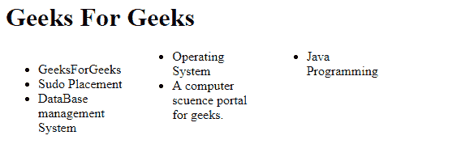

# 如何防止元素内的列断裂？

> 原文:[https://www . geeksforgeeks . org/如何防止元素内分栏/](https://www.geeksforgeeks.org/how-to-prevent-column-break-within-an-element/)

我们可以通过使用 CSS **内部中断属性**来防止元素内的**列中断**。CSS 中的 break-inside 属性用于指定列在元素内部的分隔符。有时元素的内容会被夹在列之间。为了防止列中断，我们应该使用中断内部属性集来避免。

**语法:**

```html
column-break-inside:avoid;
```

**示例:**本示例用于防止元素内的列中断。

```html
<html>

<head>
    <style>
        .x {
            -moz-column-count: 3;
            column-count: 3;
            width: 30em;
        }

        .x li {
            -webkit-column-break-inside: avoid;
        }
    </style>
</head>

<body>
    <h1>Geeks For Geeks</h1>
    <div class='x'>
        <ul>
            <li>GeeksForGeeks</li>
            <li>Sudo Placement</li>
            <li>DataBase management System</li>
            <li>Operating System</li>
                <li>A computer science portal for geeks.</li>
                <li>Java Programming</li>
        </ul>
    </div>
</body>

</html>
```

**输出:**
