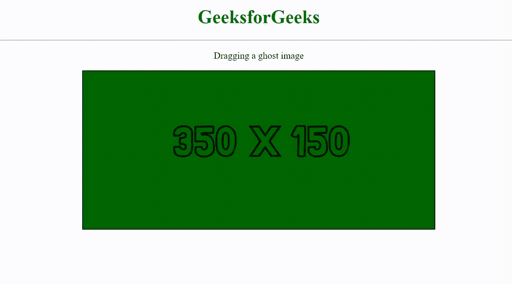
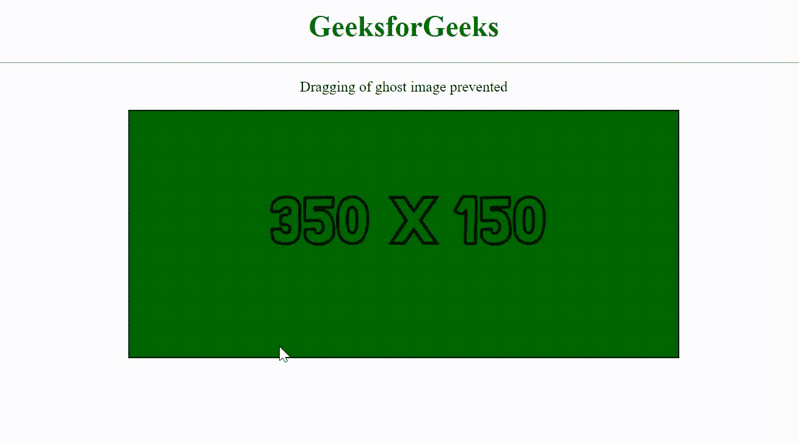

# 如何防止鬼影拖影？

> 原文:[https://www . geesforgeks . org/如何防止鬼影拖拽/](https://www.geeksforgeeks.org/how-to-prevent-dragging-of-ghost-image/)

当单击网页上的图像并试图将其从一个点拖动到另一个点时，图像的副本通常会跟随光标移动，直到被拖动。这个图像的复制品被称为鬼影。

由于个人喜好或网站要求，可能需要防止在屏幕上产生此重影图像，也就是说，有时可能需要防止重影图像的拖动。以下示例显示了默认情况下鬼图像的外观。

## 超文本标记语言

```htmlhtml
<!DOCTYPE html>
<html>

<head>
    <title>
        Prevent dragging of ghost image
    </title>
</head>

<body style="text-align: center;">
    <h1 style="color: #008000">
        GeeksforGeeks
    </h1>
    <hr>

    <p>
        Dragging a ghost image
    </p>

    
</body>

</html>
```

**输出:**



在上面的示例中，当单击并拖动图像时，它会创建一个跟随光标的可拖动重影图像。为了防止拖动这个鬼图像，使用了 [**可拖动**](https://www.geeksforgeeks.org/html-draggable-attribute/) 属性。将该图像元素的该属性设置为“假”时，将阻止其拖动。下面的例子演示了这一点。

**示例:**

## 超文本标记语言

```htmlhtml
<!DOCTYPE html>
<html>

<head>
    <title>
        Prevent dragging of ghost image
    </title>
</head>

<body style="text-align: center;">
    <h1 style="color: #008000">
        GeeksforGeeks
    </h1>
    <hr>

    <p>
        Dragging of ghost
        image prevented
    </p>

    
</body>

</html>
```

**输出:**

