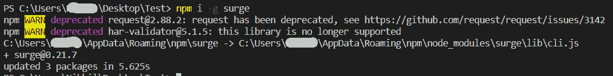
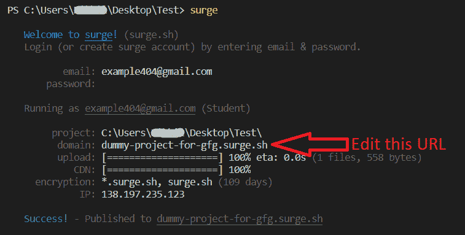

# 如何在浪涌云平台上发布你的前端？

> 原文:[https://www . geeksforgeeks . org/如何发布您的前端-浪涌-云平台/](https://www.geeksforgeeks.org/how-to-publish-your-front-end-over-surge-cloud-platform/)

**要求:**必须安装 [NPM](https://www.geeksforgeeks.org/nodejs-tutorials/)

作为一名前端开发人员，我们创造了许多很酷的设计，我们希望向其他人展示它们。但是作为学生，我们可能不想为了让网站在网上直播而购买域名。有一些免费的工具，比如 github 和 Heroku，但是如果只发布前端的话，设置就有点复杂了。

还有一个工具叫做 surge，是专门为前端开发人员开发的，非常容易使用。按照以下步骤，在 2 分钟内发布您的页面。

*   To start, lets begin with making a dummy web page, a single HTML file.

    **Index.html**

    ## 超文本标记语言

    ```html
    <!DOCTYPE html>
    <html lang="en">

    <head>
        <meta charset="UTF-8">
        <title>Document</title>
        <style>
            .navbar {
                text-align: center;
                background-color: rgb(0, 90, 121);
                color: white;
            }

            body {
                background-color: lightblue;
            }
        </style>
    </head>

    <body>
        <div class="navbar">
            This is the navbar
        </div>
        <div class="body">
            This is the body of my website
            <br> Content goes here.
        </div>
    </body>

    </html>
    ```

    *   对于此步骤，您必须在系统中安装 npm。在 index.html 所在的同一目录中打开终端。运行以下命令:

    ```html
    npm install -g surge
    ```

    

    *   现在，您的系统中已经在全球范围内安装了“surge”，这样您将来就可以想用多少次就用多少次。执行以下命令:

    ```html
    surge
    ```

    *   它现在会询问您的电子邮件 ID 和密码。在这里，你需要输入你的电子邮件 id 和你的浪涌帐户的新密码。
    *   之后你需要给你的静态文件定位。如果您按照指示在同一文件夹中打开了终端，请按回车键。
    *   现在，它将要求您提供一个域名和一个示例域名。请在“. surge.sh”之前编辑该部分，如果该域可用，它将被分配给您。
    *   现在点击进入，你会得到链接到你的网站发布在网上。

    

    正如我们所看到的，这个过程非常简单，使用一些简单的命令不到两分钟。我们可以用它来设计网页，免费制作面试简历和许多其他任务。