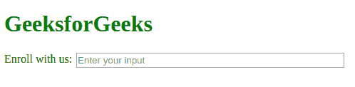

# 如何把一个输入元素和它的标签放在同一行？

> 原文:[https://www . geesforgeks . org/如何将输入元素放在其标签所在的同一行/](https://www.geeksforgeeks.org/how-to-put-an-input-element-on-the-same-line-as-its-label/)

有几种方法可以使输入元素与其标签相同。这里讨论的方法很少。基本的 CSS 标签，跨度和输入，以获得清晰的输出。

**使用浮动和溢出属性:**制作一个标签，用 **[浮动属性](https://www.geeksforgeeks.org/css-float/)** 设置样式。现在根据您的要求将标签浮动(位置)设置为左或右。这将相应地对齐您的标签。 [**溢出属性**](https://www.geeksforgeeks.org/css-overflow/) 为输入在这里用来剪辑溢出部分并显示剩余部分。

*   **例:**

    ```html
    <!DOCTYPE html>
    <html lang="en">

    <head>

        <style>
            h1 {
                color: green;
            }

            label {
                float: left;
            }

            span {
                display: block;
                overflow: hidden;
                padding: 0px 4px 0px 6px;
            }

            input {
                width: 70%;
            }
        </style>
    </head>

    <body>
        <h1>GeeksforGeeks</h1>
        <label for="test">Enroll with us:</label>
        <span>
            <input name="test" id="test" 
                   type="text" placeholder="Enter your input"/>
        </span>
    </body>

    </html>
    ```

*   **输出:**
    

**在显示属性中使用表格单元格属性:**在 div 中做一个标签，赋予 **[显示属性](https://www.geeksforgeeks.org/css-display-property/)** 。要使输入元素和跨度相等，请在这些标记中使用 table-cell 属性。该属性使元素表现为 **td** 元素。无论在附近制作什么项目，表格单元属性都会这么做。

*   **例:**

    ```html
    <!DOCTYPE html>
    <html lang="en">

    <head>

        <style>
            h1 {
                color: green;
            }

            .container {
                display: table;
                width: 100%
            }

            label {
                display: table-cell;
                width: 1px;
                white-space: nowrap;
            }

            span {
                display: table-cell;
                padding: 0 4px 0 6px;
            }

            input {
                width: 70%;
            }
        </style>
    </head>

    <body>
        <h1>GeeksforGeeks</h1>

        <div class="container">
            <label for="test">Enroll with us:</label>
            <span><input name="test" id="test" 
                         type="text" 
                         placeholder="Enter your input" />
            </span>
        </div>
    </body>

    </html>
    ```

*   **输出:** 

HTML 是网页的基础，通过构建网站和网络应用程序用于网页开发。您可以通过以下 [HTML 教程](https://www.geeksforgeeks.org/html-tutorials/)和 [HTML 示例](https://www.geeksforgeeks.org/html-examples/)从头开始学习 HTML。

CSS 是网页的基础，通过设计网站和网络应用程序用于网页开发。你可以通过以下 [CSS 教程](https://www.geeksforgeeks.org/css-tutorials/)和 [CSS 示例](https://www.geeksforgeeks.org/css-examples/)从头开始学习 CSS。