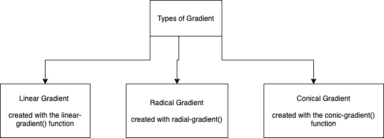
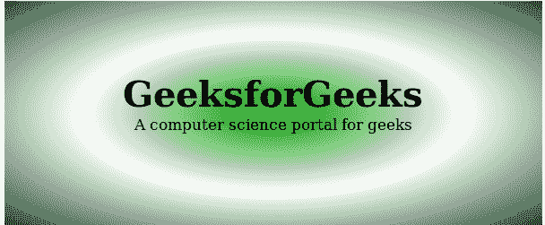
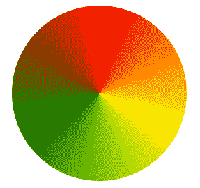

# 如何在网站中放置渐变颜色？

> 原文:[https://www . geesforgeks . org/如何在网站中放置渐变颜色/](https://www.geeksforgeeks.org/how-to-put-gradient-colors-in-a-website/)

[**CSS 渐变**](https://www.geeksforgeeks.org/css-gradients/) 是由两种或两种以上颜色过渡而成的图像。下面给出了三种类型的梯度:

*   线性梯度
*   径向梯度
*   锥形梯度



图像显示了渐变的类型

[**线性渐变:**](https://www.geeksforgeeks.org/css-linear-gradient-function/) 是以线性(直线)方式进行的渐变类型。

**语法:**

```htmlhtml
background-image: linear-gradient( direction, color1, color2, ... )
```

**示例:**本示例使用线性渐变属性值在网站中创建渐变颜色。

## 超文本标记语言

```htmlhtml
<!DOCTYPE html>
<html>

<head>
    <title>CSS Gradients</title>
    <style>
        #container {
            height: 200px;
            background: linear-gradient(
                360deg, #fd6f46 10%, #fb9832 90%);
        }

        .gfg {
            color: #000000;
            text-align: center;
            font-size: 30px;
            font-weight: bolder;
            padding: 80px;
        }
    </style>
</head>

<body>
    <div id="container">
        <div class="gfg">GFG</div>
    </div>
</body>

</html>
```

**输出:**


[**径向梯度:**](https://www.geeksforgeeks.org/css-radial-gradient-function/) 是与线性-梯度具有相似性的梯度类型，但两者的区别在于该梯度从中心点向四周辐射。

**语法:**

```htmlhtml
background-image: radial-gradient( shape size at position, 
        start-color, ..., last-color );
```

**示例:**

```htmlhtml
<!DOCTYPE html>
<html>

<head>
    <title>CSS Gradients</title>
    <style>
        #main {
            height: 250px;
            width: 600px;
            background-color: white;
            background-image: radial-gradient(
                    #090, #fff, #2a4f32);
        }

        .gfg {
            text-align: center;
            font-size: 40px;
            font-weight: bold;
            padding-top: 80px;
        }

        .geeks {
            font-size: 17px;
            text-align: center;
        }
    </style>
</head>

<body>
    <div id="main">
        <div class="gfg">GeeksforGeeks</div>
        <div class="geeks">
            A computer science portal for geeks
        </div>
    </div>
</body>

</html>
```

**输出:**


[**锥形渐变:**](https://www.geeksforgeeks.org/css-conic-gradient-function/) 这是一种创建图像的渐变类型，其颜色过渡发生在图像的中心点周围。

**语法:**

```htmlhtml
Background image: conic-gradient(color degree, color degree, ...)
```

**示例:**

```htmlhtml
<!DOCTYPE html>
<html>

<head>
    <title>Conic Gradient</title>
    <style>
        .box {
            background-color: yellow;
            height: 200px;
            width: 200px;
            float: left;
            margin: 20px;
            border-radius: 50%;
        }

        .c {
            background-image:conic-gradient(
                red, yellow, green, red);
        }
    </style>
</head>

<body>
    <div class="box c"></div>
</body>

</html
```

**输出:**
