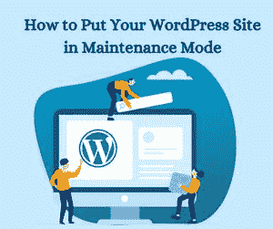

# 如何将你的 WordPress 网站置于维护模式？

> 原文:[https://www . geesforgeks . org/如何将您的 wordpress 网站置于维护模式/](https://www.geeksforgeeks.org/how-to-put-your-wordpress-site-in-maintenance-mode/)

WordPress 维护模式是在开发阶段覆盖网站的理想方式。更新 WordPress 时，最好对访问者隐藏测试和错误。

这些更改可能包括测试插件、更新内容、更改主题或任何其他服务器端更改。本文的目的在于揭示网站进入维护模式的方法。然而，领先的 **WordPress 开发公司**也可能是你的一个选择，如果你是一个初学者或非技术用户。这种模式的目的是通知访问者网站处于建设状态。这意味着一段时间后，该网站将回到其初始阶段，包括一些变化。



**WordPress 维护模式:** WordPress 维护模式要求你在不影响 SEO 和用户体验的情况下进行网站的变更。WordPress 维护模式的主要好处是不会丢失搜索引擎排名。当 WordPress 网站处于维护模式时，它会通知搜索引擎不要对其进行索引。

**为什么维护模式很重要？**

每个网站都需要更新和改变。但是，有几个因素导致网站处于维护模式。

*   每个网站都需要设计，用户界面也会随着时间的推移而改变。
*   每个网站都有风险。WordPress 维护模式是解决这些错误或 bug 最可靠的方法。

通常，您可以在任何网站上实时看到变化。您可能需要将新内容发布到网站，而不打开 WordPress 维护模式。大多数情况下，新内容发布非常快，因此无需启用 WordPress 维护模式。

但是，如果更改花费的时间比平时长，并且可以在其中发现错误，则需要使用 WordPress 维护模式。或者，用户无法访问网站部分。启用 WordPress 模式的另一个原因是，它允许您在网站处于更新阶段时保留用户。将 WordPress 网站置于维护模式后，它会在网站上显示通知，并提醒他们当前的情况。

**你应该什么时候让你的网站进入 WordPress 维护模式？**

当你进行调整时，没有必要将网站置于维护模式。比如——纠正小错误，改变一些配色方案，更新内容。

但是随着你的网站变得越来越大，变化可能会越来越大，时间也会越来越长。主题的改变，包括网站上独特的功能和服务，会导致网站停机。因此，这种方式，你可以限制网站访问者使用网站。

**使用维护模式对你的访客有什么副作用？**

默认情况下，在维护模式下，WordPress 会创建一个闪屏，通知您的访问者维护信息。此外，它只是一个网页，带有网站暂时不可用的信息。闪屏为游客营造了一种恼人的体验。

你的生意会给你的潜在客户留下不好的印象。参观者不在乎幕后发生了什么。因此，更改默认的 WordPress 维护模式页面是一个好主意。如果你想学习如何做好这件事，请继续阅读。

**如何让 WordPress 进入维护模式？**

**方法 1–使用 WordPress 插件:**这个方法是针对那些想要激活 WordPress 维护模式而不接触一行代码的人。

你所需要做的就是下载并安装 WP 维护模式插件。激活后，您需要配置插件参数。为此，请转到右侧选项卡并选择设置->维护模式。在设置页面上，您将看到 5 个选项卡:常规、设计、模块、机器人管理和 GDPR。查看下面所有的解释:

*   **常规:**第一个选项卡是常规选项卡。在“常规”选项卡的顶部，您会发现状态。要激活此插件并在 WordPress 维护模式下设置您的网站，您必须将其更改为活动。在状态选项下，你会发现搜索机器人的爬行功能。如果您设置了此选项，搜索引擎将可以在服务期间访问您的网站。接下来，有后端角色和前端角色选项，在这里您可以选择哪些用户角色可以在后端处于维护模式时访问您的后端。如果您不选择它们，则只允许管理员选择。
*   **设计:**在设计选项卡中，您将创建一个吸引人的闪屏。要开始创建闪屏，您可以直接转到标题(HTML 标记)选项。在这一部分中，为您的闪屏添加一个标题，以及一个标题和文本。一旦你完成了文章，你可以改变你的服务页面的背景。如中所示，颜色可以改变，或者图像也可以用作背景图像。
*   **模块:**此选项卡允许您管理倒计时定时器。设置开始时间和剩余时间。或者，您可以要求您的订户订阅，以便在您的站点再次活跃时立即收到通知。“模块”选项卡下的下一个选项是您可以自定义社交网络的地方。你所需要做的就是发布一个链接到你的社交媒体账户。该插件将自动在页面上显示社交媒体按钮图标。
*   **机器人管理:**下一个有用的选项卡是管理机器人选项卡。此选项卡允许您向闪屏添加聊天机器人。这样，即使您处于维护模式，也可以保持与访问者的交互通信。你甚至可以给机器人命名并添加一个头像。
*   **GDPR:** 如果你想让你的访客订阅闪屏页面，你需要定制 GDPR 标签。GDPR 代表一般数据保护条例。由于您正在收集访问者的数据，因此您需要激活它。准备完成后，单击保存设置按钮并转到您的网站。

**方法 2–使用自定义函数:**第二种方法可能有点技术性。但别担心，没那么难。请记住，当你的网站处于维护模式时，WordPress 会自动安装默认的维护页面。您可以手动将 WordPress 置于维护模式，并在没有额外插件的情况下自定义页面。

你所需要做的就是将这些代码行添加到你的主题的**functions.php**文件的末尾。

```
// Activate WordPress Maintenance Mode
function wp_maintenance_mode () {  
  if ( ! current_user_can ( 'edit_themes' ) 
               || ! is_user_logged_in ()) {    
    wp_die ( '<h1> Maintenance </h1> <br /> 
      This site is under scheduled maintenance. 
      Please check back later.'
    ) ;
  }
}

add_action ( 'get_header' , 'wp_maintenance_mode' );
```

更改第 4 行引号之间的文本以自定义服务消息。

**方法 3–使用。htaccess 文件:**你可以找到**。htaccess** 在你的网站目录中。只需将当前的. htaccess 文件重命名为。创建一个名为。并添加以下代码片段:

```
RewriteEngine On
RewriteBase /
RewriteCond% { REQUEST_URI } ! ^ / Maintenance \ .html $
RewriteRule ^ ( . * ) $ Https : 
  //example.com/maintenance.html [R = 307, L]

```

现在在您的网站目录中创建一个带有维护消息文件的 maintenance 文件。

**结束语:**让 WordPress 进入维护模式的方法有很多。第一种方法是使用 WordPress 维护模式插件。这个插件将帮助你创建一个漂亮的闪屏。这种方法推荐给那些不熟悉编码的人。第二种方法需要向 functions.php 文件中添加一段 PHP 代码。您可以尝试的最后一种方法是将代码添加到。htaccess 文件。

请记住这些方法，并在您觉得有需要时实施它们。一定要让我们知道你的经历。