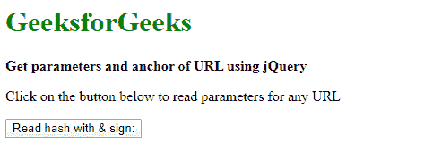
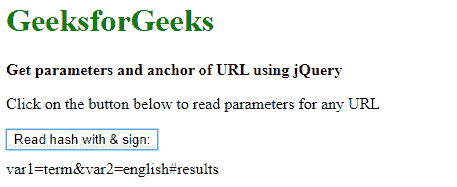

# 如何读取网址中带有“&”符号的哈希？

> 原文:[https://www . geesforgeks . org/如何通过登录 url 读取哈希/](https://www.geeksforgeeks.org/how-to-read-a-hash-with-an-sign-in-the-url/)

这是网络开发中非常常见的情况，用户希望从任何网址中提取或读取信息。在服务器端代码不可用的情况下，程序员可以使用 JavaScript 或 jQuery 来读取信息。要读取带有&符号的网址，我们可以使用 split()函数。通过该函数，我们可以很容易地获得字符串形式的 URL 参数。程序员可以使用 JavaScript 检索参数字符串并将其存储在变量中。

**语法:**

```html
var q = url.split('?')[1];
```

这里 **URL** 是任意一个示例 URL 字符串。获取**网址查询字符串参数**。如果 URL 在查询字符串中有许多参数，下面的代码片段将指导您解析并存储在可访问的变量中。

```html
var vars = [], hash;
var q = url.split('?')[1];
var fullParameter = q;

if(q != undefined) {
    q = q.split('&');

    for(var i = 0; i < q.length; i++) {
        hash = q[i].split('=');
        vars.push(hash[1]);
        vars[hash[0]] = hash[1];                
    }

    // Get hash parameter
    var hashParameter = hash[1];
    var hashstr= hashParameter.split('#')[1];
    alert("# Parameter :" + hashstr);
}

```

要使用任何参数，用户可以通过参数名称访问该值。例如，如果网址包含查询字符串**？var1 =姓名&var =姓氏&var3 =地址？**，用户可以使用以下方式访问**“var1”**的值:

```html
alert(vars['var1']);
```

以下示例说明了上述方法:

**示例:**该示例读取 URL 参数，该参数包括给定 URL 中的哈希以及“&”符号。

```html
<!DOCTYPE html>
<html>

<head>
    <title>
        How to read a hash with
        an & sign in the URL?
    </title>

    <script src=
"https://code.jquery.com/jquery-3.3.1.min.js">
    </script>
</head>

<body>
    <h1 style="color: green">
        GeeksforGeeks
    </h1>

    <b>
        Get parameters and anchor
        of URL using jQuery
    </b>

    <p>
        Click on the button below to
        read parameters for any URL
    </p>

    <button id="btn">
        Read hash with & sign:
    </button>

    <div style="height:10px;"></div>

    <div id="Ampdiv"></div>

    <script>
        var url = 
'http://www.geeksforgeeks.com/search?var1=term&var2=english#results';
        $('#btn').click(function() {
            readHash(url);
        });

        function readHash(url) {
            var vars = [], hash;
            var q = url.split('?')[1];
            var fullParameter = q;

            if (q != undefined) {
                q = q.split('&');

                for (var i = 0; i < q.length; i++) {
                    hash = q[i].split('=');
                    vars.push(hash[1]);
                    vars[hash[0]] = hash[1];
                }

                // Get hash parameter
                var hashParameter = hash[1];
                var hashstr = hashParameter.split('#')[1];
                alert("# Parameter :" + hashstr);
            }

            $("#Ampdiv").text(fullParameter);
        }
    </script>
</body>

</html>
```

**输出:**

*   **点击按钮前:**
    
*   **点击按钮后:**
    