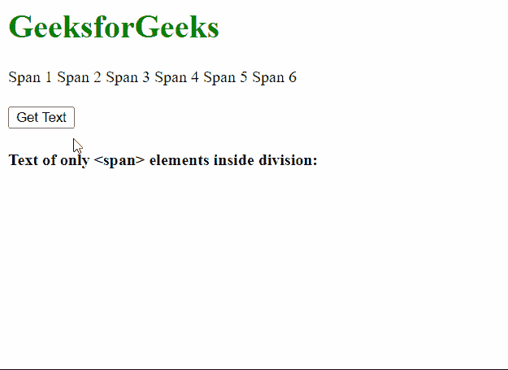
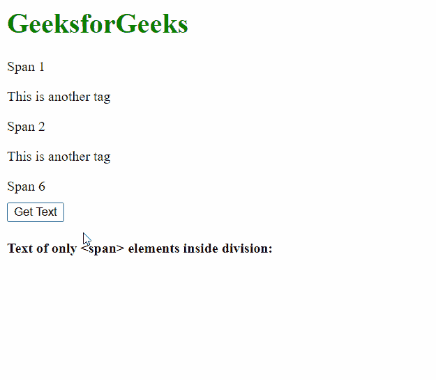

# 如何动态读取 div 的所有跨度？

> 原文:[https://www . geeksforgeeks . org/如何动态读取分区的所有跨度/](https://www.geeksforgeeks.org/how-to-read-all-spans-of-a-div-dynamically/)

在本文中，我们将学习阅读一个

元素的所有元素的文本内容。

**方法:**我们将首先选择我们要在其中找到<跨度>元素的分部。这可以通过使用 **getElementById()** 方法通过元素的 ID 选择元素来实现。接下来，我们将获取包含在这个部分中的所有指定类型的元素。这可以通过在我们上一步找到的分部上使用 **getElementsByTagName()** 方法来完成。然后，我们可以通过遍历所有 span 元素并将其显示为列表来获取其中的文本内容。

**语法:**

```htmlhtml
let getInfo = () => {

  // Get the division inside which the
  // spans have to be found
  let container = document.getElementById("container");
  let spans = container.getElementsByTagName("span");

  // Get output element
  let outputP = document.getElementById("output");

  // Iterate over spans
  for (let span of spans) {

    // Create a new list element with the data
    let listElem = document.createElement("li");
    listElem.textContent = span.textContent;

    // Insert text content of span inside output html element
    outputP.appendChild(listElem);
  }
};

```

下面的例子演示了这种方法。

**例 1:**

## 超文本标记语言

```htmlhtml
<!DOCTYPE html>
<html>

<body>
    <h1 style="color: green;">
        GeeksforGeeks</h1>

    <!-- Define the span elements
          with text content -->
    <div id="container">
        <span> Span 1 </span>
        <span> Span 2 </span>
        <span> Span 3 </span>
        <span> Span 4 </span>
        <span> Span 5 </span>
        <span> Span 6 </span>
    </div>

    <button onclick="getInfo()" 
        style="margin-top: 20px;">
        Get Text
    </button>

    <h4>
        Text of only <span> elements
        inside division:
    </h4>

    <ul id="output"></ul>

    <script>
        let getInfo = () => {
            // Get the division inside which the
            // spans have to be found
            let container =
                document.getElementById("container");
            let spans =
                container.getElementsByTagName("span");

            // Get output element
            let outputP =
                document.getElementById("output");

            // Iterate over spans
            for (let span of spans) {

                // Create a new list element
                // with the data
                let listElem =
                    document.createElement("li");
                listElem.textContent =
                    span.textContent;

                // Insert text content of span
                // inside output html element
                outputP.appendChild(listElem);
            }
        };
    </script>
</body>

</html>
```

**输出:**



**例 2:**

## 超文本标记语言

```htmlhtml
<html>

<body>
    <h1 style="color: green;">
        GeeksforGeeks
    </h1>

    <!-- Define the span elements
        with text content -->
    <div id="container">
        <span> Span 1 </span>

        <p> This is another tag </p>

        <span> Span 2 </span>

        <p> This is another tag </p>

        <span> Span 6 </span>
    </div>

    <button onclick="getInfo()" 
        style="margin-top: 10px;">
        Get Text
    </button>

    <h4>
        Text of only <span> elements
        inside division:
    </h4>

    <p id="output"></p>

    <script>
        let getInfo = () => {
            // Get the division inside which the
            // spans have to be found
            let container =
                document.getElementById("container");
            let spans =
                container.getElementsByTagName("span");

            // Get output element
            let outputP =
                document.getElementById("output");

            // Iterate over spans
            for (let span of spans) {

                // Create a new list element
                // with the data
                let listElem =
                    document.createElement("li");
                listElem.textContent =
                    span.textContent;

                // Insert text content of span
                // inside output html element
                outputP.appendChild(listElem);
            }
        };
    </script>
</body>

</html>
```

**输出:**

