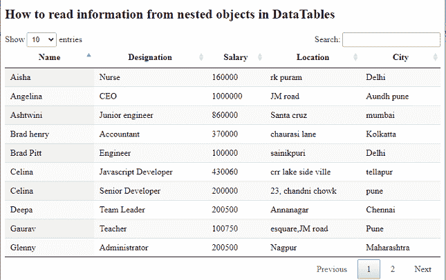

# 如何读取数据表中嵌套对象的信息？

> 原文:[https://www . geesforgeks . org/如何从数据表中的嵌套对象读取信息/](https://www.geeksforgeeks.org/how-to-read-information-from-nested-objects-in-datatables/)

**数据表** 是一个现代的 jQuery 插件，用于为网页的 HTML 表添加交互和高级控件。这是一个非常简单易用的插件，可以根据应用程序的需要为开发人员的自定义更改提供各种选项。该插件的功能包括分页、排序、搜索和多列排序。

在本文中，我们将使用**数据表**插件从嵌套数据对象中读取每个员工的信息。

**方法:**数据表插件的*列.数据*选项用于从嵌套的 JSON 数据中提取任何级别的数据。点(。)用于访问*列的另一个对象级别。*

需要实现的预编译文件有

CSS:

```htmlhtml
https://cdn.datatables.net/1.10.22/css/jquery.dataTables.min.css
```

**JavaScript:**

```htmlhtml
https://code.jquery.com/jquery-3.5.1.js
https://cdn.datatables.net/1.10.22/js/jquery.dataTables.min.js
```

**示例:**以下代码使用**数据表**插件在一个 HTML 表格中显示所有员工的数据。

**员工数据的结构:**员工明细是嵌套对象数据形式。


一名员工的详细信息结构

**HTML 代码:**以下代码的 JavaScript 部分从“ *nestedJSONData.txt* 文件中提取数据。在下面的例子中，*details . design*帮助每个员工获得 *details* 对象的*design*和 *details .薪资*获得 *details* 对象的*薪资*。类似地， *address.0* 和 *address.1* 获取该特定员工的位置和城市。

## 超文本标记语言

```htmlhtml
<!DOCTYPE html>
<html>

<head>

    <meta content="initial-scale=1, maximum-scale=1, 
        user-scalable=0" name="viewport" />
    <meta name="viewport" content="width=device-width" />

    <!-- Datatable plugin CSS file -->
    <link rel="stylesheet" href=
"https://cdn.datatables.net/1.10.22/css/jquery.dataTables.min.css" />

    <!-- jQuery library file -->
    <script type="text/javascript" 
        src="https://code.jquery.com/jquery-3.5.1.js">
    </script>

    <!-- Datatable plugin JS library file -->
    <script type="text/javascript" src=
"https://cdn.datatables.net/1.10.22/js/jquery.dataTables.min.js">
    </script>
</head>

<body>
    <h2>
        How to read information from nested 
        objects in DataTables
    </h2>

    <!--HTML table with employee data-->
    <table id="tableID" class="display" 
        style="width:100%">

        <thead>
            <!--Column headers for employee data-->
            <tr>
                <th>Name</th>
                <th>Designation</th>
                <th>Salary</th>
                <th>Location</th>
                <th>City</th>
            </tr>
        </thead>
    </table>

    <script>

        /* Initialization of datatable */
        $(document).ready(function () {

            /* table ID is taken for datatable access */
            $('#tableID').DataTable({
                "processing": true,
                "info": false,

                /* Set pagination feature */
                "paging": true,
                "ajax": 'nestedJSONData.txt',
                "columns": [
                    { "data": "name" },

                    // designation key of details to
                    // show designation
                    { "data": "details.designation" },

                    // salary key of details to show salary
                    { "data": "details.salary" },

                    // 0th index of address to show location
                    { "data": "address.0" },

                    // 1st index of address to show City
                    { "data": "address.1" }
                ]
            });
        });
    </script>
</body>

</html>
```

**nestedJSONData.txt 文件:**以下是该文件的内容，该文件包含所有员工的嵌套对象数据。上面的 HTML 代码中使用了这个文件。

```htmlhtml
{
  "data": [
    {
      "name": "Tina Mukherjee",
      "details": {
        "designation": "BPO member",
        "salary": "300000"
      },
      "address": [
        "24,chandni chowk",
        "Pune"
      ]
    },
    {
      "name": "Gaurav",
      "details": {
        "designation": "Teacher",
        "salary": "100750"
      },
      "address": [
        "esquare,JM road",
        "Pune"
      ]
    },
    {
      "name": "Ashtwini",
      "details": {
        "designation": "Junior engineer",
        "salary": "860000"
      },
      "address": [
        "Santa cruz",
        "mumbai"
      ]
    },
    {
      "name": "Celina",
      "details": {
        "designation": "Javascript Developer",
        "salary": "430060"
      },
      "address": [
        "crr lake side ville",
        "tellapur"
      ]
    },
    {
      "name": "Aisha",
      "details": {
        "designation": "Nurse",
        "salary": "160000"
      },
      "address": [
        "rk puram",
        "Delhi"
      ]
    },
    {
      "name": "Brad henry",
      "details": {
        "designation": "Accountant",
        "salary": "370000"
      },
      "address": [
        "chaurasi lane",
        "Kolkatta"
      ]
    },
    {
      "name": "Harry",
      "details": {
        "designation": "Salesman",
        "salary": "130500"
      },
      "address": [
        "32, krishna nagar",
        "Navi mumbai"
      ]
    },
    {
      "name": "Rhovina",
      "details": {
        "designation": "Amazon supporter",
        "salary": "300900"
      },
      "address": [
        "Aparna zone",
        "hyderabad"
      ]
    },
    {
      "name": "Celina",
      "details": {
        "designation": "Senior Developer",
        "salary": "200000"
      },
      "address": [
        "23, chandni chowk",
        "pune"
      ]
    },         

    {
      "name": "Glenny",
      "details": {
        "designation": "Administrator",
        "salary": "200500"
      },
      "address": [
        "Nagpur",
        "Maharashtra"
      ]
    },
    {
      "name": "Brad Pitt",
      "details": {
        "designation": "Engineer",
        "salary": "100000"
      },
      "address": [
        "sainikpuri",
        "Delhi"
      ]
    },
    {
      "name": "Deepa",
      "details": {
        "designation": "Team Leader",
        "salary": "200500"
      },
      "address": [
        "Annanagar",
        "Chennai"
      ]
    },

    {
      "name": "Angelina",
      "details": {
        "designation": "CEO",
        "salary": "1000000"
      },
      "address": [
        "JM road",
        "Aundh pune"
      ]
    }
 ]
}
```

**输出:**

**执行前:**


**执行后:** 下面的输出显示了表中显示的“搜索”操作，员工的城市持有字符串为“浦那”等等。
