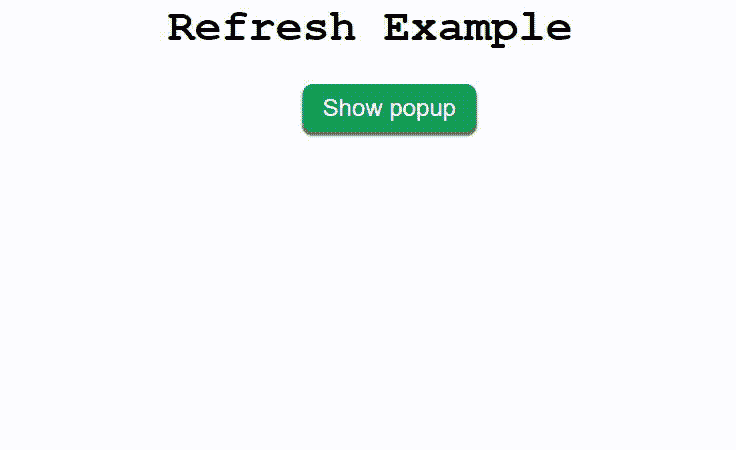

# 如何在关闭弹出窗口时刷新父页面？

> 原文:[https://www . geesforgeks . org/how-refresh-parent-page-on-closing-a-popup/](https://www.geeksforgeeks.org/how-to-refresh-parent-page-on-closing-a-popup/)

任务是在关闭弹出窗口时刷新父页面。

实现这一目标的步骤如下:

1.  创建页面。
2.  创建弹出窗口。
3.  Popup 应该包含一个按钮，单击该按钮时将刷新父页面。
4.  将事件监听器连接到该按钮，并监听该按钮上的点击事件。
5.  单击该按钮会触发一个重新加载父页面的功能。

重载是通过 JavaScript 使用下面的语句来实现的

```
window.location.reload();
```

**注意:**使用内部 CSS 让页面看起来美观。而所有 CSS 代码都是在 **<样式>** 标签内。

**示例:**

```
<!DOCTYPE html>
<html lang="en">
<head>
    <meta charset="UTF-8">
    <meta name="viewport"
          content="width=device-width, 
                   initial-scale=1.0">
    <title> Refresh Example </title>
    <style>
        /* Css Styling */
        h1{
            font-size: 45px;
            font-family: 'Courier New',
                          Courier,
                          monospace;
            text-align: center;
        }

        .btn{
            padding: 10px 20px;
            font-size: 24px;
            background-color: #0f9d58;
            border: none;
            color: white;
            border-radius: 10px;
            outline: none;
            box-shadow: 0px 3px 2px 1px rgb(100, 100, 100);
            cursor: pointer;
        }

        #popup-btn{
            margin-left: 45%;
        }

        #wrapper{
            position: absolute;
            left: 0;
            top: 0;
            width: 100vw;
            height: 100vh;
            background-color:rgba(100, 100, 100, 0.7);
            display: flex;
            justify-content: center;
            align-items: center;
            visibility: hidden;
        }

        #popup{
            width: 50%;
            height: 50%;
            background-color: white;
            display: flex;
            justify-content: center;
            align-items: center;
            border-radius: 10px;
        }

        h2{
            font-family: 'Courier New', Courier, monospace;
            font-weight: bold;
            font-size: 40px;
        }
    </style>
</head>
<body>

    <!-- Create a simple web page -->
    <div>
        <h1>Refresh Example </h1>

        <button class="btn" id="popup-btn">
            Show popup
        </button>
    </div>

    <!-- Create a simple popup which is hidden using CSS -->
    <div id="wrapper">
        <div id="popup">
            <div>
                <h2>POPUP</h2>
                <button class="btn" id = "close-btn">
                    Close
                </button>
            </div>
        </div>
    </div>

    <!-- All JavaScript code and logic -->
    <script>
        // Attach event listener to open popup
        document.getElementById(
'popup-btn').addEventListener('click', (e)=>{
            document.getElementById(
'wrapper').style.visibility = "visible";
        })

// Attach event listener to first close popup and then refresh page
        document.getElementById(
'close-btn').addEventListener('click', (e) => {
            document.getElementById(
'wrapper').style.visibility = "hidden";
            window.location.reload();
        });
    </script>
</body>
</html>
```

**输出:**
