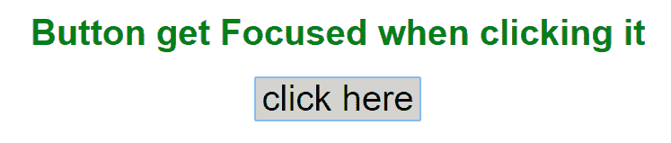
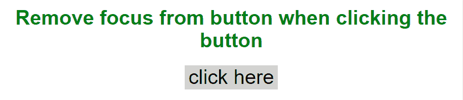

# 如何在点击时移除按钮周围的焦点？

> 原文:[https://www . geeksforgeeks . org/如何移除焦点环绕按钮点击/](https://www.geeksforgeeks.org/how-to-remove-focus-around-buttons-on-click/)

要移除按钮**轮廓周围的焦点:不使用**属性。

**语法:**

```
button {
    // Remove focus around button
    outline:none;  
}

```

**轮廓属性:**轮廓是一个元素属性，它在元素周围但在边框之外绘制一条线。它不占用像边框这样的元素宽度的空间。

**示例 1:** 本示例在按钮上创建焦点。

```
<!DOCTYPE html>
<html>

<head>
    <title>
        Remove focus around the button
    </title>

    <style>
        h1 {
            text-align: center;
            margin-top: 10%;
            font-family: Arial;
            color: green;
        }
        button {
            background-color: lightgray;
            font-size: xx-large;
            border: none;
            cursor: pointer;
        }
    </style>
</head>

<body>
    <h1>
        Button get Focused when clicking it
    </h1>

    <div>
        <button type="submit" 
            style="margin:auto;display:block;">
            click here
        </button>
    </div>
</body>

</html>                                    
```

**输出:**


**示例 2:** 本示例使用**轮廓:无**属性在单击按钮后移除按钮焦点。

```
<!DOCTYPE html>
<html>

<head>
    <title>
        Remove Focus from button
    </title>

    <style>
        h1 {
            text-align: center;
            margin-top: 10%;
            font-family: Arial;
            color: green;
        }
        button {
            background-color: lightgray;
            font-size: xx-large;
            border: none;
            cursor: pointer;
            outline: none;
        }
    </style>
</head>

<body>
    <h1>
        Remove focus from button when
        clicking the button
    </h1>

    <div>
        <button type="submit" 
            style="margin:auto; display:block;">
            click here
        </button>
    </div>
</body>

</html>                    
```

**输出:**
在上面的代码中，**轮廓:无**属性用于移除按钮的焦点。
