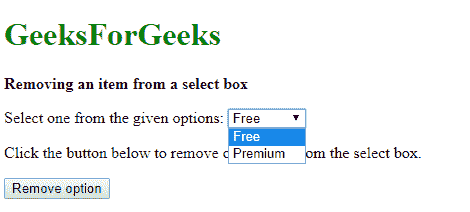
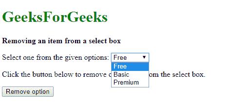

# 如何从选择框中移除项目？

> 原文:[https://www . geesforgeks . org/如何从选择框中删除项目/](https://www.geeksforgeeks.org/how-to-remove-items-from-a-select-box/)

可以使用 jQuery 中的两种方法从选择框中删除一个选项:

**方法一:直接删除框内选项**

通过选择框选择要删除的选项。要删除的值在选择框的值选择器**(值= '选项值')**中指定。然后使用**移除()**方法移除该选择的选项。

**语法:**

```html
$("selectBox option[value='optionValue']").remove()
```

**示例:**

```html
<!DOCTYPE html>
<html>
<head>
    <title>
      Removing an item from a select box
  </title>
</head>

<body>
    <h1 style="color: green">
      GeeksForGeeks
  </h1>
    <b>Removing an item from a select box</b>
    <p>
        Select one from the given options:
        <select id="select1">
            <option value="free">
              Free
          </option>
            <option value="basic">
              Basic
          </option>
            <option value="premium">
              Premium
          </option>
        </select>
    </p>
    <p>Click the button below to 
      remove one option from the select box.</p>
    <button onclick="removeOption()">
      Remove option
  </button>
    <script src=
"https://code.jquery.com/jquery-3.3.1.min.js">
  </script>

    <script type="text/javascript">
        function removeOption() {

            /* select the option with the 
            value of basic and remove the option*/
            $("#select1 option[value='basic']").remove();
        }
    </script>
</body>

</html>
```

**输出:**

*   **点击按钮前:**
    
*   **点击按钮后:**
    

**方法 2:使用 find()方法**
**find()**方法可以使用值选择器在值中查找选项。此方法搜索 DOM 中指定元素的后代，并从匹配的元素创建一个新的 jQuery 对象。

首先选择选择框，然后使用 find()方法和值选择器来查找选项。然后使用 remove()方法删除此选定的选项。

**语法:**

```html
$('selectBox').find('[value="basic"]').remove()
```

**示例:**

```html
<!DOCTYPE html>
<html>

<head>
    <title>
      Removing an item from a select box
  </title>
</head>

<body>
    <h1 style="color: green">
      GeeksForGeeks
  </h1>
    <b>
      Removing an item from a select box
  </b>
    <p>
        Select one from the given options:
        <select id="select1">
            <option value="free">
              Free
          </option>
            <option value="basic">
              Basic
          </option>
            <option value="premium">
              Premium
          </option>
        </select>
    </p>
    <p>
      Click the button below to remove 
      one option from the select box.
  </p>
    <button onclick="removeOption()">
      Remove option
  </button>
    <script src=
"https://code.jquery.com/jquery-3.3.1.min.js">
  </script>
    <script type="text/javascript">
        function removeOption() {

            /* select the option with the 
            value of basic and remove the option*/
            $('#select1').find('[value="basic"]').remove();
        }
    </script>
</body>

</html>
```

**输出:**

*   **点击按钮前:**
    
*   **点击按钮后:**
    