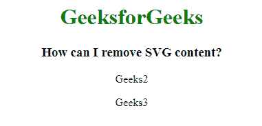
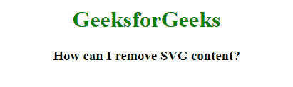

# 如何去除 SVG 内容？

> 原文:[https://www.geeksforgeeks.org/how-to-remove-svg-content/](https://www.geeksforgeeks.org/how-to-remove-svg-content/)

要删除 SVG 内容，可以使用 D3.js 提供的 **remove()** 功能， **remove()** 功能与 D3.js 也提供的两种方法一起使用，如下方法:

1.  **Using select() Method with remove() Method:** The **d3.select()** method is used to select the first element that need to remove.

    **语法:**

    ```html
    d3.select("element").remove()
    ```

    **示例:**在此示例中，删除了第一个 paramgraph (p)元素。

    ```html
    <!DOCTYPE html> 
    <html> 

    <head> 
        <title> 
            How can I remove SVG content?
        </title> 

        <script src = "https://d3js.org/d3.v4.min.js"></script> 
    </head> 

    <body style="text-align:center">  

      <h1 style="color:green">GeeksforGeeks</h1>
      <h3> How can I remove SVG content?</h3>
      <p>Geeks1</p>
      <p>Geeks2</p>
      <p>Geeks3</p>
        <script> 

            // Calling the selectAll() function 
            d3.select("p").remove(); 
        </script> 
    </body> 

    </html>                     
    ```

    **输出:**
    

2.  **Using selectAll() Method with remove() Method:** The **d3.selectAll()** method is used to select all the element that matched and remove it.

    **语法:**

    ```html
    d3.selectAll("element").remove()
    ```

    **示例:**在此示例中，删除了所有段落(p)元素。

    ```html
    <!DOCTYPE html> 
    <html> 

    <head> 
        <title> 
            How can I remove SVG content?
        </title> 

        <script src = "https://d3js.org/d3.v4.min.js"></script> 
    </head> 

    <body style="text-align:center">  

      <h1 style="color:green">GeeksforGeeks</h1>
      <h3> How can I remove SVG content?</h3>
      <p>Geeks1</p>
      <p>Geeks2</p>
      <p>Geeks3</p>
        <script> 

            // Calling the selectAll() function 
            d3.selectAll("p").remove(); 
        </script> 
    </body> 

    </html>                     
    ```

    **输出:**
    