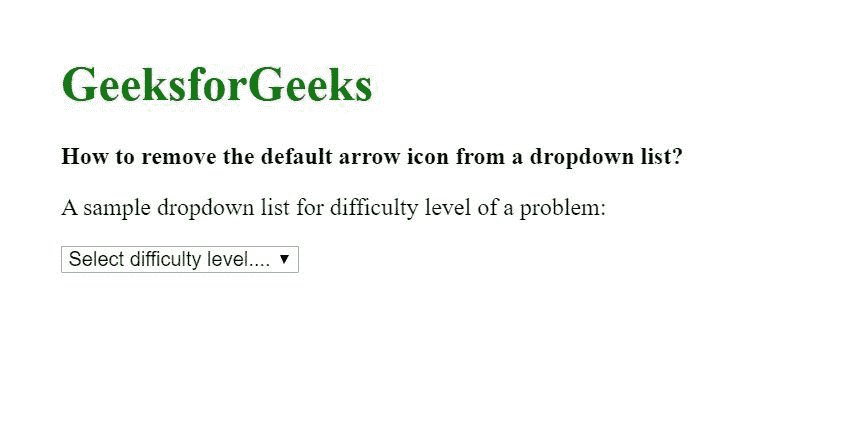
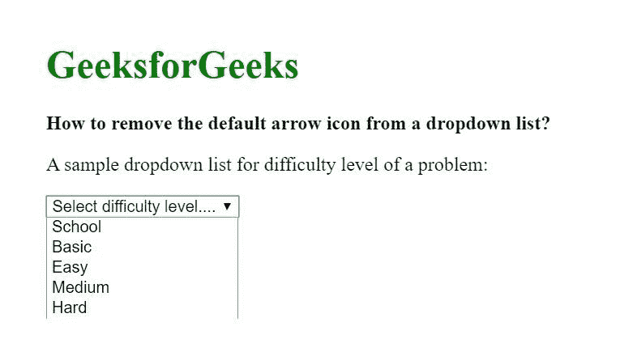
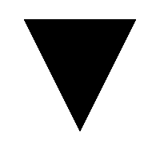
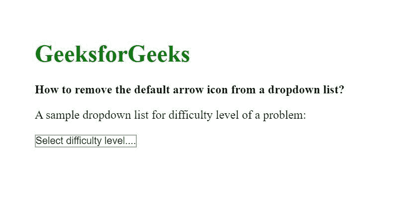
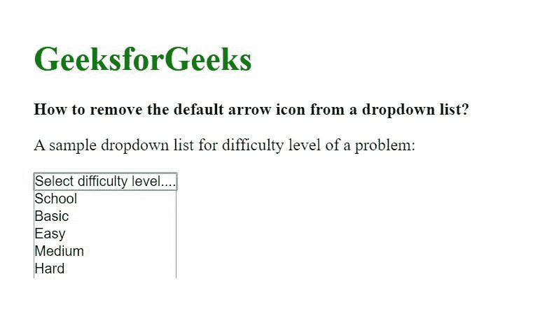

# 如何从下拉列表中删除默认箭头图标？

> 原文:[https://www . geesforgeks . org/如何从下拉列表中删除默认箭头图标/](https://www.geeksforgeeks.org/how-to-remove-the-default-arrow-icon-from-a-dropdown-list/)

下拉列表是图形控件元素，允许用户从值列表中选择一个值。它们在基于网络的表单中非常突出，在这种表单中，需要从一组固定的值中进行特定的输入。在网页中，HTML 元素**选择**和**选项**用于实现下拉列表。您可以从这里的和这里的了解这些标签及其实现。

让我们从一个示例下拉列表实现开始。以下示例实现了一个下拉列表，其中包含从一组可用选项中选择问题难度的选项。
**例:**

```htmlhtml
<!DOCTYPE html> 
<html> 
  <head>
    <title>Remove Arrow From Dropdown</title>
   </head>

  <body>
    <h1 style="color: #008000">GeeksforGeeks</h1>
    <b>
      How to remove the default arrow 
      icon from a dropdown list?
    </b>
    <p>
      A sample dropdown list for difficulty 
      level of a problem:
    </p>
    <div class="dropdown-container">
      <!-- This is our drop-down element -->
      <select>
        <option value="none" selected disabled hidden>
            Select difficulty level.... </option> 
        <option>School</option>
        <option>Basic</option>
        <option>Easy</option>
        <option>Medium</option>
        <option>Hard</option>
      </select>
    </div>

  </body>
</html>
```

**输出:**

*   **点击列表前:**
    
*   **点击列表后:**
    

现在，我们要删除下拉列表中出现的默认箭头图标()。
这可以通过更改选择标签的<mark>-moz-外观</mark>或<mark>-WebKit-外观</mark> CSS 属性来完成。
在浏览器中打开上述 HTML 代码后，如果您使用 chrome 的 dev 工具浏览网页，您会注意到对于 select 元素，默认情况下“ *-webkit-appearance* ”属性的值设置为“ *menulist* ”。
我们要改变的就是这个价值。将此属性设置为“无”即可。它明确告诉浏览器不要为该属性分配任何其他值，这又会导致默认箭头图标的移除。
**示例:**

```htmlhtml
<!DOCTYPE html> 
<html> 
  <head>
    <title>Remove Arrow From Dropdown</title>

    <style>
      /* apply CSS to the select tag of 
         .dropdown-container div*/

      .dropdown-container select {
        /* for Firefox */
        -moz-appearance: none;
        /* for Safari, Chrome, Opera */
        -webkit-appearance: none;
      }

      /* for IE10 */
      .dropdown-container select::-ms-expand {
        display: none;
      }
    </style>

   </head>

  <body>
    <h1 style="color: #008000">GeeksforGeeks</h1>
    <b>
      How to remove the default arrow
      icon from a dropdown list?
    </b>
    <p>
      A sample dropdown list for difficulty 
      level of a problem: 
    </p>
    <div class="dropdown-container">
      <!-- This is our drop-down element -->
      <select>
        <option value="none" selected disabled hidden> 
            Select difficulty level.... 
        </option> 
        <option>School</option>
        <option>Basic</option>
        <option>Easy</option>
        <option>Medium</option>
        <option>Hard</option>
      </select>
    </div>

  </body>
</html>
```

**输出:**

*   **点击列表前:**
    
*   **点击列表后:**
    

**Chrome DevTools:**`https://developers.google.com/web/tools/chrome-devtools`
**-WebKit-外观/-moz-外观:**`https://developer.mozilla.org/en-US/docs/Web/CSS/appearance`
**-ms-expand:**`https://developer.mozilla.org/en-US/docs/Web/CSS/::-ms-expand`

CSS 是网页的基础，通过设计网站和网络应用程序用于网页开发。你可以通过以下 [CSS 教程](https://www.geeksforgeeks.org/css-tutorials/)和 [CSS 示例](https://www.geeksforgeeks.org/css-examples/)从头开始学习 CSS。