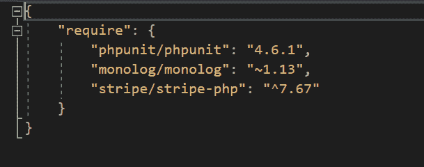
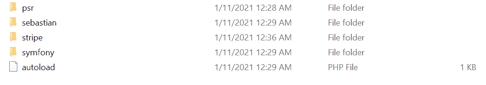
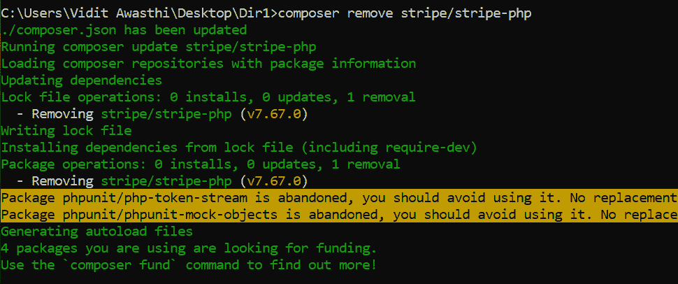
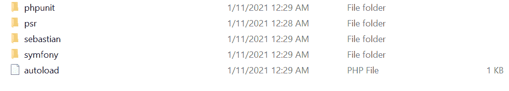
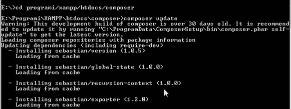
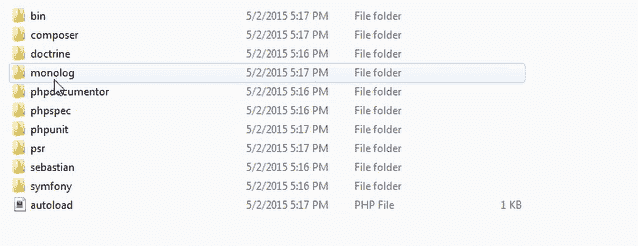
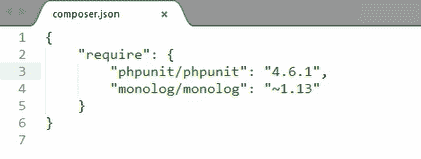
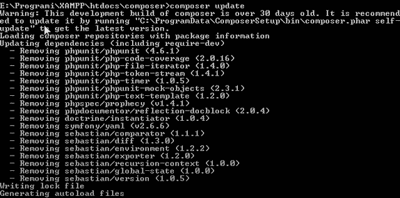
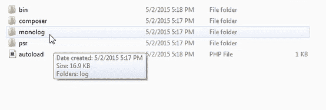

# 如何从 composer 中移除未使用的依赖项？

> 原文:[https://www . geesforgeks . org/如何从 composer 中移除未使用的依赖项/](https://www.geeksforgeeks.org/how-to-remove-unused-dependencies-from-composer/)

从 Composer 中移除未使用的依赖项非常容易。以下是两种方法:

**1。使用 Composer Remove:** 这是从 Composer 中移除未使用的依赖项的最简单命令。

**语法:**

```html
composer remove dependency_name
```

首先决定你想从作曲者那里移除哪个依赖项。这里我们将移除 ***条纹/条纹-php 中*** 的依赖关系如下所示在 composer 和*中**条纹*** 文件夹也存在于目录中。



作曲家的依赖性。



删除前存在条带文件夹。

现在只需转到 composer.json 文件所在的目录，然后键入以下命令:

```html
composer remove stripe/stripe-php
```



**作曲删除条纹/条纹-php** 命令

**输出:**该命令删除了作曲者的 ***条纹/条纹-php*** 依赖关系，如下所示:



命令后删除了条带文件夹。

因此， ***作曲者删除*** 是一个非常简单的命令，将从作曲者中删除未使用的依赖项。

**2。使用 Composer Update:** 这是从 Composer 中移除未使用的依赖项的另一种方式。

**语法:**

```html
composer update 
```



运行**作曲更新**命令。

上面的命令将更新完整的目录，并将添加下面显示的所有依赖项和文件夹:



添加和更新的所有文件夹。

现在只需打开 ***composer.json*** 文件，删除想要删除的依赖项。



文件内容

现在只需删除 **phpunit/phpunit:4.6.1** 依赖项，更新后的*T3T5 如下图所示:*


删除后的 composer.json 文件

现在我们只需要再次运行 ***composer update*** 命令，它将删除我们不想要的所有 ***phpunit*** 依赖项，如下所示:



再次运行**作曲更新**。



依赖项已删除

“composer update”将完成任务，但它也将更新其他包。

现在，如果您只想删除一个特定的包而不更新其他包，那么只需指定该包的名称。

```html
composer update packageauthor/package_name
```

它将删除“package_name”包。