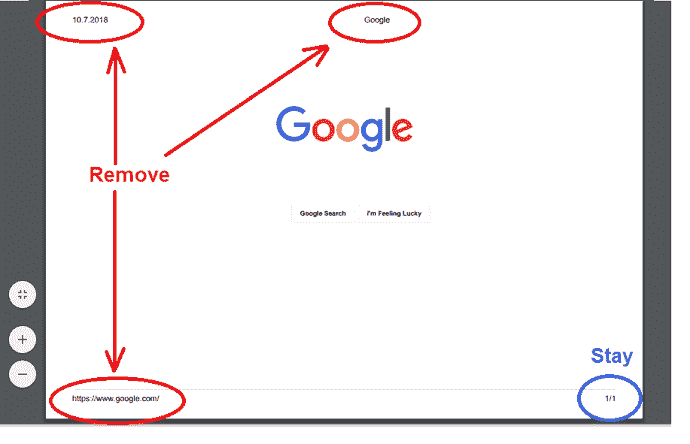
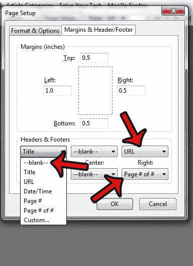
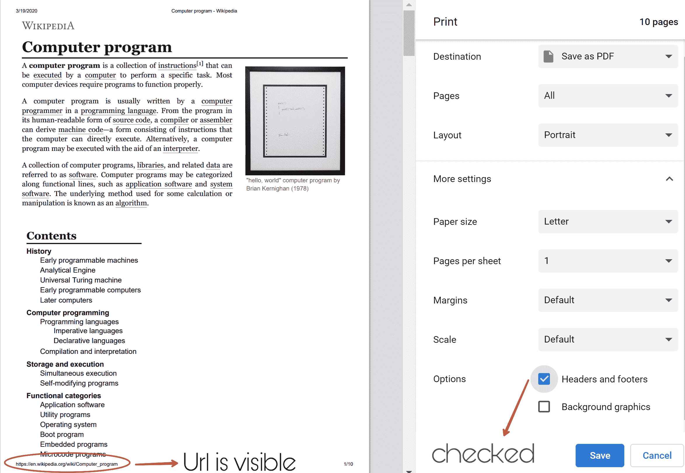
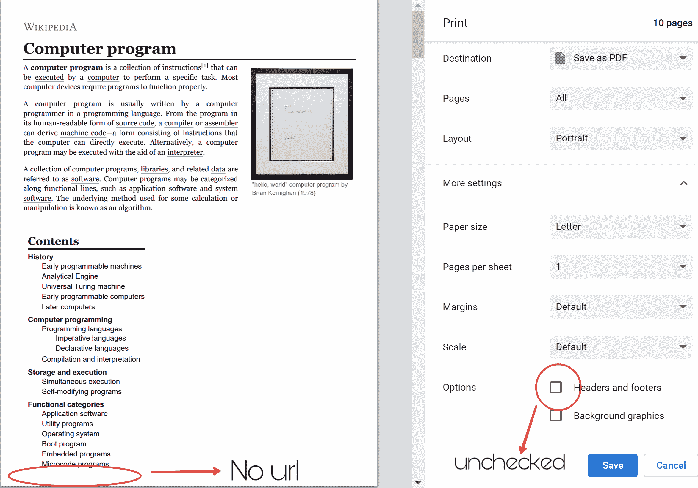

# 如何从打印页面中删除网址？

> 原文:[https://www . geesforgeks . org/如何从打印页面中删除 URL/](https://www.geeksforgeeks.org/how-to-remove-url-from-printing-the-page/)

当您从网络浏览器打印网页时，您会注意到打印输出包含一些额外的信息，如页码、日期和网页底部的网址。有时，为了整理工作，您可能不需要打印输出中的这些信息。
所以这里有几个方法可以让你打印网页，而不需要页面底部出现额外的信息。



有两种方法可以实现这一点。

1.  **Programatical Approach:** Here are few simplest ways of doing it.
    *Example 1:*

    ```
    @page {
        size: auto;
        margin: 0;
    }
    ```

    *例 2:*

    ```
    @print {
        @page :footer {
            display: none
        }

        @page :header {
            display: none
        }
    }
    ```

    但是浏览器可能会出现一些问题，导致上述代码无法工作。所以下面的代码可以用来克服浏览器问题。

    *例 3:*

    ```
    @media print {
        @page {
            margin-top: 0;
            margin-bottom: 0;
        }
        body {
            padding-top: 72px;
            padding-bottom: 72px ;
        }
    }
    ```

2.  **Browser side Approach:** There are the steps to disable the header and the footer in a browser.
    *   **Internet Explorer:** 转到“文件”菜单，从下拉菜单中选择“页面设置”，然后在“页眉和页脚”部分单击显示 URL 的菜单，并从菜单中选择`“-Empty-”`。
    *   **Mozilla Firefox:** 从文件菜单转到页面设置选项，然后单击页边距&页眉/页脚选项卡。将页眉&页脚下的每个值更改为`--blank--`。
    *   **谷歌浏览器:**进入浏览器右上角的菜单图标，点击打印按钮。取消选中“边距”选项下的`“Headers and footers”`选项。
    *   **Apple Safari:** Go to the print option from the menu and the Print dialog appears. Uncheck the `“Print headers and footers”` option.

        从字面上看，在所有浏览器中，执行相同的下列操作来删除页眉和页脚部分。

    

**样本输出:**

*   **当 Url 可见时:**
    
    此外，请注意页眉和页脚框已选中。
*   **移除 Url 时:**
    
    注意，页眉页脚框未选中。