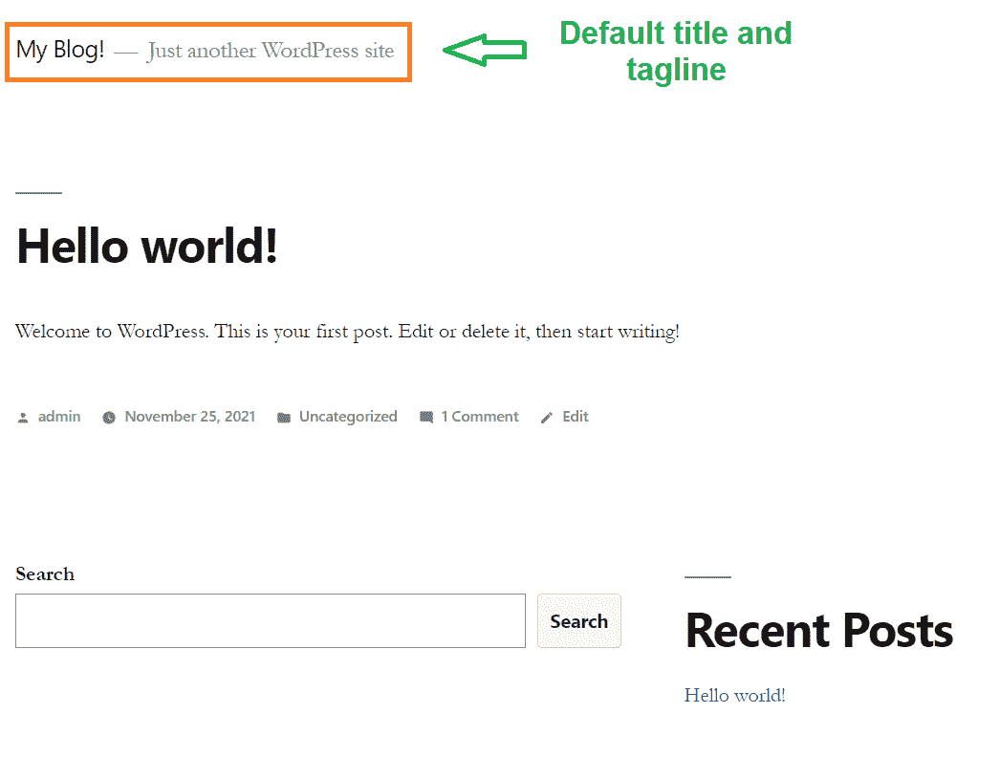
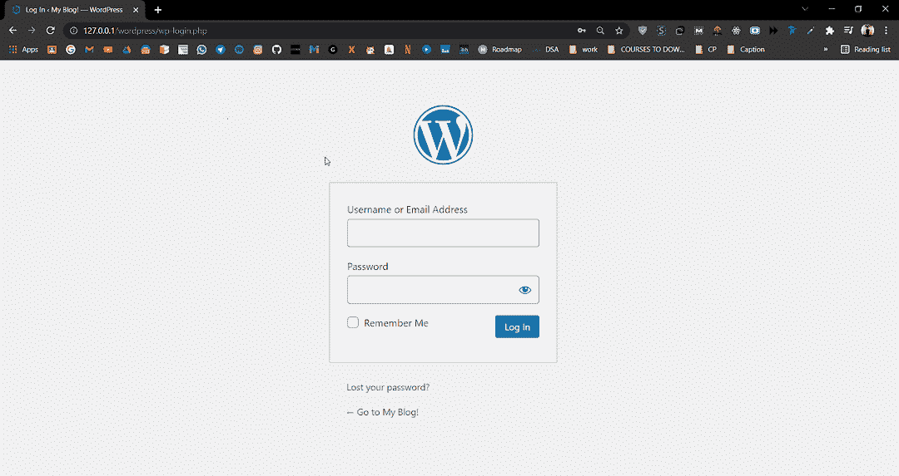
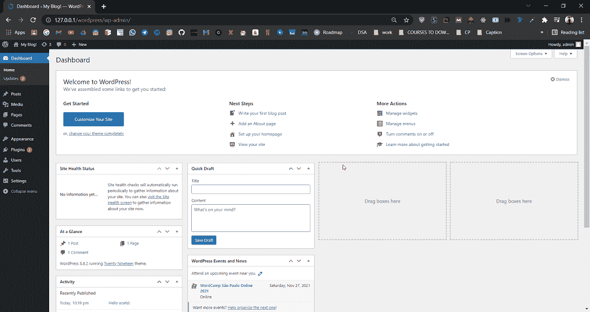
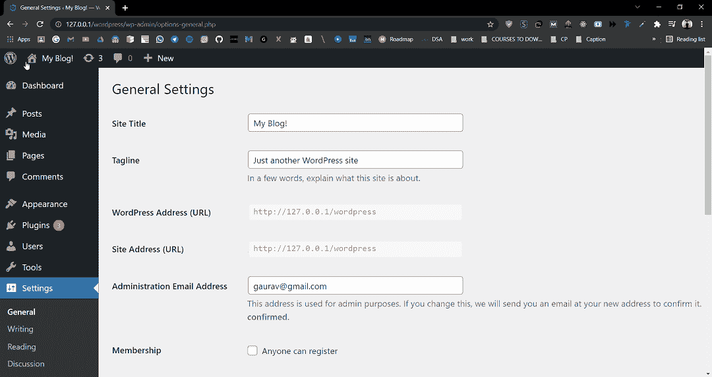
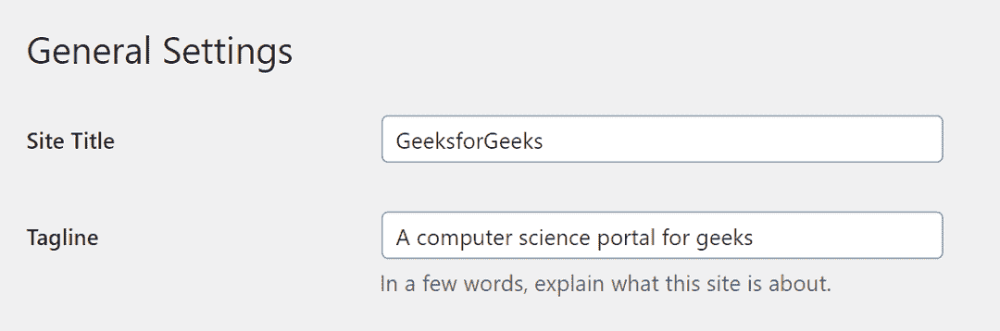
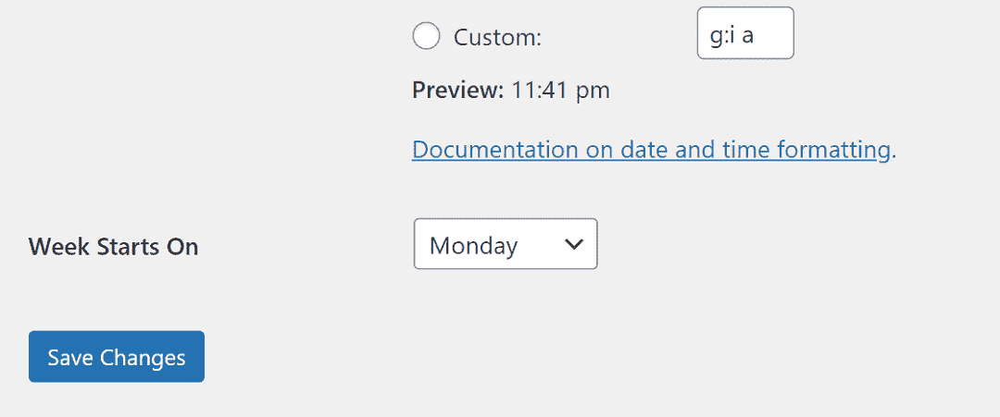
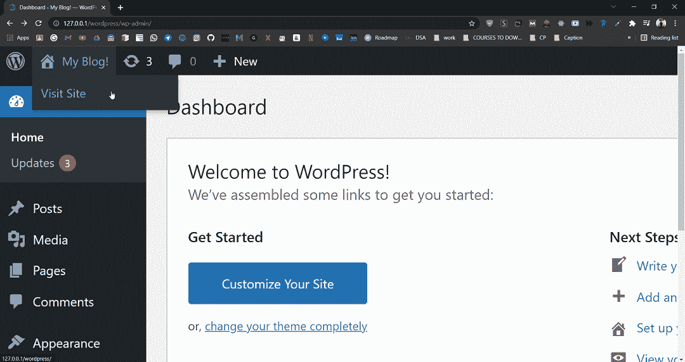
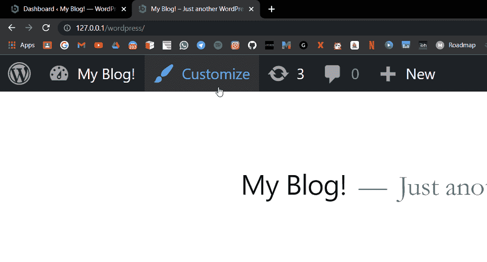
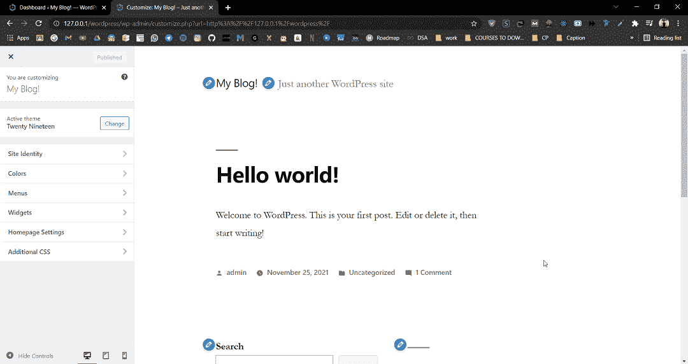
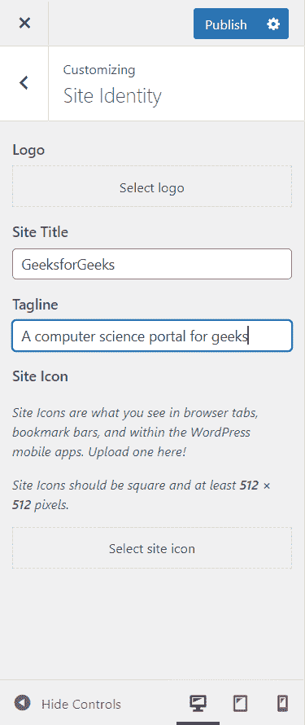

# 如何给 WordPress 博客改名？

> 原文:[https://www.geeksforgeeks.org/how-to-rename-wordpress-blog/](https://www.geeksforgeeks.org/how-to-rename-wordpress-blog/)

在本文中，我们将看到如何使用 Dashboard 重命名 WordPress 博客。在这里，我们将讨论两种重命名 WordPress 博客的方法。

[WordPress](https://www.geeksforgeeks.org/introduction-wordpress/) 是一个免费的开源内容管理系统(CMS)框架，即它是一个以最佳方式组织创建、存储和展示网络内容的整个过程的工具。WordPress 作为一个改进工具开始了它的旅程，以增强日常写作的常规排版。但它被视为一个博客工具，当我们进入今年最后一个季度时，WordPress 已经成为使用最多的 WCM(网络内容管理)系统，而且不仅仅是在博客社区。

在本文中，我们将讨论两种方法来命名 WordPress 博客的网站标题和标语。当你启动一个新的 WordPress 网站时，你会得到一个默认的标题和标语，如下图所示。

默认标题和标语

**方法一:**在本方法中，我们将学习如何通过**仪表盘**更改 WordPress Blog 的标题和标语。通过 Dashboard 命名一个 WordPress 博客非常容易。

**第一步。**进入 WordPress 登录面板，输入用户名和密码登录 WordPress 仪表盘。您可以通过在网站网址的末尾添加/登录来访问登录面板。

WordPress 登录面板

登录后，您将看到类似如下的仪表板:

WordPress 仪表板

**第二步。**在左侧，你会看到很多选项。转到**设置>T5【将军】。**

设置

**第三步。**现在，在常规设置中，您将看到更改网站的**网站标题**和**标语**的选项。只需根据您的网站更改标题和名称。

网站标题和标语

更改网站标题和标语后，滚动到底部，您会发现一个保存更改按钮。点击按钮。

保存更改

**方法二:**在这个方法中，我们将学习如何通过**直接从网站的**定制**菜单来更改 WordPress Blog 的标题和标语。**

**第一步。**首先，您必须登录仪表板。如果没有，只需遵循上述方法的第一步。您应该会看到类似如下的仪表板:

WordPress 仪表板

**步骤 2:** 在仪表板的左上角，你会找到你的网站名称，将鼠标悬停在上面，然后点击**访问网站。**

访问网站

*它会把你的 WordPress 博客作为一个网站打开。*

**第三步:**从顶部菜单栏点击**自定义**按钮。

定制

您将被重定向到您的 WordPress 博客的“自定义”部分，该部分应该如下所示:

定制

**第 4 步:**点击定制面板左栏中的**站点标识**选项。在这里，您可以选择更改站点标题和标语。

网站标识

更改网站标题和标语后，点击**发布**保存更改并关闭定制面板。