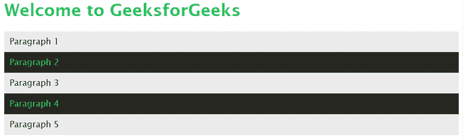

# 如何用 Less 表示一个变量？

> 原文:[https://www . geesforgeks . org/如何表示无中变量/](https://www.geeksforgeeks.org/how-to-represent-a-variable-in-less/)

**LESS** 代表 **Leaner 样式表**。它是 CSS 向后兼容的语言扩展。它的一个特性是它允许你在样式表中使用变量。变量可以用来存储可以重用的 CSS 值。通过让用户在一个位置定义常用的值，这让用户更容易。

**定义变量:**小于中的变量用 at (@)符号表示。我们可以用冒号(:)赋值。

## 半铸钢ˌ钢性铸铁(Cast Semi-Steel)

```html
@color-primary: #009900;
@background-dark: #272822;
@background-light: #fff;
```

**使用变量作为属性的值:**

## 半铸钢ˌ钢性铸铁(Cast Semi-Steel)

```html
.card {
  color: @lt-gray;
  background: @background-light;
  font-size: @font-2;
}
```

**使用变量作为函数的参数:**

## 半铸钢ˌ钢性铸铁(Cast Semi-Steel)

```html
@link-color:        #428bca;
@link-color-hover:  darken(@link-color, 10%);
```

以下示例演示了较少变量的使用。

**例 1:**

## gfg.html 格式

```html
<!DOCTYPE html>
<html>

<head>
    <link rel="stylesheet" 
        href="./css/styles.css">
</head>

<body>
    <h1>Welcome to GeeksforGeeks</h1>
    <div class="odd">Paragraph 1</div>
    <div class="even">Paragraph 2</div>
    <div class="odd">Paragraph 3</div>
    <div class="even">Paragraph 4</div>
    <div class="odd">Paragraph 5</div>
</body>

</html>
```

## 没有风格

```html
@green-color: #25C75C;
@black-color: #000;
@background-dark: #272822;
@background-light: #ebebeb;

body {
    font-family: 'Lucida Sans', Verdana, sans-serif;
}

h1 {
    color: @green-color;
}

div {
    padding: 10px;
}

.odd {
    color: @black-color;
    background-color: @background-light;
}

.even {
    color: @green-color;
    background-color: @background-dark;
}
```

我们预编译 *style.less* 后得到的文件名 *style.css*

## style.css

```html
body {
  font-family: 'Lucida Sans', Verdana, sans-serif;
}
h1 {
  color: #25C75C;
}
div {
  padding: 10px;
}
.odd {
  color: #000;
  background-color: #ebebeb;
}
.even {
  color: #25C75C;
  background-color: #272822;
}
```

**输出:**



**例 2:**

## gfg.html 格式

```html
<!DOCTYPE html>
<html>

<head>
    <link rel="stylesheet" 
        href="./css/styles.css">
</head>

<body>
    <h1>Welcome to GeeksforGeeks</h1>
    <div>
        <p><a class="link" href="#">
            Link 1</a> will take you to Page 1.
        </p>
    </div>
</body>

</html>
```

## 没有风格

```html
@link-color: #428bca;
@link-color-hover: darken(@link-color, 10%);
@green-color: #25C75C;

body {
    font-family: 'Lucida Sans', Verdana, sans-serif;
}

h1 {
    color: @green-color;
}

div {
    padding: 10px;
}

.link {
    color: @link-color;
    text-decoration: none;
}

.link:hover {
    color: @link-color-hover;
    cursor: pointer;
}
```

我们预编译 *style.less* 后得到的文件名 *style.css*

## style.css

```html
body {
  font-family: 'Lucida Sans', Verdana, sans-serif;
}
h1 {
  color: #25C75C;
}
div {
  padding: 10px;
}
.link {
  color: #428bca;
  text-decoration: none;
}
.link:hover {
  color: #3071a9;
  cursor: pointer;
}
```

**输出:**


没有盘旋