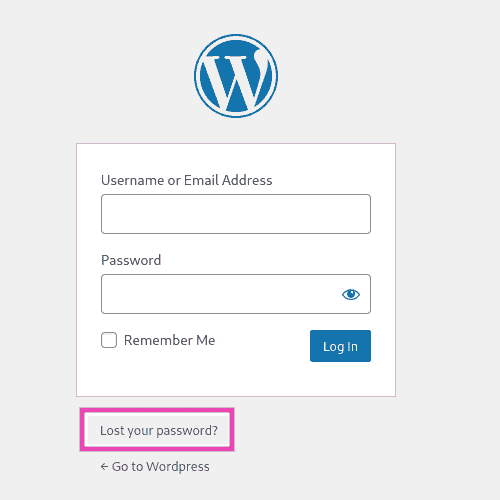
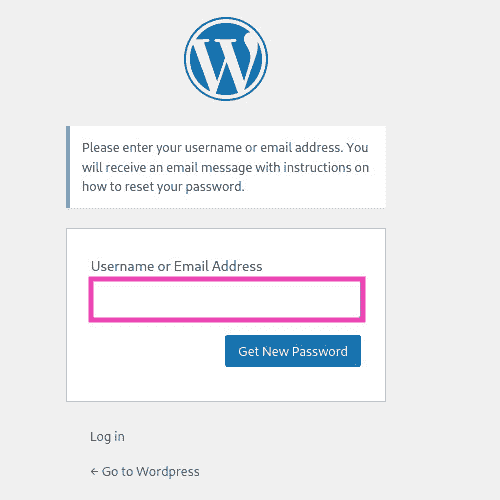
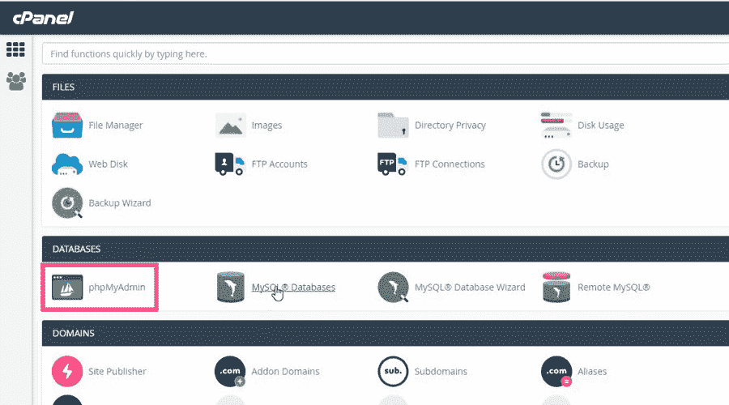
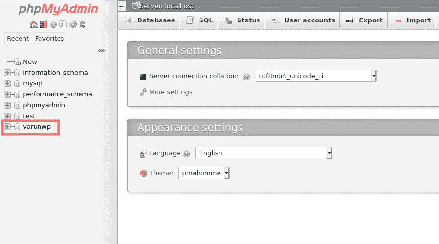
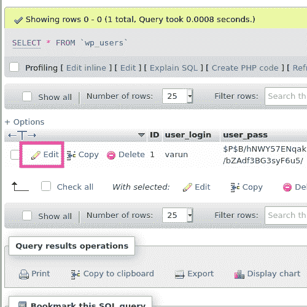
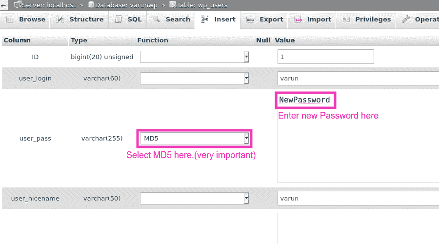

# 如何在 WordPress 中重置密码？

> 原文:[https://www . geesforgeks . org/如何重置 wordpress 中的密码/](https://www.geeksforgeeks.org/how-to-reset-password-in-wordpress/)

在这篇文章中，我们将讨论两种方法，如果你碰巧忘记了你的 WordPress 站点密码，可以让你重新登录到你的 WordPress 站点。

1.  通过电子邮件访问重置 WordPress 站点密码。
2.  重置 WordPress 站点密码，无需访问电子邮件。

**通过电子邮件访问重置 WordPress 站点密码:**如果忘记了密码，但可以访问电子邮件帐户创建 WordPress 用户，那么重置密码非常容易。

1.点击“丢失密码？”**网站登录页面上的**。

点击丢失密码？

2.输入您的 WordPress 用户的用户名或电子邮件地址，然后点击“获取新密码”。

输入用户名或电子邮件地址，然后单击获取新密码

3.按照邮件中的说明重置密码。

**重置没有电子邮件访问权限的 WordPress 站点密码:**如果您没有创建 WordPress 用户时提供的电子邮件地址的访问权限，该怎么办。嗯，我们总是可以跳到我们的数据库中手动更改密码。

1.使用 cPanel/hPanel 转到 **phpMyAdmin** 。(附图片为 cPanel)

2.点击你左边的 WordPress 数据库。(本例中，其 ***<u>varunwp</u>** 、*贵可以不同，默认名称为 **<u>wordpress</u>** )

3.现在点击用户的表格。(在本例中，其 ***<u>wp_users</u>** 、*可能因您的表前缀而异)

4.在需要重置密码的用户面前点击**编辑**。

5.在 **user_pass** 字段，输入新密码(这里是*”*new password*”*)并从下拉列表中选择 MD5(非常重要，因为 WordPress 使用 MD5 哈希)。

6.向下滚动，点击“转到**”**提交更改。

